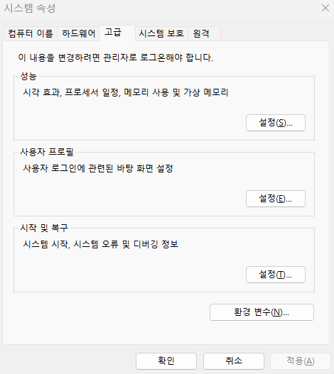
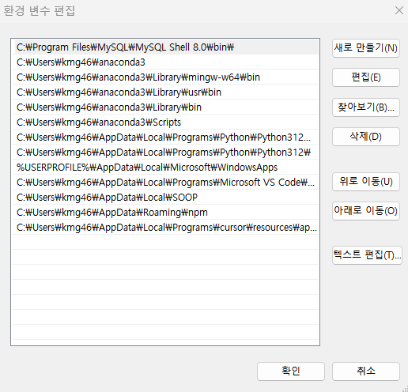
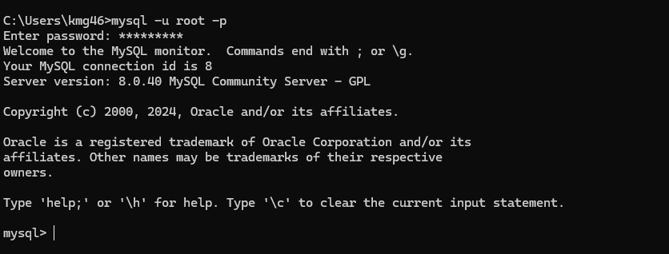
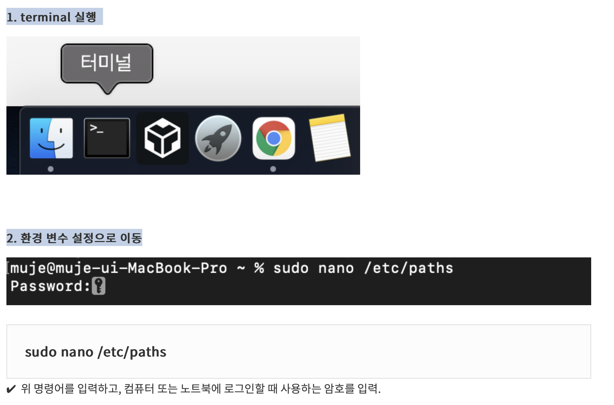
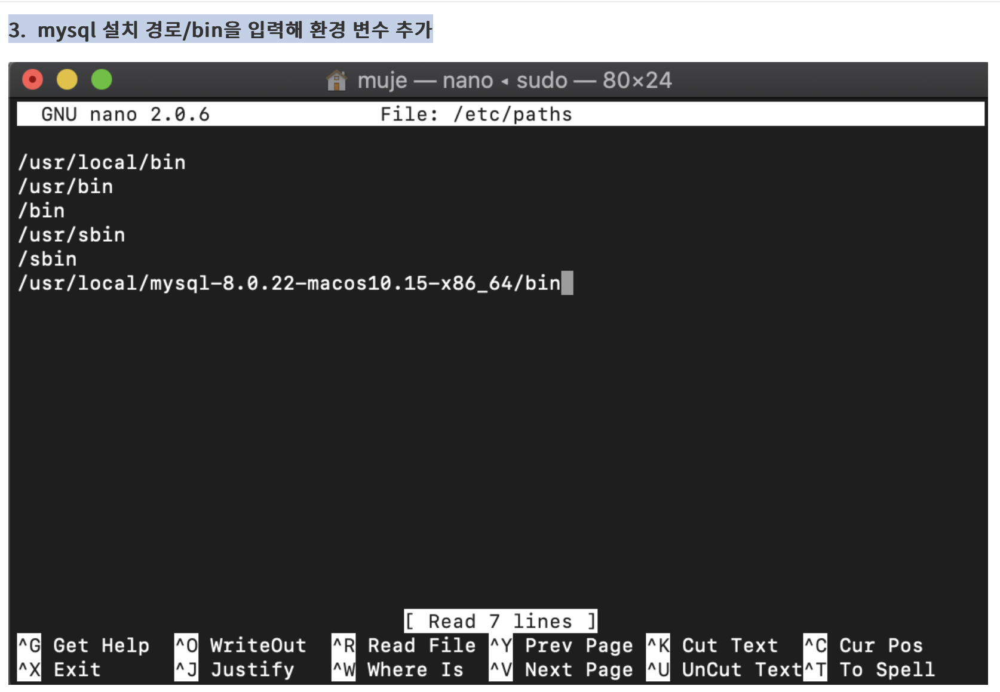
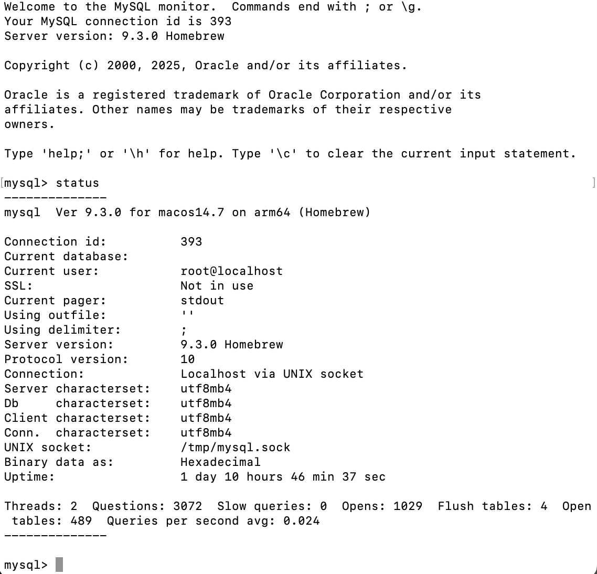
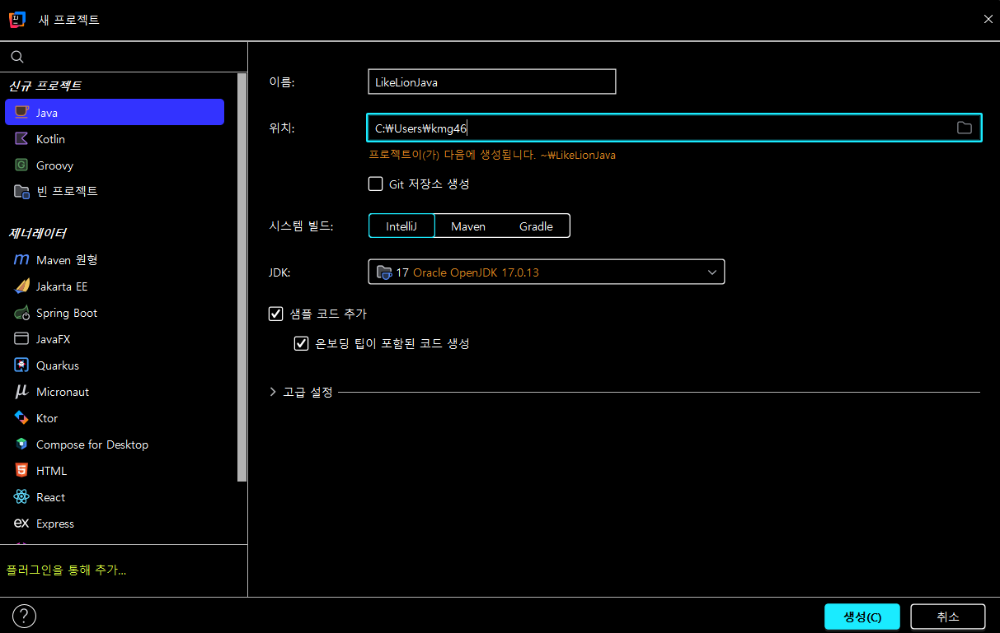
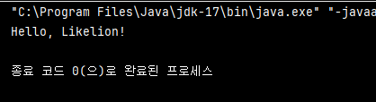

## 📂 Intro & 개발환경

### ▶️ [ERDCloud](http://ERDCloud.com) 회원가입

[ERDCloud](https://www.erdcloud.com/)

### ▶️ IntelliJ 설치 & 초기 설정

- 학교 이메일로 학생 인증을 하면 **Ultimate** 버전을 공짜로 쓸 수 있습니다. Community 버전에 비해서 기능이 많아 편해요 🙂

[[IntelliJ] Intellij 학생 인증, 무료 설치 방법](https://goddaehee.tistory.com/215)

→ 해당 자료의 참고 자료들을 타고 가면 Intellij 설치 방법 및 초기 설정하는 부분도 있습니다!! 참고해주세요~

### ▶️ Mysql설치 & 환경 변수 설정

[[Mac M1 M2] 맥북에서 간단하게 MySQL 설치하고 실행하기](https://clice.tistory.com/entry/Mac-M1-M2-%EB%A7%A5%EB%B6%81%EC%97%90%EC%84%9C-%EA%B0%84%EB%8B%A8%ED%95%98%EA%B2%8C-MySQL-%EC%84%A4%EC%B9%98%ED%95%98%EA%B8%B0)

[[MySQL] 설치 및 실행 for Mac](https://velog.io/@cyseok123/MySQL-%EC%84%A4%EC%B9%98-%EB%B0%8F-%EC%8B%A4%ED%96%89-for-Mac)

[[MySQL] MySQL 설치하기 (윈도우 / windows)](https://code-angie.tistory.com/158)

- 버전은 다를 수도 있으니 최신 버전으로 설치해주세요!
- 설치가 완료된 뒤에 아래 작업을 수행해주세요.

**환경변수 설정하기**

- 윈도우 버전
- 시스템 속성 > 환경변수 > 시스템변수 >Path 선택 → 편집 버튼
    
    
    
    - 새로 만들기를 클릭하고 MySQL의 경로를 붙여 넣으면 됩니다.
    경로를 따로 지정하지 않았다면 대부분
    C:\Program Files\MySQL\MySQL Server 8.0\bin
    위의 경로일 것입니다.
        
        
        
        위 사진에는 MySQL shell 8.0\bin으로 되어있는데, 일반적으로 MySQL Server 8.0\bin으로 하길래
        이에 맞춰서 진행해주세요 🙂
        
    - 윈도우 콘솔로 MySQL 실행 해보기
    cmd 혹은 명령 프롬프트 검색 후 콘솔 창에 mysql -u root -p 작성 후 MySQL 설치할 때 만든
    비밀번호를 입력해보세요!
        
        
        
    

- 맥 버전
    
    [[MySQL] MySQL 환경 변수 설정하기 (Window/Mac)](https://dev-ku.tistory.com/175)
    
    
    
- 터미널 실행 > sudo nano /etc/paths 명령어 실행
- 기본적으로 있는 명령어
    
    ```bash
    /usr/local/bin
    /usr/bin
    /bin
    /usr/sbin
    /sbin
    ```
    
- 위의 명령어 아래에 환경 변수 추가하기
    
    
    
- 터미널 종료 후 재실행 > mysql -v 입력 > 환경 변수 추가 확인
- 터미널로 MySQL 실행해보기
    
    ```bash
    mysql -u root -p
    ```
    
    
    

```
시스템 속성 > 환경변수 > 시스템변수 > Path 선택 후 편집 버튼 클릭
```

출처:

[https://itconquest.tistory.com/entry/MySQL-MySQL-설치-환경변수설정](https://itconquest.tistory.com/entry/MySQL-MySQL-%EC%84%A4%EC%B9%98-%ED%99%98%EA%B2%BD%EB%B3%80%EC%88%98%EC%84%A4%EC%A0%95)

[개발천재:티스토리]

```
시스템 속성 > 환경변수 > 시스템변수 > Path 선택 후 편집 버튼 클릭
```

출처:

[https://itconquest.tistory.com/entry/MySQL-MySQL-설치-환경변수설정](https://itconquest.tistory.com/entry/MySQL-MySQL-%EC%84%A4%EC%B9%98-%ED%99%98%EA%B2%BD%EB%B3%80%EC%88%98%EC%84%A4%EC%A0%95)

[개발천재:티스토리]

```
시스템 속성 > 환경변수 > 시스템변수 > Path 선택 후 편집 버튼 클릭
```

출처:

[https://itconquest.tistory.com/entry/MySQL-MySQL-설치-환경변수설정](https://itconquest.tistory.com/entry/MySQL-MySQL-%EC%84%A4%EC%B9%98-%ED%99%98%EA%B2%BD%EB%B3%80%EC%88%98%EC%84%A4%EC%A0%95)

[개발천재:티스토리]

```
시스템 속성 > 환경변수 > 시스템변수 > Path 선택 후 편집 버튼 클릭
```

출처:

[https://itconquest.tistory.com/entry/MySQL-MySQL-설치-환경변수설정](https://itconquest.tistory.com/entry/MySQL-MySQL-%EC%84%A4%EC%B9%98-%ED%99%98%EA%B2%BD%EB%B3%80%EC%88%98%EC%84%A4%EC%A0%95)

[개발천재:티스토리]

▶️ 첫 프로젝트 만들기

- 이름: LikeLionJava
- 위치: C:\Users\{사용자명}
- 신규 프로젝트: Java
- 시스템 빌드: IntelliJ
- JDK: 17 Oracle OpenJDK version 17.0.13
- 샘플 코드 추가 (체크)
- 생성



---

## 📖 Java 기본 문법 한눈에 보기

### 1️⃣ 프로그램 구조 — “Hello, Likelion!” 찍어 보기

```
public class Main {
    public static void main(String[] args) {
        System.out.println("Hello, Likelion!");
    }
}
```

- 수행 결과
    
    
    
- 맨 위 `public class Main` : **설계도** 하나를 만드는 선언입니다. 파일 이름(`Main.java`)과 클래스 이름이 꼭 같아야 합니다. (정말 중요합니다, 파일 이름과 일치하지 않을 경우에 동작을 하지 않습니다!!)
- `public static void main` : 자바가 “앱을 어디서부터 돌릴까?” 할 때 제일 먼저 찾는 입구.
- `System.out.println` : 콘솔에 글자를 찍는 함수. 괄호 안에 쌍따옴표로 감싼 문자열이 그대로 출력됩니다.

🖐️ **Scanner로 입력 받아 보기**

```
import java.util.Scanner;

public class Main {
    public static void main(String[] args) {
        Scanner sc = new Scanner(System.in);           // 입력 도구 준비
        System.out.print("숫자를 입력하세요: ");
        int num = sc.nextInt();                        // 정수 읽기
        System.out.println("입력 값 = " + num);
    }
}
```

`java.util.Scanner` 는 사용자 입력을 읽어 오는 만능 입력 도구입니다.

| 용어 | 느낌표 버전 설명 |
| --- | --- |
| **Class** | “틀” 혹은 “설계도”. 클래스를 찍어내면 객체가 만들어집니다. |
| **Method** | 클래스 안에 숨어 있는 “기능 버튼” 하나. 눌러야(=호출해야) 실행돼요. |
| **Statement** | `;`으로 끝나는 **한 줄 명령어**. 자바는 줄이 아니라 세미콜론을 보고 문장을 구분합니다. |

---

### 2️⃣ 자료형 & 변수

### 2‑1. 변수 선언 vs 초기화

```
// ① 텅 빈 상자만 만들기
int score;

// ② 상자 + 첫 값 동시에
int level = 1;
String name = "민준";
```

**변수 선언 규칙**

- `_`·`$` 이외 **특수문자 및 띄어쓰기는 사용 불가능**합니다.
- **숫자로 시작 불가능**합니다.
- `int`, `class`, `for` 등 **예약어 사용 불가능**합니다.

### 2‑2. 기본형인가? 참조형인가?

| 기본형(Primitive) | 참조형(Reference) |
| --- | --- |
| 값 그 자체를 스택에 저장 | 힙 어딘가에 있는 **객체 주소**만 들고 있음 |
| ex) `int`, `double`, `boolean` | ex) `String`, `ArrayList`, 우리가 만드는 클래스 |

### 2‑3. 기본형 정리

| 분류 | 타입 | 크기 | 값 범위 | 예시 |
| --- | --- | --- | --- | --- |
| 정수 | `byte` | 1B | −128 ~ 127 | `byte b = 64;` |
|  | `short` | 2B | −32 768 ~ 32 767 | `short s = 1000;` |
|  | `int` | 4B | −2 147 483 648 ~ 2 147 483 647 | `int age = 20;` |
|  | `long` | 8B | ±9 223 372 036 854 775 807 (`±9e18`) | `long pop = 8_000_000_000L;` |
| 실수 | `float` | 4B | 6~7자리 정밀도 · 리터럴 뒤 `F` | `float pi = 3.14F;` |
|  | `double` | 8B | 15자리 정밀도(기본) | `double avg = 8.5;` |
| 문자 | `char` | 2B | UTF‑16 한 글자 | `char grade = 'A';` |
| 논리 | `boolean` | 1B | `true` / `false` | `boolean isLogin = false;` |

### 2‑4. 값 바꿔 보기

```
public class Main {
    public static void main(String[] args) {
        String nick = "Lion";
        int coin = 500;
        System.out.println(nick + " 코인: " + coin);

        nick = "Tiger";   // 값 교체
        coin += 250;       // 750이 됨
        System.out.println(nick + " 코인: " + coin);
    }
}
```

### 2‑5. 형 변환(Casting)

- **자동 변환**: 작은 그릇 → 큰 그릇으로 옮길 때는 자바가 알아서 바꿔줍니다. (int → double)
    
    ```
    double d = 3;   // int 3이 double 3.0으로!
    ```
    
- **강제 변환**: 큰 그릇 → 작은 그릇은 손해(잘림)를 감수하고 `(타입)`을 붙입니다. (double → int)
    
    ```
    int n = (int) 3.14;   // 3 (소수점 사라짐)
    ```
    
- **문자열 ↔ 숫자** 변환
    
    ```
    int num = Integer.parseInt("123"); // "123" → 123
    String txt = String.valueOf(456);   // 456 → "456"
    ```
    

---

### 3️⃣ 연산자

### 3‑1. 산술 & 대입

```
public class Main {
    public static void main(String[] args) {
        int a = 7, b = 2;
        System.out.println(a + b);  // 9  (더하기)
        System.out.println(a - b);  // 5  (빼기)
        System.out.println(a * b);  // 14 (곱하기)
        System.out.println(a / b);  // 3  (몫 -> 정수)
        System.out.println(a % b);  // 1  (나머지)
    }
}
```

- **산술** : `+ - * / %`
- **대입** : `=` ／ 복합 `+= -= *= /= %=` (왼쪽 변수에 결과를 다시 저장)

### 3‑2. 증감 & 복합 대입

```
public class Main {
    public static void main(String[] args) {
        int n = 5;
        System.out.println(n++); // 5 (찍고 나서 6으로 변함)
        System.out.println(++n); // 7 (먼저 7로 만들고 찍음)

        n *= 2; // 14 (n = n * 2)
        System.out.println(n);
    }
}
```

**증감 연산자** :

- `++` (+1) → a=a+1; 과 같은 역할
- `--` (−1) → a=a-1; 과 같은 역할

### 3‑3. 비교 + 논리 = 조건 판단

```
public class Main {
    public static void main(String[] args) {
        int age = 20;
        boolean student = true;

        boolean discount = age < 19 || student;
        System.out.println("할인 대상? " + discount);
    }
}
```

- `&&` = 둘 다 참이어야 참 → 둘 중 하나라도 거짓이라면 거짓이다!
- `||` = 둘 중 하나만 참이면 참 → 둘 다 거짓인 경우에만 거짓, 하나라도 참이면 참!
- `!` = 반전 → !true 연산의 결과는 false, !false 연산의 결과는 true

### 3‑4. 삼항 연산자 – 미니 if

```
public class Main {
    public static void main(String[] args) {
        int score = 95;
        String grade = (score >= 90) ? "A" : "B";
        System.out.println(grade);
    }
}
```

### 3‑5. 비트 & 쉬프트 (스피드 특화)

```
public class Main {
    public static void main(String[] args) {
        int perm = 0b1010;            // 권한: 읽기·쓰기
        int readMask = 0b0010;

        System.out.println((perm & readMask) != 0);   // AND
        System.out.println((perm | readMask) != 0);   // OR
        System.out.println((perm ^ readMask) != 0);   // XOR

        int flipped = ~perm;                          // NOT (비트 반전)
        System.out.println(flipped);
    }
}
```

- &: 두 비트 모두 1일 경우에만 1
- | : 두 비트 중 하나만 1이여도 1
- ^ : 두 비트 중 하나만 1이고 다른 하나가 0일 때 계산 결과 1, 1^1 또는 0^0은 계산 결과 0
- ~: 비트를 반전 시키는 NOT 역

비트마스크는 **권한 체크**·**암호화** 같이 속도가 생명인 곳에서 자주 등장합니다.

---

### 4️⃣ 제어문

```
import java.util.Scanner;

public class Main {
    public static void main(String[] args) {
        Scanner sc = new Scanner(System.in);           // 입력 도구 준비
        System.out.print("숫자를 입력하세요: ");
        int score = sc.nextInt();                        // 정수 읽기
        if (score >= 90) {
            System.out.println("A 등급");
        } else if (score >= 80) {
            System.out.println("B 등급");
        } else {
            System.out.println("재시험!");
        }
    }
}
```

- **if / else**
    - 일반적으로 조건이 많지 않은 경우에 사용합니다!

```
public class Main {
	public static void main(String[] args) {
		int week = 3;
		//switch문을 사용할 때는 비교하고자하는 값이 같은 타입으로 이루어졌을 경우
		//switch(expression)에서 expression은 각각의 case와 값을 비교함
		//만약 일치하면 해당 case에 속한 코드를 실행함
		
		switch(week)
		{
			case 1:
				System.out.println("월요일");
				//break를 통해 switch를 빠져나감
				break;
			case 2:
				System.out.println("화요일");
				break;
			case 3:
				System.out.println("수요일");
				break;
			case 4:
				System.out.println("목요일");
				break;
			//default는 없어도 상관이 없음
			default:
				System.out.println("선택된 것이 없습니다");
				break;
		}//break 실행으로 여기서부터 다시 시작함
	}
}
```

- **switch** : 선택지가 여러 개일 때 깔끔합니다!

```
public class Main {
    public static void main(String[] args) {
        for (int i=0; i<3; i++) {
            System.out.print(i + " ");
        }
        System.out.println();

        int[] arr = {1,2,3};
        for (int n : arr) {
            System.out.println(n);
        }
    }
}
```

**for / while** : ‘몇 번 돌려?’라는 반복 횟수가 필요할 때 일반적으로 사용합니다!

---

### 5️⃣ 배열

배열은 **고정 길이**. 반면 `ArrayList` 같은 컬렉션은 **늘었다 줄었다** 자유롭습니다. (가변 길이)

```
import java.util.ArrayList;
import java.util.List;

public class Main {
    public static void main(String[] args) {

        /* 1. 배열 */
        String[] café = {"아메리카노", "라떼"};
        System.out.println(café[0]);        // 아메리카노
        System.out.println(café.length);    // 2  (길이는 고정)

        /* 2. ArrayList ― 가변 길이 컬렉션 */
        List<String> order = new ArrayList<>();

        // 요소 추가
        order.add("아메리카노");
        order.add("초코라떼");

        // 중간에 삽입(인덱스, 값)
        order.add(1, "카페라떼");           // [아메리카노, 카페라떼, 초코라떼]

        // 요소 읽기
        System.out.println(order.get(1));   // 카페라떼

        // 요소 교체(인덱스, 새 값)
        order.set(0, "콜드브루");           // [콜드브루, 카페라떼, 초코라떼]

        // 요소 삭제(인덱스)
        order.remove(2);                    // [콜드브루, 카페라떼]

        // 전체 순회
        for (String drink : order) {
            System.out.println(drink);
        }

        System.out.println("주문 수 = " + order.size()); // 2 (길이는 계속 변함)
    }
}

```

| 비교 포인트 | **배열** | **ArrayList<T>** |
| --- | --- | --- |
| 길이 | 생성 시 고정 | `add/remove` 로 가변 |
| 타입 제약 | 기본형·참조형 모두 가능 | **제네릭**(참조형)만 저장 |
| 인덱스 접근 | `café[0]` | `list.get(0)` |
| 유틸 메서드 | 거의 없음 | `add`, `remove`, `contains`, `sort` 등 풍부 |
| 속도 | 단순·빠름 (크기 고정) | 크기 늘릴 때 내부 배열 재할당 비용 발생 |

> Spring 세션에서 List, Map 같은 컬렉션 프레임워크를 더 자세히 다룰 예정이라, 지금은 “배열 ↔ ArrayList 차이” 정도만 알아두면 충분합니다! 🙂
> 

---

### 6️⃣ 메서드

메서드(method)는 **클래스 내부**에 정의된 함수입니다. 같은 로직을 여러 곳에서 쓰거나 코드 가독성을 높이고 싶을 때 메서드로 분리해 사용합니다.

### 6‑1. 기본 형태

```
[접근제한자] [static] 반환형 메서드이름(매개변수) {
    // 실행 코드
    return 값;   // 반환형이 void 라면 생략 가능
}
```

| 요소 | 설명 |
| --- | --- |
| 반환형 | 메서드가 돌려줄 값의 타입 (`int`, `void` 등) |
| 이름 | 동사 형태 camelCase 권장 (`printInfo`) |
| 매개변수 | 입력값 목록 — 0개 이상 가능 |
| return | 실행 결과를 호출부로 전달 |

### 6‑2. 예시: 인사하기 & 덧셈

```
public class Main {
    // 반환형이 void → 값 없이 동작만 수행
    static void sayHello() {
        System.out.println("Hello 함수!");
    }

    // 두 정수의 합을 반환
    static int add(int a, int b) {
        return a + b;
    }

    public static void main(String[] args) {
        sayHello();          // 호출
        int sum = add(3, 4); // 7
        System.out.println(sum);
    }
}
```

### 6‑3. 오버로딩(Overloading)

이름은 같지만 **매개변수 목록**이 다른 메서드를 여러 개 둘 수 있습니다.

```
static int    add(int a, int b)         { return a + b; }
static double add(double a, double b)   { return a + b; }
```

컴파일러가 **전달된 인수의 타입**을 보고 알맞은 버전을 자동으로 선택합니다.

### 6‑4. 메서드 만들 때 체크리스트

- **한 메서드는 하나의 역할**만 수행하도록 작성합니다. (입력·연산·출력 세 단계를 한곳에 몰아넣지 말기)
- 메서드 이름은 동사형 camelCase 로 의미가 드러나게 작성합니다.
- 재사용 가능성이 보이는 코드는 과감히 메서드로 분리합니다.

### 예제 ① : 인사하기 & 덧셈

```
public class Main {
    // 인사만 하고 끝 (반환형 void)
    static void sayHello() {
        System.out.println("Hello, 함수!");
    }

    // 매개변수 1개 → 제곱값 반환
    static int square(int x) {
        return x * x;
    }

    public static void main(String[] args) {
        sayHello();                   // 호출(이름 + 괄호)
        int result = square(5);       // 25
        System.out.println(result);
    }
}
```

### 실행 흐름

1. JVM이 `main()`부터 실행 시작.
2. `sayHello()` 호출 → 메서드 블록 진입, 문자열 출력 후 복귀.
3. `square(5)` 호출 → `x=5` 로 계산, `return 25` 하고 복귀 → `result` 에 25 저장.

### 예제 ② : 오버로딩(Overloading)

하나의 이름으로 **매개변수 목록이 다른** 메서드를 여러 개 정의할 수 있습니다.

```
static int add(int a, int b) {        // int + int
    return a + b;
}
// 같은 이름, 다른 매개변수(개수·타입) → 컴파일러가 구분
static double add(double a, double b) { // double + double
    return a + b;
}
```

→ 호출할 때 전달한 인수 타입에 따라 컴파일러가 자동으로 맞는 버전을 골라 줍니다.

---

> 궁금한 점이 있다면 언제든지 운영진에게 연락 주세요 🙂
>
