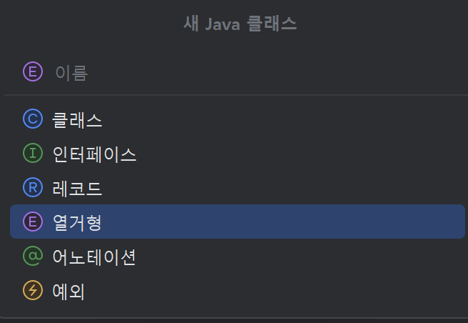
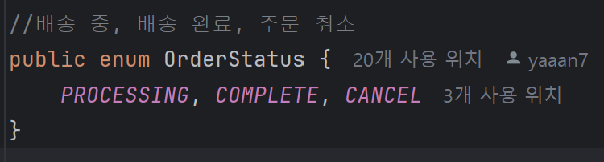
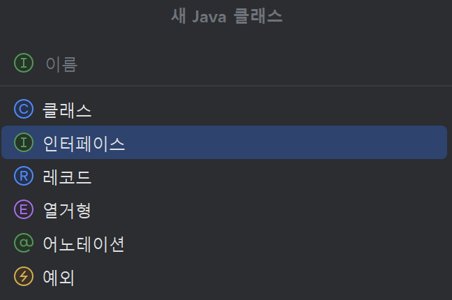

**🔎 기본 구조와 흐름을 알아보았으니 오늘은 코드를 조금 더 자세하게 봐볼까요!**

<br>

-> [어노테이션 & Repository 핵심 정리](annotation-repository.md)

<br>

## 백엔드 코드는요…

***사실 정답이 없습니다!***

많은 개발자들이 백엔드 개발을 할 때 마치 정해진 공식이나 틀이 있다고 생각해요. 

"Domain, Repository, Service, DTO, Controller가 모두 있어야 한다", "이 순서로 작성해야 한다", "반드시 이 구조를 따라야 한다"와 같은 고정관념을 가지고 있죠. 

하지만 **백엔드 개발에는 절대적인 틀이 없어요**. 

### 핵심 원칙: ERD가 출발점

백엔드 개발의 진짜 출발점은 **ERD(Entity Relationship Diagram)**예요.

- 데이터베이스 설계가 먼저 나오고
- 비즈니스 로직이 정의되고
- 그에 따라 필요한 컴포넌트들이 결정돼요

정해진 틀에 맞춰 개발하는 것이 아니라, **요구사항과 설계에 따라 필요한 부분만 구현**하는 것이 올바른 접근이에요.

### 레이어별 역할과 선택적 구현

### 1. Domain (Entity)

```java
// 필수: 데이터 구조 정의
@Entity
public class User {
    @Id @GeneratedValue
    private Long id;
    private String name;
    private String email;
    // 비즈니스 로직이 있다면 여기에
}
```

- **언제 필요한가요**: 
데이터베이스와 매핑되는 엔티티가 필요할 때
- **생략 가능한 경우**: 
단순 조회만 하는 경우, DTO로 충분할 때

### 2. Repository

```java
*// 필수: 데이터 접근 로직*
public interface UserRepository extends JpaRepository<User, Long> {
    List<User> findByEmail(String email);
    *// 복잡한 쿼리가 필요하다면 @Query 사용*
}
```

- **언제 필요한가요**: 
데이터베이스 CRUD 작업이 필요할 때
- **생략 가능한 경우**: 
외부 API만 호출하는 경우, 정적 데이터만 다루는 경우

### 3. Service

```java
*// 선택적: 비즈니스 로직이 복잡할 때만*
@Service
public class UserService {
    public User processUserRegistration(UserDto userDto) {
        *// 복잡한 비즈니스 로직*
        return userRepository.save(user);
    }
}
```

- **언제 필요한가요**: 
복잡한 비즈니스 로직, 트랜잭션 처리, 여러 Repository 조합이 필요할 때
- **생략 가능한 경우**: 
단순 CRUD만 하는 경우

### 4. DTO

```java
*// 선택적: 데이터 변환이 필요할 때만*
public class UserResponseDto {
    private String name;
    private String email;
    *// 비밀번호 등 민감정보 제외*
}
```

- **언제 필요한가요**: 
엔티티와 다른 형태로 데이터를 주고받아야 할 때
- **생략 가능한 경우**: 
엔티티 그대로 반환해도 문제없는 경우

### 5. Controller

```java
*// 필수: 외부 요청 처리*
@RestController
public class UserController {
    @GetMapping("/users")
    public List<User> getUsers() {
        return userRepository.findAll(); *// Service 없이 바로 Repository 사용도 가능*
    }
}
```

- **언제 필요한가요**: 
외부에서 API 호출이 필요할 때
- **생략 가능한 경우**: 
내부 배치 작업, 스케줄러 등

### CRUD?

**C**reate(생성), **R**ead(읽기), **U**pdate(갱신), **D**elete(삭제)

의 앞 글자를 딴 것으로 데이터베이스에서 데이터를 다루는 기본적인 네 가지 작업을 뜻합니다!

### 중요한 마인드셋

❌ **잘못된 접근**

- "무조건 5개 레이어를 다 만들어야 해요"
- "Controller → Service → Repository 순서로 반드시 거쳐야 해요"
- "DTO가 없으면 안 돼요"

✅ **올바른 접근**

- "이 기능에는 어떤 컴포넌트가 실제로 필요한가요?"
- "비즈니스 로직이 복잡한가요? 그렇다면 Service 계층이 필요해요"
- "데이터 변환이 필요한가요? 그렇다면 DTO를 만들어요"

### 결론

백엔드 개발은 요구 사항을 만족하는 것이 목표예요. 

정해진 틀에 맞춰 불필요한 코드를 작성하는 것보다, **실제 필요한 기능과 컴포넌트만 구현**하는 것이 더 효율적이고 유지보수하기 좋은 코드를 만드는 방법이에요.

## 1️⃣ 도메인 (Order.java)

### 🤔 도메인(Entity)이란?

- **도메인(Entity)**은 데이터베이스의 테이블과 1:1로 매핑되는 Java 클래스입니다.
- 실제 비즈니스에서 다루는 **핵심 개념**을 코드로 표현한 것
- 예: 주문(Order), 사용자(User), 상품(Item) 등

### **Entity 클래스에 포함 되어야 할 항목**

- **어노테이션** - Spring과 JPA에게 "이건 엔티티야!"라고 알려주기
- **필드** - 테이블의 컬럼들
- **연관관계** - 다른 테이블과의 관계 (외래키)
- **비즈니스 로직** - 해당 엔티티의 상태를 변경하는 메서드들
- 필드와 연관 관계는 과제로 제출하셨던 ERD를 보면서 하시면 됩니다!

```java
@Entity // JPA에게 "이 클래스는 엔티티야!"라고 선언
@Getter // 모든 필드의 getter 메서드 자동 생성
@Table(name = "orders") // 실제 DB 테이블명 지정 (order는 SQL 예약어라 orders 사용)
@NoArgsConstructor // 기본 생성자 자동 생성 (JPA 필수 요구사항)
public class Order extends BaseEntity {
```

**어노테이션 (필수)**

- `@Entity`
- `@Getter`
- `@NoArgsConstructor`

**💡 왜 이 어노테이션들이 필요한가요?**

- `@Entity`: JPA가 이 클래스를 관리하도록 지정
- `@Getter`: 필드에 접근하기 위한 getter 메서드들 자동 생성
- `@Table(name = "orders")`: 'order'는 SQL 예약어이므로 'orders'로 테이블명 변경
- `@NoArgsConstructor`: JPA가 객체를 생성할 때 필요한 기본 생성자

```java
/** 필드 **/
    @Id
    @GeneratedValue(strategy = GenerationType.IDENTITY)
    @Column(name = "order_id")
    @Setter(AccessLevel.PRIVATE)
    private Long id;

    @Column(nullable = false)
    private int quantity;

    @Setter
    @Column(nullable = false)
    private int totalPrice; // 기존 주문 내역을 유지하기 위해

    @Setter
    @Column(nullable = false)
    private int finalPrice;

    @Enumerated(EnumType.STRING)
    @Column(nullable = false)
    private OrderStatus status;
```

**필드 선언 (필수)**

- `@Id`로 기본키(PK)를 반드시 설정

- 외부의 무분별한 접근을 막고 안정성을 높이기 위해 private로 선언
- `@Column` 어노테이션을 활용하여 세부 속성 제어할 수 있어요!
    - 주요 속성으로는
        - name, nullable, unique 등이 있습니다.
- 주문 상태는 Enum 으로 안전하게 관리!
    - 주문 상태는 (우리 프로젝트에서는) 
    `*PROCESSING*, *COMPLETE*, *CANCEL`* 이 세 개로 정해져 있습니다. 이를 경우 Enum으로 관리하면 → **
    - 상태 값을 제한 시켜 오타를 방지하고, 가독성을 높이는 등의 장점이 있습니다.
    - **추가 설명(Enum)**
        
        ### Enum을 활용한 상태 관리
        
        ```java
        @Enumerated(EnumType.STRING)  *// Enum을 문자열로 DB에 저장*
        @Column(nullable = false)
        private OrderStatus status;   *// 주문 상태 (PROCESSING, COMPLETE, CANCEL)*
        ```
        
        **🎯 왜 Enum을 사용하나요?**
        
        ```java
        *// ❌ 문자열 사용 시 - 오타 위험!*
        order.setStatus("PROCESING");  *// 오타 발생!// ✅ Enum 사용 시 - 컴파일 타임에 오류 체크*
        order.setStatus(OrderStatus.PROCESSING);  *// 안전!*
        ```
        
        **OrderStatus Enum 예시:**
        
        ```java
        public enum OrderStatus {
            PROCESSING("처리중"),
            COMPLETE("완료"), 
            CANCEL("취소");
            
            private final String description;
            
            OrderStatus(String description) {
                this.description = description;
            }
        }
        ```
        
    
    
    
    
    

**💡 핵심 포인트**

- `@Id`: 반드시 하나의 기본키가 있어야 함
- `GenerationType.IDENTITY`: MySQL의 AUTO_INCREMENT와 같은 기능
- `@Setter(AccessLevel.PRIVATE)`: ID는 데이터베이스가 관리하므로 외부 변경 차단

**연관 관계 설정 (다른 객체와의 관계)** 

```java
/** 연관관계 설정 **/
    // Item와의 관계 N:1 -> 여러 주문이 하나의 상품을 참조
    @ManyToOne(fetch = FetchType.EAGER)
    @JoinColumn(name = "item_id")
    private Item item;

    // User와의 관계 N:1 -> 여러 주문이 한 사용자에게 속함
    @ManyToOne(fetch = FetchType.LAZY) 
    **// fetch 설정으로 연관된 엔티티를 언제(즉시vs지연) 가져올지 정하기** 
    @JoinColumn(name = "user_id")
    private User user;
```

- **1:N 관계 시에**
    - N(다수)쪽이 연관 관계의 주인이므로  `@ManyToOne` 로 설정
    - 1(단일) 쪽에서는 리스트로 관리하거나 등의 상황 시에서만 `@OneToMany` 로 설정해도 됨
    
    ```java
        /** User.java 코드 중.. **/
        // 주문 정보 (1:N 관계)
        @OneToMany(mappedBy = "user", cascade = CascadeType.ALL, orphanRemoval = true)
        private List<Order> orders = new ArrayList<>();
    ```
    
    **핵심 옵션 설명:**
    
    - `mappedBy = "user"`: Order 엔티티의 user 필드( 외래 키)가 주인임을 명시
    - `cascade = CascadeType.ALL`: 사용자 저장/삭제 시 주문들도 함께 처리
    - `orphanRemoval = true`: 관계가 끊어진 주문은 DB에서 자동 삭제
    - → 이 두 개를 동시에 사용하면 자식 엔티티의 생명 주기를 부모가 완전히 위임 받을 수 있습니다!
    
- **N:N 관계…** → Shop 프로젝트에서 유일한 N:N 관계는 카테고리와 상품입니다! 굳
    - 정석적인 방법은 ERD 에서 짰던 것과 같이 중간 테이블을 새로운 엔티티로 만들어주는 것 입니다.
    - 다만, 중간 테이블에 별다른 필드가 안 들어가는 경우`@JoinTable` 를 사용할 수 있습니다.

**양방향 메서드**

```java
//양방향 편의 메서드
    @SuppressWarnings("lombok")
    public void setUser(User user) {
        this.user = user;
    }
```

- ex) User와 Order는 1:N 관계 이며 User는 Order를 Orders라는 리스트로 관리하고 있습니다! 그러면 Order를 새로 생성할 때 User의 리스트에도 추가를 해야 돼요.
- 이를, `addOrder`라는 메서드를 만들고, 이 안에서 `orders.add(order)`를 하고, `order.setUser(this);` 를 하면
- → 서비스에서 한 메서드만 호출하면 양방향 연관 관계가 동시에 설정됩니다!
- ( ← 이때 order 쪽에서는 setUser 메서드가 있어야 하겟죠?!  )

**💡 왜 양방향 편의 메서드가 필요한가요?**

```java
*// ❌ 번거로운 방법*
User user = new User();
Order order = new Order();
user.getOrders().add(order);  *// 사용자 쪽에서 설정*
order.setUser(user);          *// 주문 쪽에서도 설정 (깜빡하기 쉬움!)*

```

```java
*// ✅ 편의 메서드 사용*
User user = new User();
Order order = new Order();
user.addOrder(order);         *// 한 번의 호출로 양쪽 모두 설정!*
```

**도메인 내에서 이루어지는 비즈니스 로직 등..**

```java
    
/** 생성자 및 비즈니스 로직 등등..**/

		// 기본 생성자 -> JPA 필수
		@NoArgsConstructor  // Lombok이 자동으로 생성
		
    // 내부 생성자 메서드 -> 필수 값만으로도 객체 생성
    private Order(User user, Item item, int quantity) {
        this.user = user;
        this.item = item;
        this.quantity = quantity;
        this.status = OrderStatus.PROCESSING;
    }

    // 정적 팩토리 메서드 -> 객체 생성의 진입점
    public static Order create(User user, Item item, int quantity, int totalPrice, int finalPrice) {
        Order order = new Order(user, item, quantity);
        order.totalPrice = totalPrice;
        order.finalPrice = finalPrice;
        return order;
    }

    // 주문 상태 업데이트
    public void updateStatus(OrderStatus status) {
        this.status = status;
    }
}
```

- 해당 엔티티 자체의 상태만 변경하는 로직은 서비스가 아니라 엔티티 내부에서 관리하는 게 좋습니다!

- 정적 팩토리 메서드 사용을 안하고 생성자만 놓고 사용하면 큰 프로젝트에서는 놓칠 수 있어요!
    - 저의 수정 전 코드를 보시면.. 냅다 Order.setFinalPrice 해버리는데 이건 소규모 + 한 명이 Order를 담당해 코드를 짜서 무사히(?) 넘어갔지만 ..
- 큰 프로젝트에서는 다른 사람과 함께 맡거나.. (실무 모름) 필드도 추가될 수도 있고.. 그럼 순서를 기억하기가 어려워지겠죠? ~~이럴 때 Builder( )를 사용하면 편리해집니다~~!

**🎯 정적 팩토리 메서드의 장점**

1. **의미 전달**: `Order.create()`가 `new Order()`보다 의도가 명확
2. **검증 로직**: 객체 생성 시 유효성 검사 가능
3. **캐싱**: 동일한 객체 재사용 가능
4. **다양한 생성 방법**: 상황에 따른 여러 생성 메서드 제공

- Order.java 전체 코드
    
    ```python
    package likelion13th.shop.domain;
    
    import jakarta.persistence.*;
    import likelion13th.shop.domain.entity.BaseEntity;
    import likelion13th.shop.global.constant.OrderStatus;
    import lombok.AccessLevel;
    import lombok.Getter;
    import lombok.NoArgsConstructor;
    import lombok.Setter;
    
    @Entity
    @Getter
    @Table(name = "orders") //예약어 회피
    @NoArgsConstructor
    public class Order extends BaseEntity {
    
        /** 필드 **/
        @Id
        @GeneratedValue(strategy = GenerationType.IDENTITY)
        @Column(name = "order_id")
        @Setter(AccessLevel.PRIVATE)
        private Long id;
    
        @Column(nullable = false)
        private int quantity;
    
        @Setter
        @Column(nullable = false)
        private int totalPrice; // 기존 주문 내역을 유지하기 위해
    
        @Setter
        @Column(nullable = false)
        private int finalPrice;
    
        @Enumerated(EnumType.STRING)
        @Column(nullable = false)
        private OrderStatus status;
    
        /** 연관관계 설정 **/
        // Item와의 관계 N:1
        @ManyToOne(fetch = FetchType.EAGER)
        @JoinColumn(name = "item_id")
        private Item item;
    
        // User와의 관계 N:1
        @ManyToOne(fetch = FetchType.LAZY)
        @JoinColumn(name = "user_id")
        private User user;
    
        /** 생성자 및 비즈니스 로직 등등..**/
        // 내부 생성자 메서드
        private Order(User user, Item item, int quantity) {
            this.user = user;
            this.item = item;
            this.quantity = quantity;
            this.status = OrderStatus.PROCESSING;
        }
    
        // 정적 팩토리 메서드
        public static Order create(User user, Item item, int quantity, int totalPrice, int finalPrice) {
            Order order = new Order(user, item, quantity);
            order.totalPrice = totalPrice;
            order.finalPrice = finalPrice;
            return order;
        }
    
        // 주문 상태 업데이트
        public void updateStatus(OrderStatus status) {
            this.status = status;
        }
    
        //양방향 편의 메서드
        @SuppressWarnings("lombok")
        public void setUser(User user) {
            this.user = user;
        }
    }
    
    ```
    

## 2️⃣레포지토리 (OrderRepository.java)

### 🤔 레포지토리(Repository)란?

- 데이터베이스와 대화하는 "번역사" 역할이에요
- 복잡한 SQL을 몰라도 간단한 메서드로 데이터를 다룰 수 있게 해줍니다
- 예: "1번 주문 정보 가져와줘" → findById(1)

```java
@Repository
public interface OrderRepository extends JpaRepository<Order, Long> {
    List<Order> findByStatusAndCreatedAtBefore(OrderStatus status, LocalDateTime dateTime);
}
```

~~저(얀)는 처음에는 상속만 받아 놓고, 서비스 코드 짜면서 필요한 걸 그때 그때 만들어줍니다!~~

**JpaRepository를 상속 받으면**

- 기본 CRUD 메서드를 자동 제공 받을 수 있어요!
    - save() : 저장하기
    - findById() : ID로 찾기 (Optional<T> 반환)
    - findAll() : 전체 데이터 조회
    - delete(entitiy), deleteById(id) : 단일 엔티티, ID 기준 삭제
    - existsById(id) : ID 존재 여부 확인
- 이 외에도 쿼리 메서드를 자동 생성해주거나 정렬 기능이 내장 되어 있는 등 장점이 많습니다.



인터페이스로 클래스 생성한 후  JpaRepository 상속 받기

🔍 **우리만의 특별한 조회 메서드도 만들 수 있어요!**

- findByStatusAndCreatedAtBefore()
→ "특정 상태이면서 특정 날짜 이전에 만들어진 주문들"
- Spring이 메서드 이름만 보고 SQL을 자동 생성해줍니다!

## 3️⃣서비스 (OrderService.java)

### 🤔 서비스(Service)란?

- Service는 "비즈니스 로직의 두뇌" 역할이에요!
- 비즈니스 로직 구현
    - 💡 예시: "주문할 때 재고가 충분한지 확인하고, 포인트 차감하고, 주문 생성하기"
- Controller에서 넘어온 요청을 처리해서 가공된 결과를 돌려주기

### **Service 클래스에 포함되어야 할 항목**

- **의존성 주입( 레포지토리 등)**

🔌 의존성 주입이 뭐예요?

- Service가 Repository를 사용하려면 "연결"이 필요해요
- @Autowired나 생성자 주입으로 Spring이 자동으로 연결해줍니다
- 마치 "전원 코드를 꽂으면 전기가 통하는 것"과 비슷해요!

- **비즈니스 로직 구현**
    - ( 트랜젝션 처리 + 예외 처리 )

💼 비즈니스 로직 예시:

- 주문 생성할 때: 재고 확인 → 가격 계산 → 포인트 차감 → 주문 저장
- 주문 취소할 때: 취소 가능 기간 확인 → 환불 처리 → 재고 복구
- 컨트롤러에서 넘겨준 요청 DTO와 유저 정보를 받아서 **검증 + 처리 + 결과 반환**을 담당합니다!

서비스 코드를 본격적으로 작성하기 전에, 먼저 컨트롤러부터 설계해보겠습니다. 

이 단계에서 각 기능의 용도와 필요성을 생각해보고, 관련 어노테이션도 미리 설정해두면 전체 흐름을 잡는 데 도움이 됩니다! 

~~(저는 도메인 별로 필요한 기능을 모조리 짜버리는 스타일입니다 ㅎㅎ 기능 하나씩 짜는 방법도 있어요! )~~

```java
@Tag(name = "주문", description = "주문 관련 API 입니다.")
@Slf4j
@RestController
@RequestMapping("/orders")
@RequiredArgsConstructor
public class OrderController {

    /** 주문 생성 **/
  
    /** 모든 주문 목록 조회 **/
    
    /** 주문 취소 **/
}
```

🐎 🐎 🐎 그럼 이제 서비스 코드를 보러 가보겠습니다. 🐎 🐎 🐎 

### 🚀 서비스 코드 구현

**어노테이션, 의존성 주입**

```java
@Service
@RequiredArgsConstructor
public class OrderService {
    private final OrderRepository orderRepository;
    private final ItemRepository itemRepository;
    
       /** 주문 생성 **/
    @Transactional
    public OrderResponse createOrder(OrderCreateRequest request, User user) {
        
        
```

**🔄 메서드에 트랜잭션 어노테이션 사용**

서비스 메서드에는 종종 `@Transactional` 어노테이션이 사용됩니다.

이 어노테이션은 **하나의 작업 단위(트랜잭션)로 묶어 처리**하겠다는 의미입니다.

즉, **여러 작업 중 하나라도 실패하면 전체가 롤백**되도록 보장해줍니다.

> 예를 들어:
> 
> 
> 주문 생성 중 상품이 없거나, 마일리지가 부족하거나, DB 저장이 실패한다면
> 
> 이미 차감된 마일리지 등도 함께 되돌릴 수 있어야 합니다.
> 

```java
// 사용자 조회
User user = userService.getAuthenticatedUser(customUserDetails.getProviderId());
// 상품 조회
Item item = itemRepository.findById(request.getItemId())
      .orElseThrow(() -> new GeneralException(ErrorCode.ITEM_NOT_FOUND));
```

```java
/** UserService.java 중.**/
public User getAuthenticatedUser(String providerId) {
        return userRepository.findByProviderId(providerId)
                .orElseThrow(() -> new GeneralException(ErrorCode.USER_NOT_FOUND));
    }
```

```java
// 총 금액 계산
int totalPrice = item.getPrice() * request.getQuantity();

// 마일리지 유효성 검사
int mileageToUse = request.getMileageToUse();
if (mileageToUse > user.getMaxMileage()) {
     throw new GeneralException(ErrorCode.INVALID_MILEAGE);
}
       
// 사용할 수 있는 최대 마일리지 = 총 금액
int availableMileage = Math.min(mileageToUse, totalPrice);

// 최종 결제 금액 계산
int finalPrice = totalPrice - availableMileage;

```

```java
//주문 생성 ( 주문 중으로 설정은 Order.java 생성자에서 )
Order order = Order.create(user, item, request.getQuantity(), totalPrice, finalPrice);

//사용자 마일리지 차감 및 적립
user.useMileage(availableMileage);
user.addMileage((int) (finalPrice * 0.1));//결제 금액의 10% 마일리지 적립

//최근 결제 금액 업데이트
user.updateRecentTotal(finalPrice);
```

```java
//연관관계 설정
user.addOrder(order);

//주문 저장
orderRepository.save(order);
return OrderResponse.from(order);

```

```java
/** 로그인한 사용자의 모든 주문 조회 **/
    @Transactional
    public List<OrderResponse> getAllOrders(User user) {
        //프록시 객체 -> DTO로 변환 후 반환
        return user.getOrders().stream()
                .map(OrderResponse::from)
                .collect(Collectors.toList());
    }
```

```java
@Scheduled(fixedRate = 60000) 
@Transactional
public void updateOrderStatus() {

// PROCESSING 상태면서 1 분 이전에 생성된 주문 찾기
   List<Order> orders = orderRepository.findByStatusAndCreatedAtBefore(
           OrderStatus.PROCESSING,
          LocalDateTime.now().minusMinutes(1)
   );

// 주문 상태를 'COMPLETE' 로 변경
   for (Order order : orders) {
      order.updateStatus(OrderStatus.COMPLETE);
   }

```

주문 API에는 다음과 같은 기능이 필요합니다:

1. 주문 생성
2. 로그인한 사용자의 전체 주문 목록 조회
3. 주문 취소

이런 부분은 피그마를 보면서 ‘어떤 기능들이 필요할까~’ 하시면 됩니다. 

혹은 해커톤 백엔드 담당자 분들은 다 작성해보셨을 것 같은데요!!  API 명세서를 작성하면서 미리 기능과 엔드포인트, HTTP 메서드를 작성한 후 컨트롤러를 짜면 수월하답니당

> **🎯 컨트롤러의 역할 복습
*** 클라이언트의 **요청을 받고**,
* 서비스에게 **비즈니스 로직을 위임하고**,
* **응답을 반환하는** 것이 핵심 역할입니다.
> 

클래스를 생성한 후에 어노테이션을 추가해줍시다.

`@Service`  : Spring에게 서비스라고 알리기~

`@RequiredArgsContstructor` : final 이 붙은 변수를 자동으로 의존성 주입

컨트롤러가 서비스의 메서드를 호출하듯이,

서비스는 **레포지토리의 메서드**를 호출하여 실제 데이터를 처리합니다.

그럼 컨트롤러에서 주문 생성을 할 때에 어떤 정보를 서비스 메서드에 전달 해야 할까요? 

요청 받은 정보와 사용자 정보를 함께 서비스에 전달하면 됩니다.

### 🛒주문 생성

1. **트랜잭션 설정, 인자 받기(?)**

**🧾 DTO에 대하여..잠깐..**

📌 DTO는  “요청이 어떤 형태로 들어올까?”,

“주문을 생성하기 위해 어떤 정보가 필요할까?”를 고민하면서 설계합니다.

- 주의 : 사용자는 직접 자신의 `id`를 건네주지 않습니다!

즉, 프론트엔드가 보내줄 수 있는 실제 값만 포함하는 것이 중요합니다.

주문 생성 요청이 들어오고, 컨트롤러가 requestDTO와 유저 정보를 함께 서비스에 전달해줍니다. 

```python
public class OrderCreateRequest {
    private Long itemId;
    private int quantity;
    private int mileageToUse;
}
```

 1. **사용자 검증, 상품 유효성 검증**

먼저 **사용자 검증**을 합니다. 

이렇게 자주 사용되는 부분은 따로 메서드로 만들어주어 재사용성을 높일 수 있습니다.

그 다음으로는 **해당 상품이 실제로 존재하는지 검증**합니다.

이때 `ItemRepository.findById()` 메서드를 사용하면 됩니다.

해당 메서드는 JPA가 제공하는 기본 메서드로, `Optional<Item>`을 반환합니다.

존재하지 않는 상품이라면 `orElseThrow()`를 통해 예외를 던지고,

이 예외는 **글로벌 응답 형식** 에 맞게 처리해봅시다!

1. **총 결제 금액 계산**

총 금액 = **상품 가격 × 수량**

- 상품 가격은 `Item` 객체에서 가져오고,
- 수량은 요청(Request DTO)에서 가져올 수 있습니다.

이런 식으로 어떤 기능을 구현할 때에 필요한 정보들을 요청해서 받은 정보에서 구하거나, 레포지토리에서 조회해서 얻거나 하면서 비즈니스 로직을 짜시면 됩니다!

**3. 마일리지 검증 및 최종 결제 금액 계산**

사용자가 마일리지를 사용하려는 경우, 두 가지를 검증해야 합니다.

1. 사용자가 입력한 마일리지만큼을 실제로 **보유하고 있는가?**
2. 입력한 마일리지가 **총 금액을 초과하지 않는가?**

검증이 끝나면, 최종 결제 금액을 계산해줍시다.

**4. 주문 생성 및 사용자 정보 업데이트**

계산한 정보를 바탕으로 **Order 엔티티를 생성**합니다.

사용자 객체에서 마일리지를 차감하고, 일정 비율로 적립도 합니다.

최근 결제 금액도 업데이트합니다.

**5. 연관 관계 설정 및 저장**

주문이 생성되면, **해당 주문을 사용자와 연결해줘야 합니다.**

( 주문이 생성됨에 따라 사용자의 OrderList에도 추가해 주어야 하니까! )

연관 관계 편의 메서드를 사용하여 간단하게 추가해주고, 주문을 저장합니다.

**6. 응답 반환**

모든 로직이 완료되면, 생성된 주문 정보를

`OrderResponseDto`에 담아서 컨트롤러로 반환합니다.

### 🧋 전체 주문 조회

전체 주문 조회에서는 `user.getOrders( )`로 컬렉션을 가져오고, 

`stream( )`으로 리스트를 하나씩 순회하여 가공(map) 할 수 있도록 하고, stream으로 처리된 각 DTO들을 다시 List로 수집(collect)하여 반환하면 됩니다!

`map( )`은 Optional에 값이 있으면 그 값을 OrderResponse.from(Order)으로 변환해줍니다. 즉, Order 엔티티로 반환받은 것을 DTO로 매핑하는 단계예요!

주문 삭제도 만들어주면 저희가 생각한 기능들은 다 만든겁니다!

### 🧋 주문 상태 업데이트

근데 주문과 관련된 기능 중에서.. 주문 상태를 업데이트하는 것도 있었죠? 저희는 어떤 요청을 받아서 처리하는 것이 아니라 자동으로 처리하려고 해요! 

→ 초반에 언급됐던 컨트롤러가 필요없는 경우가 바로 이런 경우 입니다!

이럴 때는`@Scheduled`를 이용해서 일정 주기마다 자동으로 실행되도록 해줍니다. 

(  실행되도록 하려면 `@EnableScheduling`을 설정 클래스 또는 `ShopApplication`에 선언해야 해요! )

- [OrderService.java](http://OrderService.java) 전체 코드
    
    ```python
    package likelion13th.shop.service;
    
    import jakarta.transaction.Transactional;
    import likelion13th.shop.DTO.request.OrderCreateRequest;
    import likelion13th.shop.DTO.response.OrderResponse;
    import likelion13th.shop.domain.Item;
    import likelion13th.shop.domain.Order;
    import likelion13th.shop.domain.User;
    import likelion13th.shop.global.api.ErrorCode;
    import likelion13th.shop.global.constant.OrderStatus;
    import likelion13th.shop.global.exception.GeneralException;
    import likelion13th.shop.repository.ItemRepository;
    import likelion13th.shop.repository.OrderRepository;
    import lombok.RequiredArgsConstructor;
    import org.springframework.scheduling.annotation.Scheduled;
    import org.springframework.stereotype.Service;
    
    import java.time.LocalDateTime;
    import java.util.List;
    import java.util.stream.Collectors;
    
    @Service
    @RequiredArgsConstructor
    public class OrderService {
        private final OrderRepository orderRepository;
        private final ItemRepository itemRepository;
    
        /** 주문 생성 **/
        @Transactional
        public OrderResponse createOrder(OrderCreateRequest request, User user) {
            // 상품 조회
            Item item = itemRepository.findById(request.getItemId())
                    .orElseThrow(() -> new GeneralException(ErrorCode.ITEM_NOT_FOUND));
    
            // 총 금액 계산
            int totalPrice = item.getPrice() * request.getQuantity();
            // 마일리지 유효성 검사
            int mileageToUse = request.getMileageToUse();
            if (mileageToUse > user.getMaxMileage()) {
                throw new GeneralException(ErrorCode.INVALID_MILEAGE);
            }
            // 논리 오류가 있엇서용...
            // 사용할 수 있는 최대 마일리지 = 총 금액
            int availableMileage = Math.min(mileageToUse, totalPrice);
            // 최종 결제 금액 계산
            int finalPrice = totalPrice - availableMileage;
    
            //주문 생성 ( 주문 중으로 설정은 Order.java 생성자에서 )
            Order order = Order.create(user, item, request.getQuantity(), totalPrice, finalPrice);
    
            //사용자 마일리지 차감 및 적립
            user.useMileage(availableMileage);
            user.addMileage((int) (finalPrice * 0.1));//결제 금액의 10% 마일리지 적립
            //최근 결제 금액 업데이트
            user.updateRecentTotal(finalPrice);
    
            //연관관계 설정
            user.addOrder(order);
            //주문 저장
            orderRepository.save(order);
    
            return OrderResponse.from(order);
        }
    
        /** 로그인한 사용자의 모든 주문 조회 **/
        @Transactional
        public List<OrderResponse> getAllOrders(User user) {
            //프록시 객체 -> DTO로 변환 후 반환
            return user.getOrders().stream()
                    .map(OrderResponse::from)
                    .collect(Collectors.toList());
        }
    
        /** 주문 삭제 **/
        //데이터 삭제가 아니라 주문 상태 변경으로 soft delete
        //배송 완료된 상품, 주문 취소된 상품은 주문 취소 불가능
        @Transactional
        public void cancelOrder(Long orderId) {
            Order order = orderRepository.findById(orderId)
                    .orElseThrow(() -> new GeneralException(ErrorCode.ORDER_NOT_FOUND));
    
            if (order.getStatus() == OrderStatus.COMPLETE || order.getStatus() == OrderStatus.CANCEL) {
                throw new GeneralException(ErrorCode.ORDER_CANCEL_FAILED);
            }
    
            User user = order.getUser();
            // 회수해야할 마일리지보다 가지고 있는 마일리지가 적을 경우
            if (user.getMaxMileage() < (int) (order.getFinalPrice() * 0.1)) {
                throw new GeneralException(ErrorCode.INVALID_MILEAGE);
            }
    
            //주문 상태 변경
            order.updateStatus(OrderStatus.CANCEL);
            // 결제 시에 적립되었던 마일리지 차감 ( 결제 금액의 10% )
            user.useMileage((int)(order.getFinalPrice() * 0.1));
    
            //마일리지 환불
            user.addMileage(order.getTotalPrice() - order.getFinalPrice()); //즉, 사용한 마일리지 반환
    
            // 주문 취소 시, 해당 주문의 총 결제 금액 차감
            user.updateRecentTotal(-order.getTotalPrice());
        }
    
        @Scheduled(fixedRate = 60000) //테스트를 위해 바꿔놓음
        @Transactional
        public void updateOrderStatus() {
    
            // PROCESSING 상태면서 1분 이전에 생성된 주문 찾기
            List<Order> orders = orderRepository.findByStatusAndCreatedAtBefore(
                    OrderStatus.PROCESSING,
                    LocalDateTime.now().minusMinutes(1)
            );
    
            // 주문 상태를 'COMPLETE' 로 변경
            for (Order order : orders) {
                order.updateStatus(OrderStatus.COMPLETE);
            }
        }
    
    }
    
    ```
    

## 4️⃣DTO (OrderCreateResponse.java, OrderResponse.java)

### 🤔 DTO란?

- DTO는 "데이터 배송 상자"예요!
- Entity를 그대로 주고받으면 보안상 위험해요 (모든 정보가 노출됨)
- 클라이언트가 필요한 정보만 골라서 전달하고 싶어요
- API 버전이 바뀌어도 Entity는 안전하게 보호할 수 있어요

### ⚖️ Entity vs DTO, 뭐가 다른가요?

Entity (Order):

- 데이터베이스와 1:1 매칭되는 "진짜 데이터"
- 모든 정보가 다 들어있음 (ID, 생성일, 수정일 등)
- 내부에서만 사용

DTO (OrderResponse):

- 클라이언트에게 보여줄 "필요한 정보만" 선별
- 보안에 민감한 정보는 제외
- API 응답 전용

### 🧾 OrderCreateRequest — 주문 생성 요청 DTO

**Request DTO 에 필요한 어노테이션**

- `@Getter` : 클래스의 모든 필드에 대하여 getter 메서드 자동 생성
- `@NoArgsConstructor` : 기본 생성자 자동 생성
    - jpa와  jackson는 객체를 생성할 때 기본 생성자를 필요로 합니다. 이때 이 어노테이션으로 자동 생성할 수 있어요!

```java
@Getter
@NoArgsConstructor
public class OrderCreateRequest {
    private Long itemId;
    private int quantity;
    private int mileageToUse;
}
```

### 🧾 OrderResponse — 주문 단건 조회 및 응답 DTO

**🎯 언제 사용할까요?**

- 엔티티 데이터를 받아 DTO로 변환하여 클라이언트에 전달해야 할 때
- ex)
    - 주문 생성 후 클라이언트에게 **결과 정보**를 **반환**할 때
    - 주문 상세 조회 시, **화면에 보여줄 정보만** 선별해 **응답**할 때
    - …

**Response DTO 에 필요한 어노테이션**

- `@Getter` , `@NoArgsContructor`
- `@AllArgsConstructor` : 모든 필드를 매개변수로 받는 전체 생성자 자동 생성
    - → 이를 통해 `new OrderResponse( ~~ )` 와 같은 방식으로 객체를 간단하게 생성할 수 있습니다!

**🧐 응답 DTO에는 어떤 내용을 넣어야 할까요?**

- “프론트에서 필요한 정보를 담자”
- 엔티티와 1:1로 매핑하기보다 실제로 화면에 어떤 정보가 필요한 지를 중심으로 필드를 구성해주세요.

**🔄 Entity → DTO 변환은 어떻게?** 

- 엔티티에서 DTO로 변환하는 과정은
    
    **정적 팩토리 메서드(`from()` 등)를 활용하면 가독성이 훨씬 좋아집니다.**
    
- 변환 로직을 한 곳에 모아두면 유지보수도 편하고, 테스트도 쉬워져요.

```java
@Getter
@NoArgsConstructor
@AllArgsConstructor
public class OrderResponse {
    private Long orderId;
    private String usernickname;
    private String itemName;
    private int quantity;
    private int totalPrice;
    private int finalPrice;
    private int mileageToUse; //사용한 마일리지
    private OrderStatus status;
    private LocalDateTime createdAt;

    public static OrderResponse from(Order order) {
        return new OrderResponse(
                order.getId(),
                order.getUser().getUsernickname(),
                order.getItem().getItemName(),
                order.getQuantity(),
                order.getTotalPrice(),
                order.getFinalPrice(),
                order.getTotalPrice() - order.getFinalPrice(),
                order.getStatus(),
                order.getCreatedAt()
        );
    }
}
```

## 5️⃣컨트롤러 (OrderController.java)

### 🤔 컨트롤러란?

- “웹 요청의 접수 창구” 역할이에요!
- 클라이언트의 HTTP 요청을 받아서 처리하는 진입점 입니다.
- 요청을 받으면 적절한 Service에게 일을 맡기고
- 결과를 클라이언트에게 응답으로 돌려줍니다!

**📍 클래스 기본 어노테이션**

```java
@Slf4j // 로깅 기능 제공
@RestController
@RequestMapping("/orders")
@RequiredArgsConstructor // final로 선언된 필드에 대해 생성자 자동 생성
public class OrderController {
    private final OrderService orderService;
```

`@RestController` : (@Contorller + @ResponseBody) 이 클래스를 REST API 의 컨트롤러로 지정해줍니다.

→ 클라이언트가 요청한 데이터를 JSON 형식으로 반환합니다.

`@RequestMapping(”/orders”)`  :  이 컨트롤러가 처리할 요청 URL의 기본 경로를 지정합니다

→ 클래스 내부의 모든 API 메서드는 (/orders)로 시작해야 호출됩니다.

**📍메서드 기본 어노테이션**

| HTTP 메서드 | 어노테이션 | 역할 |
| --- | --- | --- |
| POST | `@PostMapping` | 데이터 생성 |
| GET | `@GetMapping` | 데이터 조회 |
| PUT | `@PutMapping` | 데이터 수정 |
| DELETE | `@DeleteMapping` | 데이터 삭제 |

✨ API 명세서를 미리 작성해두셨다면,

> 컨트롤러 구현 시 해당 명세서를 참고하여
> 
> 
> **필요한 엔드포인트와 요청/응답 구조를 효율적으로 설계**할 수 있습니다.
> 

 **🎨 Swagger  어노테이션**

- `Tag` : 컨트롤러 단위로 설명하기!
    - @Tag(name = "주문", description = "주문 관련 API 입니다.")
- `Operation` : 각 API 엔드 포인트가 무슨 기능을 하는지 설명하기!
    - @Operation(summary = "주문 생성", description = "로그인한 사용자의 주문을 생성합니다.")

**🤔 그렇다면 어떻게 정보를 받을까요?** 

→ 컨트롤러에서 **정보를 받은 주요 어노테이션**들을 사용합니다!

- `@PathVariable` :
    - URL 경로에 포함된 변수값을 파라미터로 바인딩해줍니다.
- `@RequestBody` :
    - 클라이언트가 보낸 JSON 요청 본문을 Java 객체로 변환해 가져옵니다.
- `@AuthenticationPrincipal` :
    - 로그인 된 사용자 정보를 SecurityContext에서 가져와 주입합니다.

### 🎢 컨트롤러 코드 구현

```java
/** 주문 생성 **/
@PostMapping
@Operation(summary = "주문 생성", description = "로그인한 사용자의 주문을 생성합니다.")
public ApiResponse<?> createOrder(
       @AuthenticationPrincipal CustomUserDetails customUserDetails,
       @RequestBody OrderCreateRequest request
) {
   OrderResponse newOrder = orderService.createOrder(request, customUserDetails);
   return ApiResponse.onSuccess(SuccessCode.ORDER_CREATE_SUCCESS, newOrder);
}
```

- 🔐 로그인 사용자 정보 주입 아주 조금 더 자세히 보기
    
    Spring Security에서는 `@AuthenticationPrincipal` 어노테이션을 사용하여
    
    > 현재 로그인한 사용자 정보를 컨트롤러 파라미터로 직접 주입받을 수 있습니다.
    > 
    
    이때 주입 되는 `CustomUserDetails` 객체는
    
    > 인증이 완료된 사용자의 정보를 담고 있는 객체로,
    요청이 들어올 때마다 Spring Security 필터가 이를 파악하여 `SecurityContext`에 주입합니다.
    > 
    > 
    > 해당 객체를 통해 사용자의 식별자(ID), 권한, 닉네임 등의 정보에 접근할 수 있어요.
    > 
    
    - 자세한 동작 원리는 Spring Security의 인증 필터 흐름과 SecurityContext 저장 구조를 이해 하셔야 하며, 이는 이후 로그인 세션 및 JWT 강의/세션에서 심화 학습할 예정입니다 😊

```java
/** 주문 취소 **/
@PutMapping("/{orderId}/cancel")
@Operation(summary = "주문 취소", description = "로그인한 사용자의 주문을 취소합니다.")
public ApiResponse<?> cancelOrder(
					@PathVariable Long orderId
) {
orderService.cancelOrder(orderId);
return ApiResponse.onSuccess(SuccessCode.ORDER_CANCEL_SUCCESS, null);
}
```

❓ **삭제면 .. DeleteMapping 아닌가요?**

→ 삭제는  **soft Delete , Hard Delete** 두 가지 의 방식이 있습니다!

| 구분 | Soft Delete (논리 삭제) | Hard Delete (물리 삭제) |
| --- | --- | --- |
| 설명 | 실제로 DB에서 삭제하지 않고, **"삭제 상태"로만 표시** | DB에서 해당 레코드를 **완전히 제거** |
| 방식 | `deleted = true` 또는 `status = "CANCEL"` 등의 컬럼으로 관리 | `DELETE FROM table WHERE id = ?` |
| 조회 | `WHERE deleted = false` 조건을 붙여야 함 | 자동으로 조회되지 않음 |
| 복구 | 복구 가능 (데이터는 남아 있음) | 복구 불가 |
| 보안/감사 목적 | 변경 기록 유지 가능 | 기록 자체가 사라짐 |

→ Soft Delete 를 사용하신다면, 데이터를 조회할 때는 **"전체(all)"가 아닌 "status가 true인 데이터만"** 조회도록 주의해주세요.

`@PostMapping` :

- 데이터(DB)에 새로운 정보를 생성할 때 사용합니다.
- 주문 생성은 새로운 데이터 삽입이므로 `POST` !

`@RequestBody` :

- 사용자가 입력한 주문 정보를 OrderCreateReques 객체로 받아 옵니다.

`@AuthenticationPrincipal` : 

- 로그인 된 사용자의 정보를 받습니다.

**📦 요청 정보를 받았으니, 이제 서비스 계층으로!**

→ 이제 적절한 서비스 계층에 전달하여 비즈니스 로직 처리를 맡깁니다.

🧾 **만약 주문 내역을 바로 사용자에게 보여주고 싶다면**

- 이렇게 처리 결과인 OrderResponse 객체를 받아 ApiResponse에 담아서 클라이언트에게 반환!
    
    → 이렇게 하면 프론트는 별도 API 호출 없이
    
    → 주문 완료 화면이나 상세 정보 화면으로 바로 넘어갈 수 있습니다.
    
- ~~Shop 프로젝트처럼~~ 바로 보여줄 필요가 없다면 응답 메시지만 전달하거나, 주문 id만 전달하여도 됩니다.

**📌 다음은 주문 취소 부분을 봐볼까요?**

- 주문 취소를 하려면 **‘어떤 주문’을 취소할 것**인지 받아야 합니다.
- 이때 `@PathVariable` 을 활용하여 URL 경로에서 orderId를 받아옵니다.

```java
PUT /orders/2/cancel
→ orderId = 2 로 자동 바인딩!
```

- 처리 결과는 `ApiResponse`로 감싸서 클라이언트에게 **성공 메시지를 반환**합니다.
- 이때에도 만약 삭제 완료 메시지와 함께 사용자에게 ‘너가 방금 삭제한 주문 내역을 보여줄게! ‘ 하고 싶다면 객체로 받아서 전달하면 됩니다.

**🗨️ null 이면.. 메시지는 어디서 오나요?**

- 반환 되는 메시지(`"주문이 성공적으로 취소되었습니다."`)는
    
    `SuccessCode.ORDER_CANCEL_SUCCESS`에 정의된 값입니다.
    
- 이 값은 전역 응답 코드 모음(Global SuccessCode Enum)에서 관리되며,
    
    **일관된 메시지 포맷**을 제공하기 위해 사용됩니다.
    

> 관련 자료는 Global 자료에서,
관련 코드는 SuccessCode 클래스 에서 확인할 수 있어요! ☺️
> 

- [OrderController.java](http://OrderController.java) 전체 코드
    
    ```python
    package likelion13th.shop.controller;
    
    import io.swagger.v3.oas.annotations.Operation;
    import io.swagger.v3.oas.annotations.tags.Tag;
    import likelion13th.shop.DTO.request.OrderCreateRequest;
    import likelion13th.shop.DTO.response.OrderResponse;
    import likelion13th.shop.global.api.ApiResponse;
    import likelion13th.shop.global.api.SuccessCode;
    import likelion13th.shop.login.auth.jwt.CustomUserDetails;
    import likelion13th.shop.login.service.UserService;
    import likelion13th.shop.service.OrderService;
    import lombok.RequiredArgsConstructor;
    import lombok.extern.slf4j.Slf4j;
    import org.springframework.security.core.annotation.AuthenticationPrincipal;
    import org.springframework.web.bind.annotation.*;
    
    import java.util.Collections;
    import java.util.List;
    
    @Tag(name = "주문", description = "주문 관련 API 입니다.")
    @Slf4j
    @RestController
    @RequestMapping("/orders")
    @RequiredArgsConstructor
    public class OrderController {
        private final OrderService orderService;
        private final UserService userService;
    
        /** 주문 생성 **/
        @PostMapping
        @Operation(summary = "주문 생성", description = "로그인한 사용자의 주문을 생성합니다.")
        public ApiResponse<?> createOrder(
                @AuthenticationPrincipal CustomUserDetails customUserDetails,
                @RequestBody OrderCreateRequest request
        ) {
            OrderResponse newOrder = orderService.createOrder(request, customUserDetails);
            return ApiResponse.onSuccess(SuccessCode.ORDER_CREATE_SUCCESS, newOrder);
        }
    
     
    
        /** 모든 주문 목록 조회 **/
        @GetMapping
        @Operation(summary = "모든 주문 조회", description = "로그인한 사용자의 모든 주문을 목록으로 조회합니다.")
        public ApiResponse<?> getAllOrders(
                @AuthenticationPrincipal CustomUserDetails customUserDetails
        ) {
            List<OrderResponse> orders = orderService.getAllOrders(customUserDetails);
            // 주문이 없더라도 성공 응답 + 빈 리스트 반환
            if (orders.isEmpty()) {
                return ApiResponse.onSuccess(SuccessCode.ORDER_LIST_EMPTY, Collections.emptyList());
            }
            return ApiResponse.onSuccess(SuccessCode.ORDER_LIST_SUCCESS, orders);
        }
    
        /** 주문 취소 **/
        @PutMapping("/{orderId}/cancel")
        @Operation(summary = "주문 취소", description = "로그인한 사용자의 주문을 취소합니다.")
        public ApiResponse<?> cancelOrder(@PathVariable Long orderId) {
    
            orderService.cancelOrder(orderId);
    
            return ApiResponse.onSuccess(SuccessCode.ORDER_CANCEL_SUCCESS, null);
    
        }
    }
    
    ```
    

## 추가 학습하시면 좋을 부분들

- **어노테이션 세부 기능들**

> @Column, @Setter 와 같은 어노테이션들은 속성 설정으로 동작을 제어할 수 있습니다. 
이런 세부 옵션을 잘 사용하면 엔티티 설계의 정확성과 안전성이 높아져요!
> 

- **@Builder**

> 생성자 대신 빌더를 사용하면 가독성 높고 실수 없는 객체 생성이 가능해요.  (주로 @AllCostructor과 함께 사용됩니다.)
2학기 세션에서는 @Builder를 활용한 코드를 보실 수 있으실겁니다(?)
> 

- **@Valid 유효성 검사**

> 컨트롤러에서 요청 DTO를 받을 때 입력 값의 형식이나 조건을 검사하고 자동으로 예외를 던져주는 기능입니다. DTO에서 @NotNull을 적어 함께 사용해요.
이때에도 @Size, @Min, @Max 등 다양한 제약 조건을 걸 수 있습니다.
> 

### +) 상품, 카테고리 등록 쿼리문

- 수정된 과제에는 상품 생성.. 수정.. 등이 없어요! ( 만드신 분께는 박수와 🍎와 양해의 말씀을..)
- → 그럼 상품 생성을 어떻게 하나요…?
- **터미널에서 MySQL에 접속한 후, SQL 쿼리문을 통해 직접 데이터를 삽입**하면 됩니다

> 이 작업은 **로그인 기능이 완료되고, 테스트가 가능한 시점에 진행하면 됩니다.** 
지금 단계에서는 “아, 이렇게 직접 데이터를 넣을 수 있구나!" 정도로 이해하고 넘어가시면 충분합니다. 😊
> 

**쿼리문 예시** 

```sql
// 카테고리 생성
INSERT INTO category (category_name) VALUES ('Diffuser'), ('Perfume');

// 상품 생성
INSERT INTO item (itemName, price, imagePath,brand,isNew, created_at, updated_at)
VALUES 
('미스터블루 디퓨저', 16800 , 's3url1~.jpg', '코코도르',  true, NOW(), NOW()),
('어퍼플로즈 오 드 퍼퓸', 38500 , 's3url2~.jpg', '스튜지오오도르',  true, NOW(), NOW());

// 카테고리 - 상품 연결 ( 별다른 필드가 없을 경우에 )
INSERT INTO category_item (category_id, item_id)
VALUES 
(1, 1),
(2, 1); 
```
