## 🗨️ 관계형 데이터 베이스란?

현재 가장 많이 사용되는 데이터베이스의 한 종류

: 데이터를 행과 열(테이블)로 저장하는 방식 → key, value 관계

- 여러 개의 테이블이 있고, 이 테이블들이 **관계(데이터의 종속성을 표현)**를 맺고 있고
- 데이터를 중복 없이 관리하고, 정규화 등의 규칙을 따릅니다. 
→ 기본 원칙 : 각 칸은 오직 하나의 값만 가진다.

### ✅ 특징

- 데이터를 **테이블 단위**로 관리합니다.
- 각 테이블에는 **고유한 키(Primary Key)** 가 있고, 이 키를 통해 다른 테이블과 연결됩니다.
- 데이터 중복을 줄이고, 데이터 정합성을 지키기 위해 **정규화**를 적용합니다.
- 모든 칸은 오직 **하나의 값만 저장**할 수 있습니다.

## 0️⃣ ERD 란?

**Entity Relationship Diagram** 으로 데이터베이스 설계에서 **테이블 간의 관계**를 시각적으로 표현하는 그림

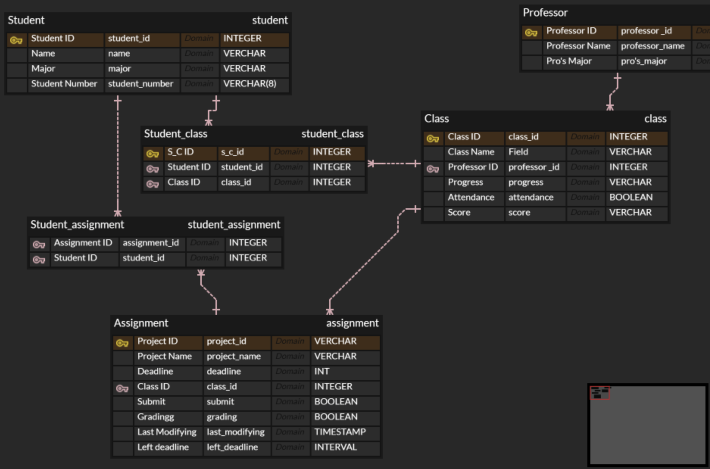

작년 아기사자 시절 과제로 낸^^. 학습에 참고하지 마시길..ㅋㅋ..

### 📌 ERD를 왜 사용하는 것인가!!

- 데이터 구조를 쉽게 이해할 수 있음
- 테이블 간의 관계를 미리 설계하여 오류를 방지할 수 있음
- 개발자, 기획자, 디자이너가 함께 데이터 흐름을 논의할 수 있음

---

## 1️⃣ ERD의 기본 구성 요소

ERD는 크게 **개체, 속성, 관계**로 이루어져 있어요!

### 1. 개체(Entity) → 테이블

- 개체(Entity)는 데이터베이스에서 저장할 정보의 유형 또는 객체를 나타냄
- ex) 사람… 물체… 개념…
- 데이터베이스에서 각 개체는 테이블로 표현됨

---

### 2. 속성 = 컬럼

- 테이블에 저장되는 데이터의 속성을 나타냄

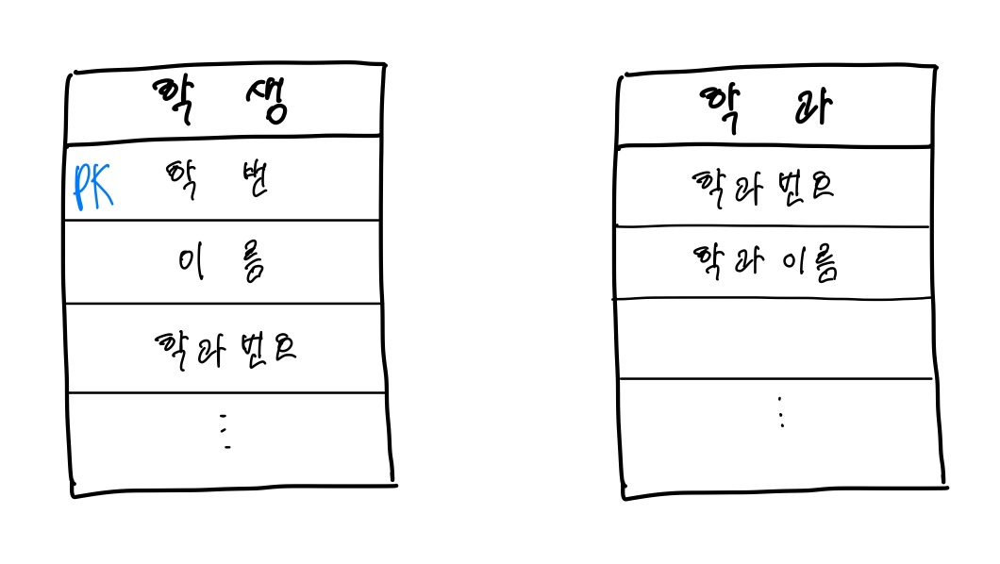

**🧐 PK(Primary Key) 란?**

- Primary Key(기본 키)는 **테이블 내 각 행(Row)을 고유하게 식별**하기 위한 필드입니다.
- 한 테이블 안에서 **중복되지 않는 값**이어야 하며, **절대 NULL이 될 수 없습니다.**
- 예를 들어, 주민등록번호나 학번처럼 **각 데이터를 유일하게 구분할 수 있는 값**이 PK가 될 수 있습니다.
- 실제 엔티티를 생성할 때에는 **데이터 안정성과 관리 편의성**을 위해 보통 `id`라는 이름의 **숫자형 자동 증가 값**을 만들어 PK로 사용합니다.

- 그렇다면 학과 테이블의 PK는?
    - 학과 번호
        - 학과 이름은 같을 수 있더라도, 학과번호가 같다면 학과를 판별할 수 없는 문제가 발생합니다.
        사람의 이름은 같을 수 있더라도 주민등록번호가 같을 수 없는 것과 같은 맥락입니다.

---

### 3. 관계 = 테이블 간의 연결

- 하나의 테이블이 다른 테이블과 어떻게 연결되는지를 표시함

📌 **관계의 유형으로는..**

- 1:1 관계
- 1:N 관계
- M:N 관계

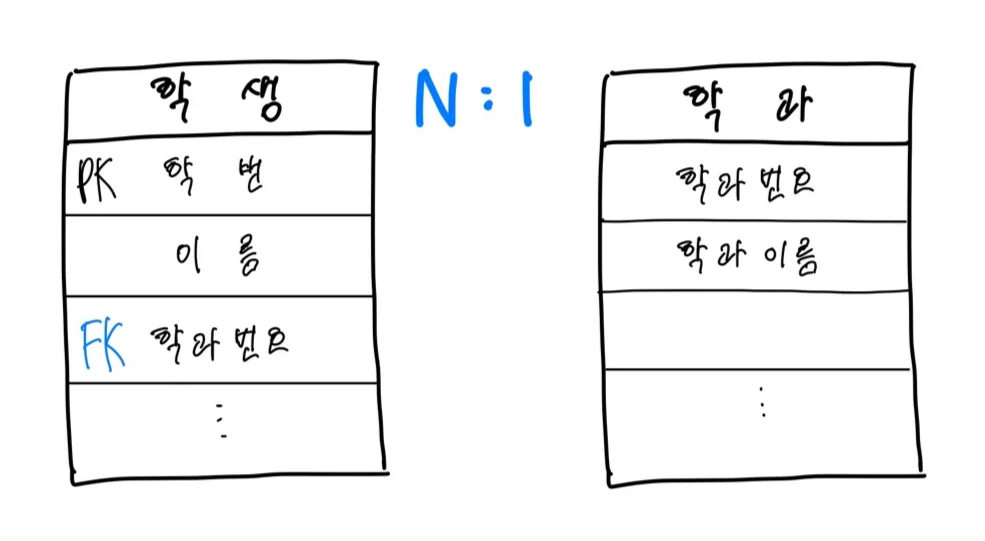

✔ **학생과 학과의 관계를 생각해봅시다.**

- 각 학생은 하나의 학과에만 속할 수 있음
    - 복수전공은 고려하지 않도록 할게요.
- 하나의 학과에는 여러 명의 학생이 소속될 수 있음

      **→ 즉, 학생과 학과는 1:N 관계**

✔ **학생 테이블에 학과 정보를 저장하려면..?**

이를 데이터베이스에서 표현하려면 학과 테이블의 PK를 학생 테이블의 FK로 설정해야 함!

→ 각 학생이 어느 학과에 속해 있는지 쉽게 알 수 있음

→ 예를 들어 만약 ‘멋대’라는 학생이 속한 학과 이름이 궁금하면?

1. student 테이블에서 ‘멋대’ 학생의 id(PK → 학번)로 해당 행을 찾고
2. 조회된 행에서 멋대의 dept_id(FK)를 확인한 뒤,
3. department 테이블에서 해당 dept_id에 대응하는 dept_name을 조회하는 방식! 

**🧐 FK(Foregin Key) 란?**

- 다른 테이블의 Primary Key(PK)를 참조하는 컬럼
- 테이블 간의 관계를 연결해주는 다리 같은 역할
- → 다른 테이블의 정보를 조회하고 싶을 때, 그 길을 열어주는 역할!

- ❓왜 `id` 쓴다고 했는데  `dept_id` 를 확인하나요? `dept_id`는 department의 PK아닌가요? 그러면`id` 여야 하는 거 아닌가요?
    - 기본적으로 각 테이블의 PK는 id로 짓지만!
    - **다른 테이블과 연결(FK)될 때**는 헷갈릴 수 있기 때문에,
    명확하게 구분해주기 위해 이름에 테이블 이름을 붙여서 사용해요.
    
    ✔ 그래서 `department` 테이블에서는 그냥 `id`지만,
    
    ✔ `student` 테이블에서는 그걸 참조하는 FK **칼럼 이름**을 `dept_id`라고 짓는 겁니다!
    

### 🤨왜 학생 테이블에 학과의 PK를 넣나요?

**만약 반대로 학과 테이블에서 학생 PK를 FK로 가진다면..???**

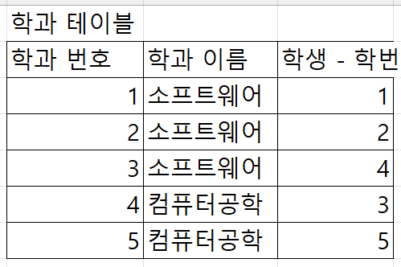

- **❌ 학과 테이블이 학생 개수만큼 늘어나야 함**
    
     **-** 학생이 늘어날 때마다 학과 테이블에 새로운 FK가 필요하게 됨 → **비효율적!**
    
- ❌ **한 학과에 여러 학생을 저장할 방법이 없음**
    
     **-** 학과 테이블이 학번(학생 테이블의 PK)를 FK로 가진다면, 한 개의 학과에 여러 명의 학생을 매핑할 수 없음
     - 즉, 학과는 단 하나의 학생만 가질 수 있는 구조가 되어버림 → **올바른 1:N 관계를 표현할 수 없음**
    
- ❌ **학과가 먼저 존재해야 하는데, 학생이 없으면 학과도 추가할 수 없게 됨**
    
     **-** 학과는 학생이 없어도 존재할 수 있어야 함
     - 하지만 FK가 학과 테이블에 있다면, **학과를 추가할 때 반드시 학생 ID가 필요함 → 데이터 구조가 비정상적이 됨**
    

이렇게 

- PK를 가지며 다른 테이블에서 FK로 참조되는 테이블을 → **주인 테이블**
- FK로 받는 테이블을 → **종속 테이블**

이라고 합니다. 즉, 

- **학과(Department) 테이블**
    - `학과번호`를 **PK**로 가짐
    - 다른 테이블(학생 테이블)에서 이 PK를 **FK로 참조**함
        
        → 따라서 **주인 테이블**
        
- **학생(Student) 테이블**
    - `학과번호`를 **FK**로 가짐
        
        → 따라서 **종속 테이블**
        

## 🔄 이 구조가 말하는 의미는?

> “학생은 어떤 학과에 반드시 속해야 한다” 는 의미이고,
> 
> 
> **“학과는 학생이 없어도 존재할 수 있다”** 는 관계를 표현한 것입니다.
> 

---

## 2️⃣ 관계 유형

관계는 크게 ‘행동’과 ‘소속’ 으로 나눌 수 있습니다. 
누가 행동하고, 또 어떤 테이블이 소속되고 소속하는지를 생각해 봅시다!

- **카디널리티 (Cardinality)
:** 테이블간의 수적 관계를 명시하는 표현
    - **1:1 관계**
        
        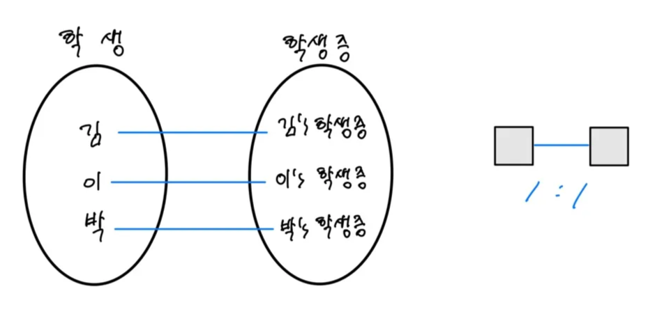
        
    
    - **1:N 관계**
        
        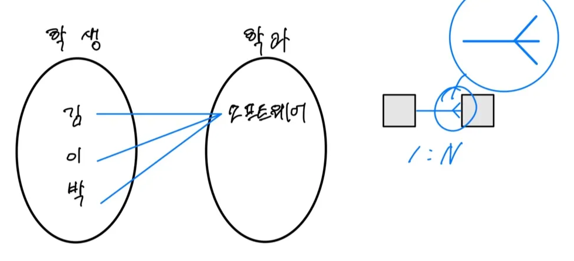
        
    - **N:M 관계**
        
        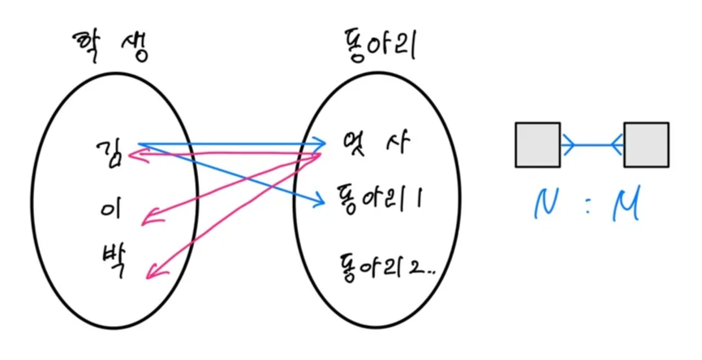
        
 

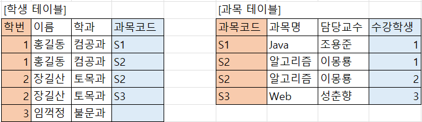

데이터 모델링에서는 **N:M 관계를 완성되지 않은 모델**이라고 간주합니다. 

→ 여기 저기 데이터가 중복해서 등장하게 되고, 데이터를 수정할 때에 더욱 많은 데이터를 수정해야 합니다. 

https://goodteacher.tistory.com/466

→ 그래서 중간 테이블을 만들어 두 엔티티의 관계를 **1:N, N:1**로 조정하는 작업을 해줍니다.

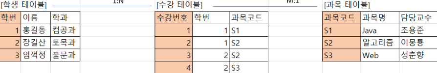

 

- **관계의 참여도 (Optionality)**
: 어떤 개체가 다른 개체와의 관계에 **반드시 참여해야 하는지** 여부를 나타냄
    
    : 각 테이블의 입장에서 다른 테이블을 생각해봅시다!! 🧹🧹
    
    - **선택 참여 (Optional)** : ‘있을 수도 있고 없을 수도 있다’ 라는 의미
    
    → ex) 학생은 동아리를 가입할 수도 있고, 가입하지 않을 수도 있어요. 즉, 학생의 입장에서는 동아리와의 관계가 선택적입니다. 
    
    → ERD에서는 O로 표현합니다.
    
    - **필수 참여 (Mandatory)** : ‘무조건 있어야 한다’ 라는 의미를 담고 있음
    
    → ex) 하나의 동아리는 반드시 학생이 있어야 의미가 있습니다. 즉, 동아리의 입장에서는 학생과의 관계가 필수적입니다. 
    
    →  ERD에서는 | 로 표현합니다.
    
    💡 ‘|’ 는 참여 제약, 수량 제약 두 가지 의미로 사용됩니다!
    
    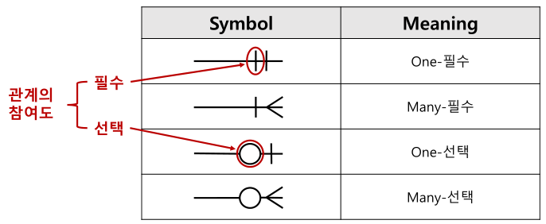
    
- **식별자/비식별자 관계**
    - 식별자 관계
        - 부모 테이블의 기본 키(PK)를 자식 테이블이 가지고 있으며 이를 기본 키(PK)로 사용하는 경우 → **PK + FK**가 동시에 걸리는 관계
        - ERD에서 실선으로 표현됨.
        - ex) 주문 - 주문상세 에서는 주문 테이블의 id(PK)를 주문상세 테이블의 PK로도 사용할 수 있음.
            
            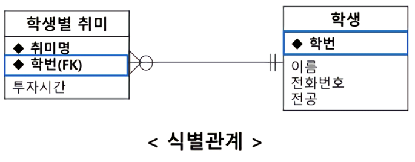
            
    - 비식별자 관계
        - 부모 테이블의 기본 키(PK)를 자식 테이블이 가지고 있지만 이를 기본 키(PK)로 사용하지 않을 때 사용 → **FK로만 존재**
        - ERD에서 점선으로 표현됨.
            
            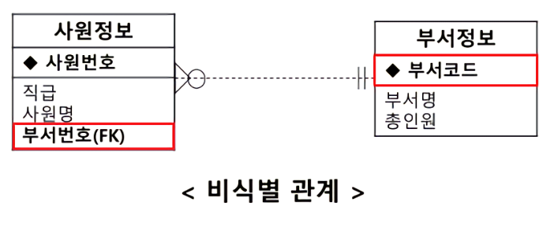
            

---

## 3️⃣ 예제

주소창에 [erdcloud.com](http://erdcloud.com) 검색 🔍

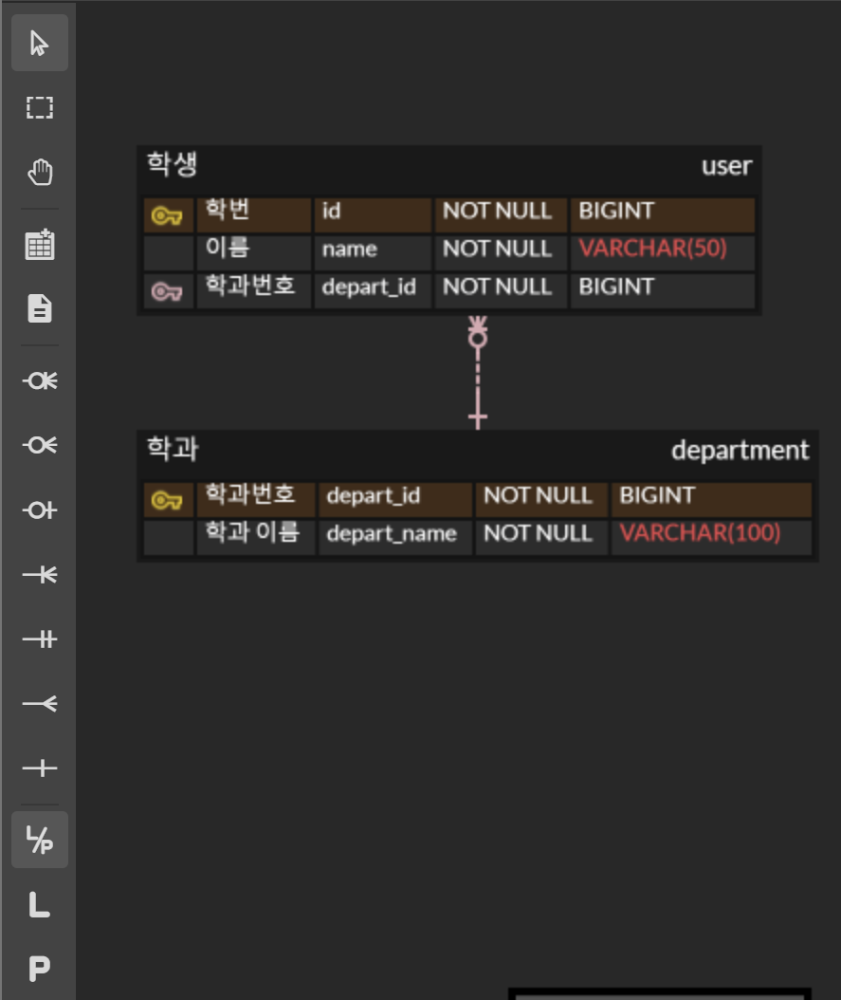

1. 네 번째 아이콘을 눌러 엔티티 생성
2. 노란색 네모🟨를 눌러 PK 추가
3. FK를 제외한 필드 추가
4. 옆에 아이콘을 누르고 엔티티들을 선택해 관계 생성
5. 식별/비식별 선택

사장 프로젝트에 적용해봅시다! 

(편의를 위해 조건 몇 가지를 추가하고자 합니다.)

- 상품 종류 하나씩만 주문할 수 있음 ( 개수는 상관 x) (즉 장바구니 없음!)
- 상품의 재고는 무제한
- 사용자가 사용할 수 있는 돈은 무제한 → 즉, 결제 인증 과정 필요 x

- users, orders, item, category, category_item, refresh_token 테이블이 존재
