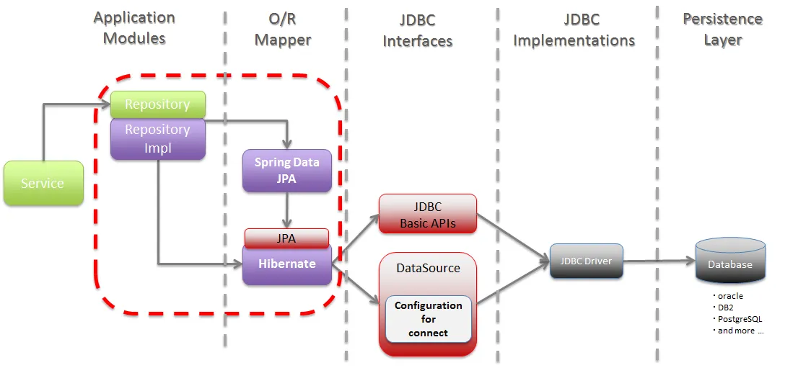
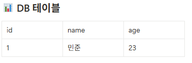
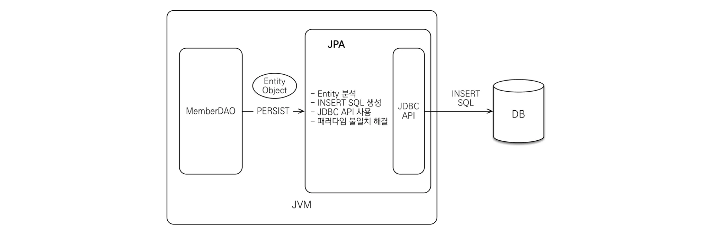
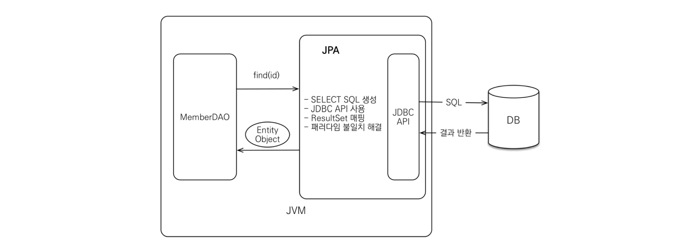
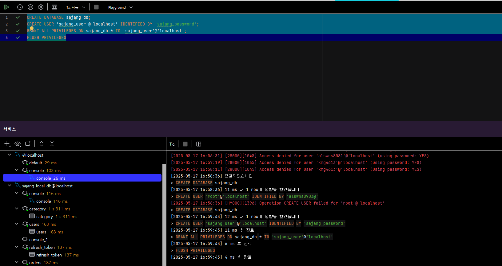
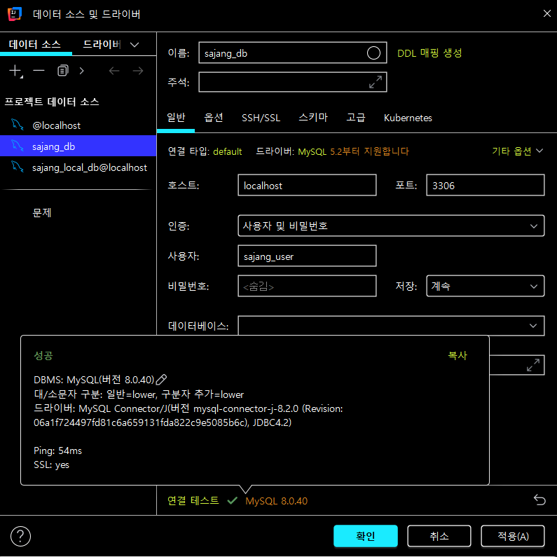

## 목표

- ORM과 JPA가 어떤 문제를 해결해주는지 이해합니다.
- Spring Data JPA의 흐름을 이해합니다.
- 엔티티 매핑, 연관관계, 영속성 컨텍스트 개념을 그림과 함께 매칭해 봅니다.

---

## JPA(Java Persistence API)란?

JPA는 **자바 애플리케이션**에서 **관계형 데이터베이스**를 다룰 수 있도록 **표준화된 인터페이스(규칙)** 을 제공해주는 기술입니다.

즉, JPA 자체는 기능을 직접 제공하는 라이브러리는 아니며, **"이런 방식으로 구현하면 자바 코드만으로 DB를 다룰 수 있다"**는 약속을 제공합니다.



- JPA는 스프링이 만든 기술이 아니고,  `JAVA`에서 제공하는 API입니다!
- 표준 인터페이스를 제공하기 때문에 구현체(Hibernate 등)를 바꾸더라도 코드 수정은 최소화됩니다.
- ORM 기반이므로 **자바 클래스와 DB 테이블** 간의 매핑을 통해 동작합니다. **SQL 자체를 다루지 않습니다.**

---

## Hibernate는 어떤 역할인가?

Hibernate는 대표적인 JPA 구현체입니다.

- 자바 객체 ↔ 테이블 자동 매핑
- SQL 자동 생성 및 실행 (`@Entity` 기반)

```
@Entity
public class User {
    @Id @GeneratedValue
    private Long id;
    private String email;
    private String password;
}
```

이렇게 객체를 만들면 Hibernate가 알아서 INSERT/UPDATE SQL을 만들어 실행합니다.

---

## ORM(Object‑Relational Mapping)이란?

| 개념 요약 | 설명 |
| --- | --- |
| **데이터 ↔ 객체 자동 매핑** | 테이블의 행(Row)을 자바 객체의 필드에 자동으로 매핑합니다. |
| **SQL 대신 메서드** | `save()`, `find()` 같은 메서드로 INSERT/SELECT 작업을 수행합니다. |
| **연관관계·상속 처리** | 자바 객체 간의 관계를 분석해 자동으로 JOIN SQL이나 상속 전략을 적용합니다. |
| **지속성 API** | 영속성 컨텍스트, 캐시, 트랜잭션 동기화를 지원합니다. |

### **데이터 ↔ 객체 자동 매핑**

```java
public class Person {
    String name;
    int age;
}
```



- 자바는 위와 같이 **객체 중심**으로 저장을 하지만, 데이터베이스는 **테이블 형태**로 저장을 합니다.
    - ORM은 이 둘을 이어주는 다리 역할로, 우리는 객체만 가지고 작업을 진행하면 되고, ORM은 이를 테이블과 알아서 연결해주는 역할을 합니다.

### **SQL 대신 메서드**

> 기존 방식 (JDBC)
> 
> 
> 우리가 만약 회원 정보를 저장하려면 아래처럼 SQL을 직접 작성해야 합니다.
> 

```sql
INSERT INTO member (username, age) VALUES (?, ?)
```

그리고 이걸 자바 코드로 작성하면…

```java
Connection conn = ...;
PreparedStatement pstmt = conn.prepareStatement("INSERT INTO member ...");
pstmt.setString(1, "minjun");
pstmt.setInt(2, 23);
pstmt.executeUpdate();
```

😵‍💫 복잡하고 귀찮고, 실수하기도 쉽습니다.

---

> 하지만 JPA + ORM 방식을 사용하면
> 

```java
Member member = new Member("minjun", 23);
memberRepository.save(member);
```

그냥 **객체를 만들고 메서드를 호출**하면 됩니다! (훨씬 간단하죠?)

### **연관관계 처리**

**예시 상황:**

회원(Member)과 팀(Team) 정보가 있고, 회원은 하나의 팀에 소속될 수 있습니다. (1:N 관계)

> DB 테이블 기준
> 
- `member` 테이블에 `team_id` FK 컬럼이 존재
- `team` 테이블과 JOIN을 해야 팀 이름을 가져올 수 있음

---

> JPA에서는 객체 간의 연관관계를 이렇게 표현합니다:
> 

```java
@Entity
public class Member {
    @Id @GeneratedValue
    private Long id;

    private String name;

    @ManyToOne
    private Team team; // 객체로 직접 참조!
}
```

우리는 `team_id` 같은 FK 숫자가 아니라,

**진짜 Team 객체 자체를 참조**하는 것입니다!

---

📌 그리고 이렇게 하면 JPA가 알아서 JOIN 쿼리까지 만들어줍니다.

```java
member.getTeam().getName();
```

### **지속성 API**

JPA는 단순히 데이터를 저장하거나 조회하는 것뿐만 아니라,

**데이터가 변경되었는지도 자동으로 감지해서 SQL을 실행해주는 기능**을 제공합니다.

이러한 기능을 가능하게 하는 것이 바로 **영속성 컨텍스트**입니다.

---

**예시 상황**

회원 정보를 수정하려고 합니다.

이전 방식(JDBC)에서는 다음과 같은 과정을 거쳐야 했습니다:

```sql
UPDATE member SET name = '민준' WHERE id = 1;
```

그리고 이를 자바 코드로 바꾸면:

```java
Connection conn = ...;
PreparedStatement pstmt = conn.prepareStatement("UPDATE member SET name = ? WHERE id = ?");
pstmt.setString(1, "민준");
pstmt.setLong(2, 1L);
pstmt.executeUpdate();
```

😵 꽤 번거롭고, 실수할 여지도 많습니다.

---

**JPA + 영속성 컨텍스트**

JPA에서는 아래처럼 간단하게 처리됩니다:

```java
Member member = memberRepository.findById(1L).get();
member.setName("민준"); // 이름만 바꿔도
```

별도로 `save()`나 `update()`를 호출하지 않아도,

**트랜잭션이 끝나는 시점에 UPDATE 쿼리가 자동으로 실행**됩니다.

📌 이러한 동작을 **더티 체킹(Dirty Checking)** 이라고 부릅니다.

### 💡 왜 가능한가요?

- 조회된 엔티티(`member`)는 **영속성 컨텍스트라는 공간에 저장**되어 관리됩니다.
- JPA는 이 객체의 처음 상태(스냅샷)을 기억하고 있다가,
- 트랜잭션 종료 시점에 **처음 상태와 지금 상태를 비교**해서 변경이 있으면 UPDATE SQL을 생성합니다.

---

## JPA를 사용해야 하는 이유

- **객체 중심의 개발이 가능해집니다**
    
    → SQL이 아닌 도메인 모델(예: 회원, 주문 등 자바 클래스) 위주로 설계할 수 있습니다.
    
- **반복되는 코드 작성을 줄여줍니다**
    
    → JDBC, PreparedStatement 등 복잡한 코드 없이 CRUD 처리가 가능합니다.
    
- **유지보수가 쉬워집니다**
    
    → 테이블 컬럼이 변경되더라도 자바 클래스만 수정하면 됩니다. JPA가 SQL을 자동으로 생성해줍니다.
    
- **패러다임 불일치를 해결해줍니다**
    
    → 자바의 상속, 컬렉션 등 객체지향 개념을 SQL에 자동으로 매핑해줍니다.
    
- **다양한 부가기능을 제공합니다**
    
    → 1차 캐시, 더티 체킹, 벌크 INSERT 최적화 등 성능 향상 기능을 기본으로 제공합니다.
    

---

### Spring Data JPA란?

Spring Data JPA는 “JPA → 하이버네이트” 위에 **Repository 추상화**를 한 단계 더 씌운 스프링 모듈입니다. `JpaRepository` 같은 인터페이스만 구현하면 스프링이 CRUD(Create, Read, Update, Delete)
메서드·쿼리 메서드 구현체를 자동으로 만들어 빈으로 등록해줍니다.

- **Repsitory란 뭘까요?**
    
    Spring 계층 구조에 대해서 다음주에 설명할 예정인데, 간단하게 설명하자면 **데이터 접근을 전담하는 창구**라고 볼 수 있습니다.
    주로 데이터베이스 또는 다른 저장소에 저장된 객체를 읽고 쓰기 위한 전용 인터페이스에요!
    
- **Bean으로 등록해준다는 것은 또 뭘까?**
    
    > Spring이 객체를 대신 만들어 두고, 필요할 때 이름만 부르면 꺼내 쓸 수 있도록 컨테이너(Bean Container)에 보관한다 는 뜻입니다.
    > 
    - **Bean**이란 **Spring이 관리하는 객체**입니다. (수명·의존성 모두 Spring 책임)

```
[우리가 작성한 코드] → [Spring Data JPA] → [Hibernate] → [JPA Spec] → [DB SQL 실행]
```

> Repository 인터페이스 이름 규칙만 맞추면 findByUsernameAndAgeGreaterThan() 같은 메서드가 자동으로 JPQL 쿼리를 생성합니다.
> 
- **JPQL(Java Persistence Query Language)이란?**
    
    JPQL은 **엔티티와 필드 이름으로 작성하는 객체 지향 쿼리 언어**입니다.
    
    SQL과 비슷하지만, **테이블 이름이 아니라 자바 클래스 이름을 사용**합니다.
    
    - SQL → `SELECT * FROM member`
    - JPQL → `SELECT m FROM Member m` ← 여기서 `Member`는 테이블이 아니라 **엔티티 클래스** 이름
        
        스프링 Data JPA는 `findByUsernameAndAgeGreaterThan()` 같은 메서드명을 JPQL로 자동 번역해 줍니다.
        

---

## JPA 동작 과정 요약





| 단계 | JPA 내부 처리 | DB에 일어나는 일 |
| --- | --- | --- |
| `persist(newUser)` | 새 객체를 1차 캐시에 저장하고 INSERT 문장을 생성합니다. | INSERT 실행 → 새 행이 저장됩니다. |
| `find(1L)` | 먼저 캐시에서 찾고, 없으면 SELECT 쿼리를 전송하여 캐시에 올립니다. | SELECT 실행 → 결과를 받아옵니다. |

---

# 영속성

> 데이터를 생성한 프로그램이 종료되어도 사라지지 않고 유지되는 특성을 말합니다.
> 

JPA에서의 영속성은 **영속성 컨텍스트**라는 내부 저장소에 엔티티를 보관함으로써 이루어집니다.

## JPA에서의 영속성


 JPA의 핵심 내용은 엔티티가 `영속성 컨텍스트`에 포함되어 있냐 아니냐로 갈립니다. JPA의 `엔티티 매니저`가 활성화된 상태로 트랜잭션(@Transactional) 안에서 DB에서 데이터를 가져오면 이 데이터는 영속성 컨텍스트가 유지된 상태입니다.

 이 상태에서 해당 데이터 값을 변경하면 **트랜잭션이 끝나는 시적에 해당 테이블에 변경 내용을 반영하게 됩니다.** 따라서 우리는 엔티티 객체의 필드 값만 변경해주면 **별도로 update()쿼리를 날릴 필요가 없게 됩니다!**

위에서 설명했듯이 이 개념을 `더티 체킹`이라고 합니다.

> Spring Data Jpa를 사용하면 기본으로 엔티티 매니저가 활성화되어있는 상태

영속 컨텍스트: 엔티티를 담고 있는 집합으로, JPA는 영속 컨텍스트에 속한 엔티티를 DB에 반영합니다. 

엔티티를 검색, 삭제, 추가 하게 되면 영속 컨텍스트의 내용이 DB에 반영된다.

영속 컨텍스트는 직접 접근이 불가능하고 Entity Manager를 통해서만 접근이 가능하다.

엔티티: 자바 내에서 @Entity 어노테이션을 붙인 클래스
> 

([https://velog.io/@adam2/JPA는-도데체-뭘까-orm-영속성-hibernate-spring-data-jpa#jpa-동작-과정](https://velog.io/@adam2/JPA%EB%8A%94-%EB%8F%84%EB%8D%B0%EC%B2%B4-%EB%AD%98%EA%B9%8C-orm-%EC%98%81%EC%86%8D%EC%84%B1-hibernate-spring-data-jpa#jpa-%EB%8F%99%EC%9E%91-%EA%B3%BC%EC%A0%95)) (https://suhwan.dev/2019/02/24/jpa-vs-hibernate-vs-spring-data-jpa/) 참조

## 🔑 핵심 용어 한눈에 보기

| 용어 | 한 마디 설명 | 기억 포인트 |
| --- | --- | --- |
| **영속성 컨텍스트** | 트랜잭션 동안 **엔티티를 잠시 보관**해 두는 JPA 전용 ‘메모장’ | • 같은 PK 객체는 한 번만 생성• 더티체킹·캐시 기능의 근거지 |
| **더티체킹** *(Dirty Checking)* | “엔티티 값이 바뀌었네?”를 JPA가 눈치채서 **UPDATE SQL을 자동**으로 만든다 | • 비교 대상 = **스냅샷**• SQL은 `flush`(=커밋 직전) 시점에 생성 |
| **EntityManager** | 영속성 컨텍스트를 **조종하는 리모컨** | • `persist` (등록) / `find` (조회) / `remove` (삭제)• `flush`·`clear`도 여기서 호출 |
| **지연 로딩** *(LAZY)* | 연관 엔티티를 **가짜 프록시**로 두고, 실제 값이 필요할 때 SELECT | • 쿼리 수 줄지만 **N+1** 위험• 기본 전략: `@ManyToOne(fetch = LAZY)` |
| **즉시 로딩** *(EAGER)* | 엔티티를 가져올 때 **JOIN으로 한꺼번에** 연관 데이터까지 조회 | • 편하긴 하지만 필요 없는 JOIN이 나갈 수 있어 **신중히 사용** |

# Mysql 연결을 해보고 집에 가자 (앞으로 편해지기 위해서)

### 1) DB·계정·권한 스크립트

아래 스크립트를 복사해 MySQL CLI(또는 Workbench)에서 실행하면 **`sajang_db`** 데이터베이스와 전용 계정이 한 번에 설정됩니다.

```sql
CREATE DATABASE sajang_db;
CREATE USER 'sajang_user'@'localhost' IDENTIFIED BY 'sajang_password';
GRANT ALL PRIVILEGES ON sajang_db.* TO 'sajang_user'@'localhost';
FLUSH PRIVILEGES;
```



> 확인용 명령
> 
> 
> ```sql
> # CLI 접속 후 실행
> mysql -u root -p
> ```
> 
> ```bash
> SHOW DATABASES;
> ```
> 

✔ `SHOW DATABASES;` → `sajang_db` 확인

---

### 2) IntelliJ → Database 탭 연동

1. 오른쪽 Database 탭 `+` → **Data Source > MySQL**
2. Host `localhost`, Port `3306`, DB `sajang_db`
3. User `sajang_user` / PW `sajang_password` → **Test Connection** ✅



---

## 🛠️ Spring Boot 프로젝트 세팅 (MySQL 버전)

### 1) build.gradle 의존성

```groovy
dependencies {
    implementation 'org.springframework.boot:spring-boot-starter-data-jpa'
    implementation 'org.springframework.boot:spring-boot-starter-web'
    runtimeOnly   'com.mysql:mysql-connector-j:8.3.0'
    compileOnly   'org.projectlombok:lombok'
    annotationProcessor 'org.projectlombok:lombok'
    developmentOnly 'org.springframework.boot:spring-boot-devtools'
    testImplementation 'org.springframework.boot:spring-boot-starter-test'

```

> MySQL Driver(mysql-connector-j) 빠뜨리지 말기!
> 

### 2) application.yml

```yaml
spring:
  datasource:
    url: jdbc:mysql://localhost:3306/sajang_db
    username: sajang_user
    password: sajang_password
    driver-class-name: com.mysql.cj.jdbc.Driver
  jpa:
    hibernate:
      ddl-auto: create   # 첫 실행 시 테이블 자동 생성
    show-sql: true
    properties:
      hibernate:
        format_sql: true
```
