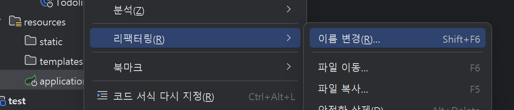
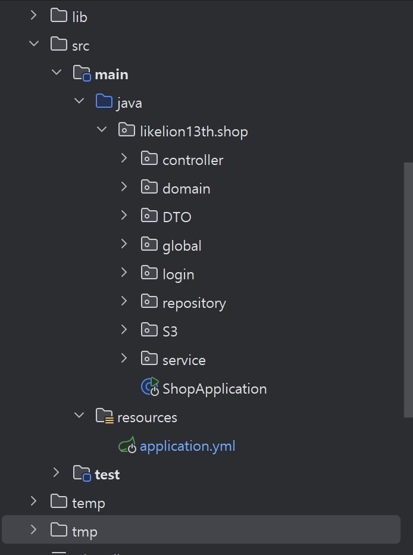
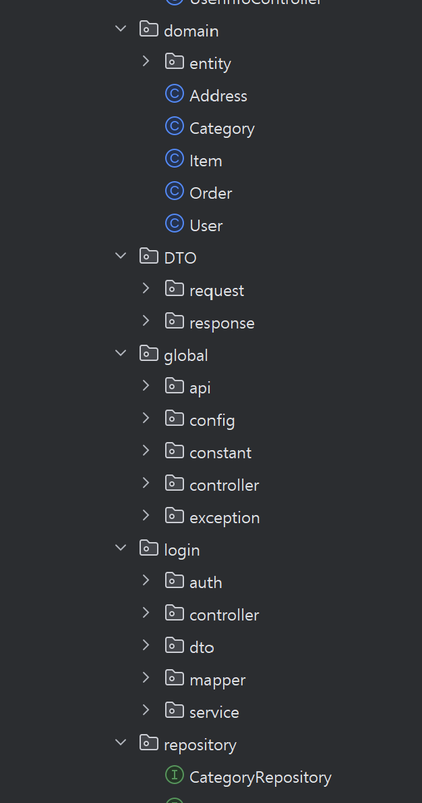
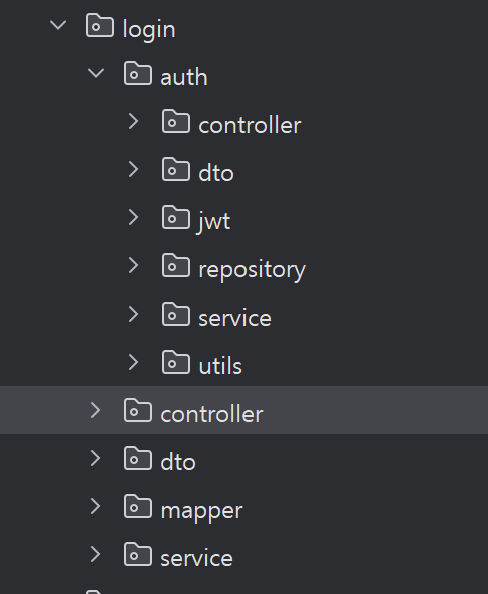

## 🌐 **API란?**

### 🔹 **API (Application Programming Interface)**

- 프로그램끼리 서로 소통할 수 있게 해주는 "규칙"이자 "통신 창구" 같은 것.
- 즉, 한 프로그램이 다른 프로그램에 요청하고, 결과를 받아오는 약속된 통신 규칙입니다!

### 🔹 **API의 역할**

- 서로 다른 프로그램(프론트 ↔ 백엔드)이 소통할 수 있게 함
- 개발자가 **내부 로직을 몰라도**, 규칙만 알면 사용할 수 있음
- 다양한 서비스(앱, 웹, 프로그램)를 연결하는 핵심 기술!

### 🔹 **ex) GPT API를 사용한다는 건?**

- OpenAI가 운영하는 GPT 모델에 요청을 보내서 결과를 받아오는 것을 의미합니다!
- OpenAI의 GPT API는 **GPT 모델을 이용할 수 있게 만든 "창구"**를 제공해줘요.

**✅ GPT API 사용 흐름**

1️⃣ 개발자가 OpenAI의 GPT API에 요청(Request)을 보냄

2️⃣ GPT 모델이 그 요청을 처리하고 응답(Response)을 반환 

3️⃣ 개발자는 그 응답을 받아서 프로그램에 표시하거나 사용

---

## 🌐 **REST API란?**

🔹 **REST (Representational State Transfer)**
: 웹에서 **자원(데이터)을 HTTP로 주고받는 API를 설계할 때 지켜야 할 규칙과 스타일**

### 🔹 **REST API란?**

- REST의 규칙을 지켜서 만든 **웹 API**예요.

**👉REST의 기본 원칙**

| 원칙 | 설명 |
| --- | --- |
| **자원의 이름 (URI)** | 모든 자원(데이터)는 고유한 URI(자원의 식별자 전체 의미)로 식별해야 함.
 |
| **표준 HTTP 메서드로 행위 표현** | 자원에 대한 행위(조회, 생성, 수정, 삭제)를 HTTP 메서드(`GET`, `POST`, `PUT`, `DELETE` ,`PATCH` )로 나타냄. |
| **무상태성** | 서버는 요청 간의 상태를 저장하지 않음. |
| **계층 구조** | 클라이언트 ↔ 서버 사이에 중간 계층 (캐시, 로드밸런서 등)을 둘 수 있음 |
- URI 에는 **동사를 사용 X**
- 동사는 **HTTP methods 로 표현**

### 📌 HTTP methods 요약

| 메서드 | 의미 |
| --- | --- |
| **GET** | 데이터 조회 (읽기) |
| **POST** | 새 데이터 생성 |
| **PUT** | 데이터 전체 수정 (대체) |
| **PATCH** | 데이터 일부 수정 |
| **DELETE** | 데이터 삭제 |

**예를 들어 사용자(User)라는 자원을 REST 규칙에 따라 설계하면!**

- `GET /users` : 사용자 리스트 조회
- `POST /users` : 새 사용자 생성

- `PUT /users/{userId}` : 특정 사용자 전체 수정
- `PATCH /users/{userId}` : 특정 사용자 일부 수정
- `DELETE /users/{userId}` : 특정 사용자 삭제
- `GET /users/{userId}` : 특정 사용자 조회

👉 URI 그대로 놔두고, HTTP 메서드만 바꿔도 행위가 달라짐..!

### 🔹 **REST API의 장점**

- **HTTP 표준을 사용해 이해하기 쉽고, 확장성이 좋음**
- **클라이언트-서버 구조로 역할이 분리되어 개발 편리**
- **무상태성으로 서버가 단순하고, 확장성 좋음**

---

# 🔍 Swagger 란?

: 개발한 REST API를 문서화하고, 시각적으로 관리할 수 있게 도와주는 툴

→ 이를 활용해 **프론트엔드 개발자, 테스터, 기획자** 등 **제3자가 API를 쉽게 이해하고 테스트**할 수 있습니다

### 장점

- API 설명서 자동 생성
- API  호출/테스트 가능
- 테스트 코드 없이도 API 동작 확인 가능

---

(사장 스웨거 소개)

---

## **🛠️  Swagger 설정 방법**

1️⃣ **build.gradle 에 의존성 추가** 

```java
dependencies {
		// Swagger
    implementation 'org.springdoc:springdoc-openapi-starter-webmvc-ui:2.2.0'
}
```

- `build.gradle` : 프로젝트 빌드에 필요한 의존성, 플러그인, 빌드 설정 등을 정의 → intellJ가 자동으로 다운로드하고 빌드합니다!
- `springdoc-openapi`는 Swagger(OpenAPI) 기반의 라이브러리로, API 문서화와 Swagger UI를 쉽게 연동해줍니다.

2️⃣  **application.yml에 Swagger UI 경로 설정**

먼저, application.properties를 찾아 

**.yml** 로 고쳐주세요.



```java
springdoc:
  swagger-ui:
    path: /swagger  # Swagger UI 접속 경로를 /swagger로 설정
    display-request-duration: true  # 요청 소요시간을 UI에 표시
  api-docs:
    enabled: true  # OpenAPI Docs (JSON) 활성화
    path: /v3/api-docs  # OpenAPI Docs 접근 경로
  cors:
    enabled: true  # CORS 허용 설정
```

- `application.yml` :
    - Spring Boot 애플리케이션의 설정 파일
    - 서버 포트, DB 연결 정보, 스프링 설정 등을 key-value 형식으로 정의
- 접속 URL :  **http://localhost:8080/swagger**
- `api-docs.path`는 Swagger 내부적으로 OpenAPI 문서를 `/v3/api-docs` 경로로 제공.
- `cors.enabled: true`는 CORS를 Swagger 문서 API에서 허용해주어 프론트엔드가 같은 경로로 Swagger Docs를 호출할 때 문제를 막아줌.

3️⃣ **컨트롤러에 API 문서화 어노테이션 추가** 

```java
@RestController
@RequestMapping("/users")
@Tag(name = "회원", description = "회원 관련 API 입니다.")
public class UserController {

    @Operation(summary = "사용자 조회", description = "사용자의 정보를 조회합니다.")
    @GetMapping("/{userId}")
    public ResponseEntity<UserResponseDto> getUser(@PathVariable Long userId) {
        return ResponseEntity.ok(new UserResponseDto(userId, "홍길동"));
    }
}
```

- `@Tag` : API 그룹을 분류하고 설명할 때 사용하는 어노테이션
- `@Operation` :
    - API의 요약(summary)과 자세한 설명(description)을 작성할 수 있어요!
    - Swagger UI에 API의 설명을 자동으로 출력해줍니다.
    

4️⃣ **서버 실행 후 Swagger 접속**

**http://localhost:8080/swagger**

---

**세팅하는 김에 DB 설정도 해봅시다~!**

mysql -u root -p

[JPA 핵심 개념](https://www.notion.so/JPA-1f6f249f748880b0a91bcbfd5c716ee8?pvs=21) 

### 1) build.gradle 의존성

```groovy
dependencies {
    implementation 'org.springframework.boot:spring-boot-starter-data-jpa' // Spring Data JPA 사용하기 위한 의존성
    implementation 'org.springframework.boot:spring-boot-starter-web' // Spring MVC 사용하기 위한 의존성
    **runtimeOnly   'com.mysql:mysql-connector-j:8.3.0'
    // MySQL 데이터베이스 연결 드라이버**
    // 애플리케이션 실행 시(runtime)에만 필요한 의존성
    compileOnly   'org.projectlombok:lombok'
    // Lombok 라이브러리, 컴파일 시점에만 필요한 의존성
    annotationProcessor 'org.projectlombok:lombok'
    // Lombok 애노테이션 프로세서 , 컴파일 시 Lombok 애노테이션을 처리하고 코드를 생성.
    developmentOnly 'org.springframework.boot:spring-boot-devtools'
    // 개발 편의 기능
    testImplementation 'org.springframework.boot:spring-boot-starter-test'

```

> MySQL Driver(mysql-connector-j) 빠뜨리지 말기!
> 

### 2) application.yml

```yaml
spring:
  datasource:
    url: jdbc:mysql://localhost:3306/sajang_db
    username: sajang_user
    password: sajang_password
    driver-class-name: com.mysql.cj.jdbc.Driver
  jpa:
    hibernate:
      ddl-auto: create   # 첫 실행 시 테이블 자동 생성
    show-sql: true
    properties:
      hibernate:
        format_sql: true
```

- spring.jpa.hibernate.ddl-auto
    - 애플리케이션 시작 시 데이터베이스의 테이블 처리 방식을 정하는 옵션
    - 종류 : create (삭제 후 새로 생성), create-drop (
    시작 시 테이블 생성, 애플리케이션 종료 시 테이블 삭제), update (자동 수정)

---

### 쉬는 시간 가지기 전, 패키지 후다닥 만들어 봅시당







~~git push~~

---
