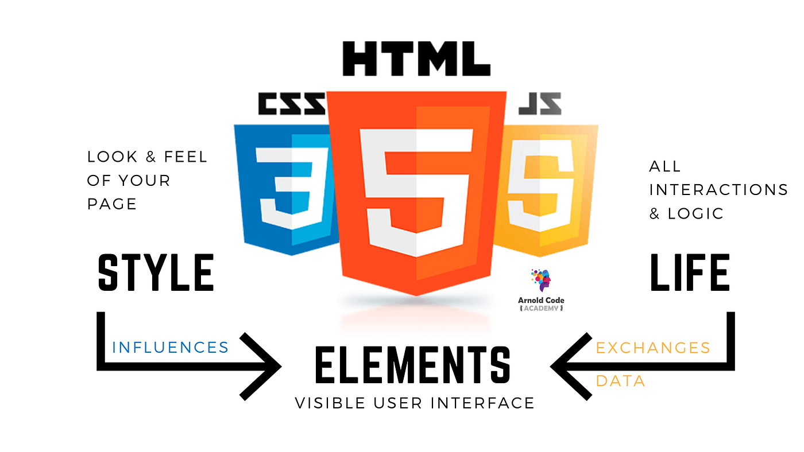

### **📌 HTML, CSS, JavaScript는 웹 개발의 필수 요소!**

> ***아래 언어별 상세 페이지에서 자세히 확인해보세요.***
> 

---

**HTML (HyperText Markup Language) -** 웹페이지의 **뼈대(구조)**를 담당하는 언어

→ [HTML](frontend/1.1. html.md)

---

**CSS (Cascading Style Sheets) -** 웹페이지의 **디자인(색상, 레이아웃, 폰트 등)**을 담당하는 언어

→ [CSS](1.2. css.md)

---

**JavaScript -** 웹페이지의 **동작(인터랙션, 애니메이션, 동적 기능)**을 담당하는 언어

→ [JavaScript](1.3. js.md)

