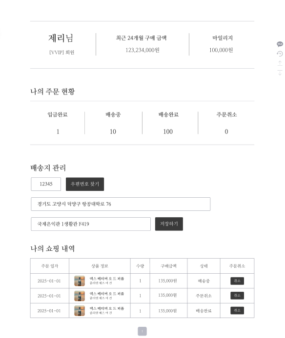
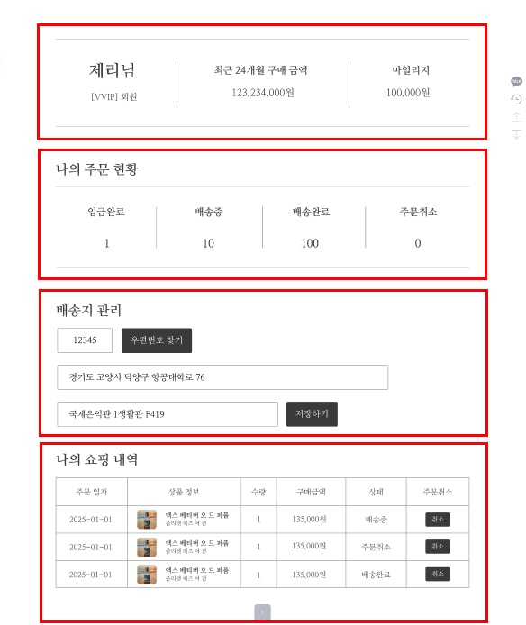
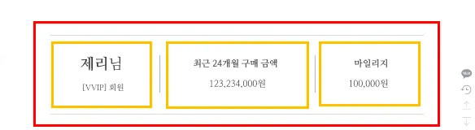
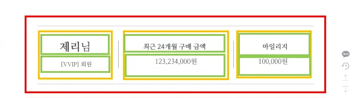
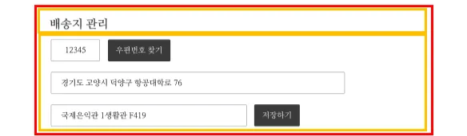
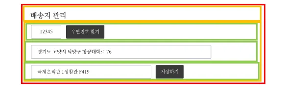
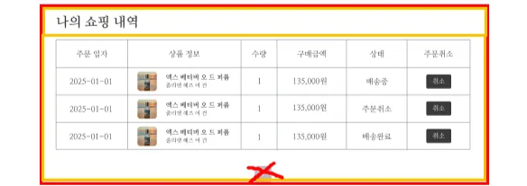

### 💡 오늘의 목표: 마이페이지 제작하기!

세부 목표:
- UseState에 대해 이해하기!
- OnChange 이벤트 이해하기!
- OnClick 이벤트 이해하기!
- Open API 사용하기!


---

### 📌 마이 페이지 디렉토리 구조

마이 페이지의 디렉토리 구조는 다음과 같습니다.

```scss
- Pages
    - Mypage
        - Address.js     # 주소 컴포넌트
        - History.js     # 주문 이력 컴포넌트
        ~~- Mypage.js      # Mypage 페이지~~
	      - Status.js      # 주문 현황 컴포넌트
        - Profile.js     # 사용자 프로필 컴포넌트
    - styles
        - Mypage.css # 스타일 파일
```

- 각 js 파일에 세팅
    
    ```jsx
    import React from "react";
    
    const 컴포넌트이름 = () => {
      return (
        <div>
    	    마이페이지
        </div>
      );
    };
    export default 컴포넌트이름;
    ```
    

### 📌 마이 페이지 디자인



- 1차 구조화
    
    
    

### 📍Mypage 페이지 제작

```jsx
import React from "react";
import "../../styles/Mypage.css";
import Profile from "./Profile";
import Status from "./Status";
import Address from "./Address";
import History from "./History";

const Mypage = () => {
  return (
    <div className="page-container">
      <Profile />
      <Status />
      <Address />
      <History />
    </div>
  );
};
export default Mypage;
```

```css
/* Mypage Base*/
.page-container {
    height: 100%;
    display: flex;
    flex-direction: column;
    justify-content: center;
    align-items: center;
    margin: 50px 80px;
    font-family: 'NanumMyeongjo', sans-serif;
}
```

### 📍Profile 컴포넌트 제작 (Profile.js)

- 2차 구조화
    
    
    
- 3차 구조화
    
    
    

**🚩1단계**

```jsx
import React from "react";

const Profile = () => {
  return (
    <div> {/* 빨간박스 */}
        <div> {/* 노란박스 */}
            <div></div> {/* 초록박스 */}
            <div></div> {/* 초록박스 */}
        </div>
        <div> {/* 노란박스 */}      
            <div></div> {/* 초록박스 */}
            <div></div> {/* 초록박스 */}
        </div>
        <div> {/* 노란박스 */}
            <div></div> {/* 초록박스 */}
            <div></div> {/* 초록박스 */}
	      </div>
    </div>
  );
};
export default Profile;
```

**🚩2단계**

```jsx
import React from "react";

const Profile = () => {
  return (
    <div className="profile-container">
        <div className="profile-section">
            <div className="profile-name">
	            <span className="profile-realName">제리</span>
	            님
	          </div>
            <div className="profile-membership">[VVIP]회원</div>
        </div>
        <div className="profile-section">
            <div className="profile-stat-label">총 결제 금액</div>
            <div className="profile-stat-value">
	            <span>100,000</span>
			        원
			      </div>
        </div>
        <div className="profile-section">
            <div className="profile-stat-label">마일리지</div>
            <div className="profile-stat-value">
	            <span>10,000</span>
	            원
		        </div>
        </div>
    </div>
  );
};
export default Profile;
```

**🚩3단계**

```css
/* Profile Component */
.profile-container {
    width: 100%;
    display: flex;
    justify-content: space-between;
    margin-top: 20px;
    padding: 50px 0px;
    border-top: 1px solid #9698A4;
    border-bottom: 1px solid #9698A4;
}
.profile-section {
    width: 33%;
    height: 80px;
    display: flex;
    flex-direction: column;
    align-items: center;
    justify-content: space-between;
    font-size: 1.2rem;
    font-weight: 400;
}
.profile-name {
    display: flex;
    align-items: center;
    font-size: 2rem;
    height: 40px;
    font-weight: 500;
}
.profile-realName {
    font-weight: 600;
}
.profile-stat-label {
    display: flex;
    align-items: center;
    height: 40px;
}
.profile-stat-value {
    font-weight: 500;
}
```

**🚩최종단계**

```jsx
import React from "react";

const Profile = () => {
  const formatCurrency = (amount) => {
    return new Intl.NumberFormat('ko-KR').format(amount);
  };
  return (
    <div className="profile-container">
        <div className="profile-section">
            <div className="profile-name">
	            <span className="profile-realName">제리</span>
	            님
	          </div>
            <div className="profile-membership">[VVIP]회원</div>
        </div>
        <div className="profile-section">
            <div className="profile-stat-label">총 결제 금액</div>
            <div className="profile-stat-value">
	            <span>{formatCurrency(100000)}</span>
			        원
			      </div>
        </div>
        <div className="profile-section">
            <div className="profile-stat-label">마일리지</div>
            <div className="profile-stat-value">
	            <span>{formatCurrency(10000)}</span>
	            원
		        </div>
        </div>
    </div>
  );
};
export default Profile;

```

### 📍Address 컴포넌트 제작 (Address.js)

- 2차 구조화
    
    
    
- 3차 구조화
    
    
    

**🚩1단계**

```jsx
import React from "react";

const Address = () => {
  return (
    <div>
        <div></div>
        <div>
            <div>
                <div></div>
                <div></div>
            </div>
            <div>
                <div></div>
            </div>
            <div>
                <div></div>
                <div></div>
            </div>
        </div>
    </div>  
    );
};
export default Address;
```

**🚩2단계**

```jsx
import React from "react";

const Address = () => {
  return (
    <div className="address-container-wrap">
        <div className="address-title">배송지 관리</div>
        <div className="address-container">
            <div className="address-section">
                <div className="address-post">
                    <input className="address-input-post" value={""} />
                </div>
                <div className="address-button">우편번호 찾기</div>
            </div>
            <div className="address-section">
                <div className="address-base">
                    <input className="address-input-base" value={""} />
                </div>
            </div>
            <div className="address-section">
                <div className="address-detail">
                    <input className="address-input-detail" value={""} />
                </div>
                <div className="address-button">
                    저장하기
                </div>
            </div>
        </div>
    </div>  
    );
};
export default Address;
```

```css
/* Address Component */
.address-container-wrap {
    width: 100%;
    display: flex;
    flex-direction: column;
    margin-top: 50px;
}
.address-title {
    font-size: 1.8rem;
    font-weight: 600;
    margin-bottom: 20px;
}
.address-section {
    width: 100%;
    display: flex;
    align-items: center;
    margin-bottom: 20px;
}
.address-post {
    width: 80px;
    margin-right: 40px;
}
.address-base {
    width: 800px;
}
.address-detail {
    width: 500px;
    margin-right: 40px;
}
.address-input-post, .address-input-base, .address-input-detail {
    width: 100%;
    height: 40px;
    border: 2px solid #9698A4;
    border-radius: 5px;
    padding: 0 10px;
}
.address-button {
    display: flex;
    align-items: center;
    padding: 0 10px;
    height: 40px;
    background-color: #3A3A3A;
    border: 1px solid #3A3A3A;
    border-radius: 5px;
    color: #FFFFFF;
    cursor: pointer;
}
```

**🚩 useState란?**

> useState는 **컴포넌트 안에서 값(상태)을 저장**하고,
> 
> 
> 그 값을 바꾸면 **화면이 자동으로 다시 그려지게 해주는 함수**입니다.
> 

**🚩 onChange란?**

> **입력값이 바뀔 때마다 실행되는 “반응형 알람”** 같은 것입니다.
사용자가 입력창에 글자를 쓰거나 선택을 바꾸면, 그걸 **즉시 감지해서 어떤 행동을 하게 만들 수 있어요.**
> 

**🚩 onClick란?**

> 버튼이나 이미지 같은 걸 **클릭했을 때 실행할 행동을 정해주는 React 속성**입니다.
”**이 버튼을 누르면 이걸 해!!**” 라고 말하는 것과 같아요.
> 

```jsx
import React, { useState } from "react";

const Address = () => {
	
	// **🚩useState**
  const [zipcode, setZipcode] = useState("");
  const [address, setAddress] = useState("");
  const [addressDetail, setAddressDetail] = useState("");
  
  // **🚩onChange**
  const handleAddressDetailChange = (e) => setAddressDetail(e.target.value);
	
	// **🚩onClick**
	const handleSave = () => {
		alert("저장");
	}
	
  return (
    <div className="address-container-wrap">
        <div className="address-title">배송지 관리</div>
        <div className="address-container">
            <div className="address-section">
                <div className="address-post">
                    <input 
		                    className="address-input-post" 
		                    value={zipcode} 
		                />
                </div>
                <div className="address-button">우편번호 찾기</div>
            </div>
            <div className="address-section">
                <div className="address-base">
                    <input 
		                    className="address-input-base" 
		                    value={address} 
		                />
                </div>
            </div>
            <div className="address-section">
                <div className="address-detail">
                    <input 
		                    className="address-input-detail" 
			                  value={addressDetail} 
			                  onChange={handleAddressDetailChange}
		                />
                </div>
                <div 
		                className="address-button"
					          onClick={handleSave}
		            >
                    저장하기
                </div>
            </div>
        </div>
    </div>  
    );
};
export default Address;
```

**🚩 open API란?**

> **OpenAPI**는 누구나 사용할 수 있도록 **공개된 API(Application Programming Interface)**입니다.
> 

**🚩 Daum Postcode API란?** 

> **주소와 우편번호를 자동으로 찾아주는 공식 무료 OpenAPI 서비스**
현재는 **카카오**에서 운영 중
> 

[Daum 우편번호 서비스](https://postcode.map.daum.net/guide)

- 특징
    - **회원가입/인증키 없이 무료로 사용 가능**
    - 도로명 주소, 지번 주소, 우편번호 모두 제공
    - iframe 또는 팝업 방식으로 UI 지원
    - 상업적 서비스에서도 사용 가능

**public/index.html**

```jsx
<script src="https://t1.daumcdn.net/mapjsapi/bundle/postcode/prod/postcode.v2.js"></script>
```

```html
<!DOCTYPE html>
<html lang="en">
  <head>
    <meta charset="utf-8" />
    <link rel="icon" href="%PUBLIC_URL%/favicon.ico" />
    <meta name="viewport" content="width=device-width, initial-scale=1" />
    
    // 여기에 추가!
    <script src="https://t1.daumcdn.net/mapjsapi/bundle/postcode/prod/postcode.v2.js"></script>
    
    <title>LIKELION</title>
  </head>
  <body>
    <div id="root"></div>
  </body>
</html>

```

**🚩최종단계**

```jsx
import React, { useState } from "react";

const Address = () => {
	
	// 🚩useState
  const [zipcode, setZipcode] = useState("");
  const [address, setAddress] = useState("");
  const [addressDetail, setAddressDetail] = useState("");
  
  // 🚩onChange
  const handleAddressDetailChange = (e) => setAddressDetail(e.target.value);
	
	// 🚩onClick
	const handleSave = () => {
		alert("저장");
	}
	
	// 🚩openAPI
	const handleSearchPostcode = () => {
    new window.daum.Postcode({
      oncomplete: function (data) {
        setZipcode(data.zonecode);
        setAddress(data.roadAddress || data.jibunAddress);
      }
    }).open();
  };
	
  return (
    <div className="address-container-wrap">
        <div className="address-title">배송지 관리</div>
        <div className="address-container">
            <div className="address-section">
                <div className="address-post">
                    <input 
		                    className="address-input-post" 
		                    value={zipcode} 
		                />
                </div>
                <div 
		                className="address-button" 
		                onClick={handleSearchPostcode}
		            >우편번호 찾기</div>
            </div>
            <div className="address-section">
                <div className="address-base">
                    <input 
		                    className="address-input-base" 
		                    value={address} 
		                />
                </div>
            </div>
            <div className="address-section">
                <div className="address-detail">
                    <input 
		                    className="address-input-detail" 
			                  value={addressDetail} 
			                  onChange={handleAddressDetailChange}
		                />
                </div>
                <div 
		                className="address-button"
					          onClick={handleSave}
		            >
                    저장하기
                </div>
            </div>
        </div>
    </div>  
    );
};
export default Address;
```

### 📍 History 컴포넌트 제작 (History.js)

- 2차 구조화
    
    
    

**🚩1단계**

```jsx
import React from "react";

const History = () => {
  return (
    <div>
        <div></div>
        <div>
            <table>
                <thead>
                    <tr>
                        <th></th>
                        <th></th>
                        <th></th>
                        <th></th>
                        <th></th>
                        <th></th>
                    </tr>
                </thead>
                <tbody>
                    <tr>
                        <td></td>
                        <td></td>
                        <td></td>
                        <td></td>
                        <td></td>
                        <td></td>
                    </tr>
                </tbody>
            </table>
        </div>
    </div>
    );
};
export default History;
```

**🚩1단계**

```jsx
import React from "react";

const History = () => {
  return (
    <div className="history-container-wrap">
        <div className="history-title">나의 쇼핑 내역</div>
        <div className="history-container">
            <table className="history-table" cellpadding="10" cellspacing="0">
                <thead>
                    <tr>
                        <th>주문 일자</th>
                        <th>상품 정보</th>
                        <th>수량</th>
                        <th>구매 금액</th>
                        <th>상태</th>
                        <th>주문 취소</th>
                    </tr>
                </thead>
                <tbody>
		                <tr>
                        <td>2025-01-01</td>
                        <td>엑스 베티버 오 드 퍼퓸</td>
                        <td>1</td>
                        <td>135,000원</td>
                        <td>배송중</td>
                        <td>취소</td>
                    </tr>
                </tbody>
            </table>
        </div>
    </div>    
    );
};
export default History;
```

```css
/* History Component */
.history-container-wrap {
    width: 100%;
    display: flex;
    flex-direction: column;
    margin-top: 50px;
}
.history-title {
    font-size: 1.8rem;
    font-weight: 600;
    margin-bottom: 20px;
}
.history-container {
    width: 100%;
}
.history-table {
    width: 100%;
    border: 1px solid #9698A4;
}
.history-table th {
    border: 1px solid #9698A4;
    font-weight: 500;
}

.history-table td {
    text-align: center;
    border: 1px solid #9698A4;
}
```

**🚩2단계**

```jsx
import React from "react";

const History = () => {

	// **🚩onClick**
	const handleCancel = () => {
		alert("취소");
	}
	
  return (
    <div className="history-container-wrap">
        <div className="history-title">나의 쇼핑 내역</div>
        <div className="history-container">
            <table className="history-table" cellpadding="10" cellspacing="0">
                <thead>
                    <tr>
                        <th>주문 일자</th>
                        <th>상품 정보</th>
                        <th>수량</th>
                        <th>구매 금액</th>
                        <th>상태</th>
                        <th>주문 취소</th>
                    </tr>
                </thead>
                <tbody>
		                <tr>
                        <td>2025-01-01</td>
                        <td>엑스 베티버 오 드 퍼퓸</td>
                        <td>1</td>
                        <td>135,000원</td>
                        <td>배송중</td>
                        <td>
		                      <div className="history-cancel">
		                        <div
		                          className="history-cancel-button"
		                          onClick={handleCancel}
		                        >  
		                          취소
		                        </div>
		                      </div>
                        </td>
                    </tr>
                </tbody>
            </table>
        </div>
    </div>    
    );
};
export default History;
```

```css
.history-cancel {
    width: 100%;
    display: flex;
    justify-content: center;
}
.history-cancel-button {
    width: 30%;
    height: 40px;
    display: flex;
    justify-content: center;
    align-items: center;
    padding: 0 10px;
    background-color: #3A3A3A;
    border: 1px solid #3A3A3A;
    border-radius: 5px;
    color: #FFFFFF;
    cursor: pointer;
}
```
