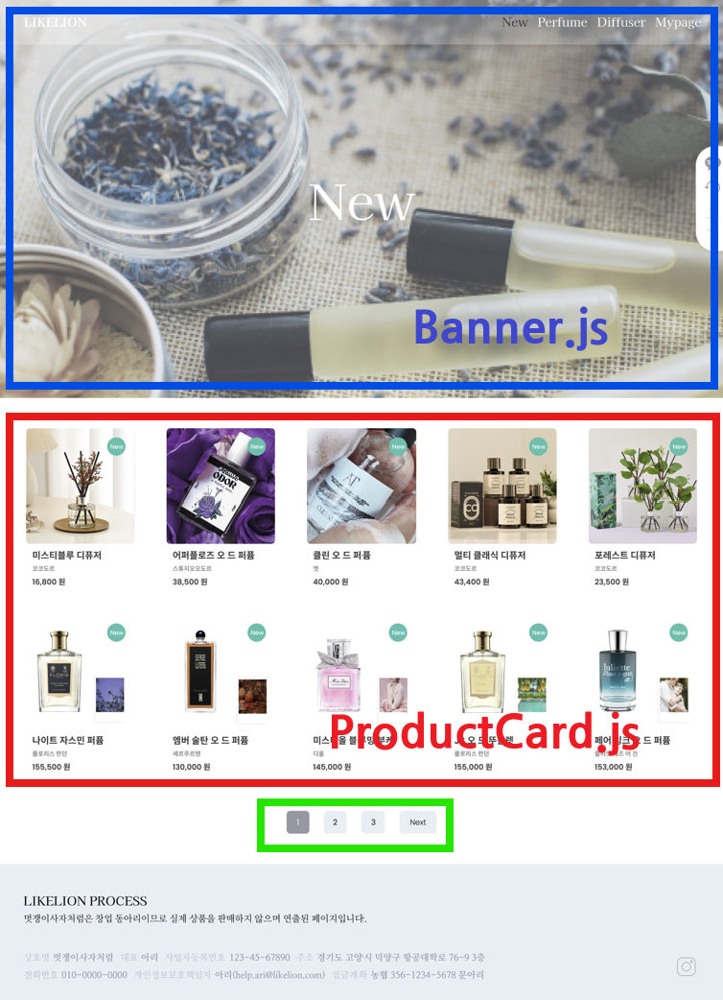

### 💡 오늘의 목표: 상품 페이지 및 결제 창 제작하기!

이번 세션에서는 공통된 레이아웃을 재사용하여 
상품 페이지를 만드는 방법을 배우고, 
상품 클릭 시, 결제 모달이 뜨도록 구현하는 방법을 익힙니다.

---

### 📌 상품 페이지 디렉토리 구조

상품 페이지의 디렉토리 구조는 다음과 같습니다.

```scss
- pages
    - ProductPage
        - Banner.js       # 배너 컴포넌트
        - Diffuser.js     # Diffuser 페이지
        - New.js         # New 페이지
        - Perfume.js     # Perfume 페이지
        - ProductCard.js # 상품 카드 컴포넌트
- styles
    - ProductPage.css # 스타일 파일
- public
    - img
        - banner_diffuser.png # Diffuser 페이지 배너 이미지
        - banner_perfume.png # Perfume 페이지 배너 이미지
        - banner_new.png # New 페이지 배너 이미지
```

<br>

각 페이지(New, Perfume, Diffuser)는 공통 배너와 상품 카드 컴포넌트를 재사용하여 구현해 봅시다.



---

### 📍Banner 컴포넌트 제작

#### 배너는 각 상품 페이지 상단에 위치하며, 배경 이미지와 페이지 타이틀을 포함합니다.

**Banner.js**

이 컴포넌트는 페이지 제목과 배경 이미지를 받아서 화면에 렌더링합니다.

```jsx
import React from "react";
import "../../styles/ProductPage.css";

// 배너 컴포넌트: title과 imagePath를 props로 받아 표시
const Banner = ({ title, imagePath }) => {
  return (
    <div className="banner">
      
      <div className="banner-title">{title}</div>
    </div>
  );
};

export default Banner;
```

<br>

**Productpage.css (배너 스타일)**

```css
@font-face {
  font-family: "KaiseiDecol-Regular";
  src: url("../../public/font/KaiseiDecol-Regular.ttf") format("truetype");
}

/* Banner Component */
.banner {
  position: relative; /* 기준점 잡기 */
  width: 100%;
  height: 100%;
}

.banner-title {
  font-family: "KaiseiDecol-Regular";
  font-size: 128px;
  color: white;
  /* banner 기준 왼쪽 위 모서리 기준점 잡고 중앙 정렬 */
  position: absolute; 
  top: 50%;
  left: 50%;
  transform: translate(-50%, -50%);
}

.banner-image {
  width: 100%;
  height: 100%;
  object-fit: cover;  /* 비율 깨짐 방지 */
  display: block;
}
```

<br>

**Perfume.js에서 배너 추가하기**

```jsx
import React from "react";
import Banner from "./Banner";

const Perfume = () => {
  return (
    <div>
      <Banner title="Perfume" imagePath={"/banner_perfume.png"} />
    </div>
  );
};

export default Perfume;
```

이와 동일한 방식으로 `New.js`와 `Diffuser.js`에서도 **Banner**를 추가하면 됩니다.

---

### 📍ProductCard 컴포넌트 제작

#### 상품 카드는 상품 목록을 표시하는 데 사용됩니다.


<br>

**ProductCard.js**

상품 명, 브랜드 명, 가격, 상품 이미지를 표시하며, 신상품 여부에 따라 `New` 배지를 추가합니다.

```jsx
import React from "react";
import "../../styles/ProductPage.css";

const ProductCard = ({ product }) => {
  return (
    <div className="product-card">
      {product.isNew && <div className="new-badge">New</div>}
      
      <div className="product-name">{product.name}</div>
      <div className="product-brand">{product.brand}</div>
      <div className="product-price">{product.price.toLocaleString()} 원</div>
    </div>
  );
};

export default ProductCard;
```

- `toLocaleString()` 숫자나 날짜를 읽기 편한 문자열 형태로 바꿔줌
    
    297000원 → 297,000원
    
<br>

**ProductPage.css (상품 카드 스타일)**

```css
@font-face {
  font-family: "NanumMyeongjo-Regular";
  src: url("../../public/font/NanumMyeongjo-Regular.ttf") format("truetype");
}

/* ProductCard Component */
.product-card {
  display: flex;
  flex-direction: column;
  align-items: flex-start;
  width: 100%;
  position: relative; /* 기준점 잡기 */
}

.product-image {
  width: 100%;
  height: 100%;
  border-radius: 10px;
  object-fit: cover; /* 비율 깨짐 방지 */
}

.product-name {
  font-family: "NanumMyeongjo-Regular";
  font-size: 18px;
  font-weight: bold;
  margin-top: 16px;
  color: #3a3a3a;
}

.product-brand {
  font-family: "NanumMyeongjo-Regular";
  font-size: 12px;
  font-weight: bold;
  color: #898989;
  margin-top: 8px;
}

.product-price {
  font-family: "NanumMyeongjo-Regular";
  font-size: 16px;
  font-weight: bold;
  color: #3a3a3a;
  margin-top: 8px;
}

.new-badge {
  /* 위에서 10 오른쪽에서 10 떨어지게 */
  position: absolute;
  top: 10px;
  right: 10px;
  background-color: #2ec1ac;
  color: #ffffff;
  font-size: 0.8rem;
  font-family: "KaiseiDecol-Regular";
  padding: 10px 5px 10px 5px;
  border-radius: 50px;
  text-align: center;
}

/* ProductPage Base */
.product-container {
  width: 100%;
  padding: 80px;
  box-sizing: border-box; /* padding, border까지 포함된 크기로 계산하도록 */
}

.product-grid {
  /* 칸 사이 간격 84px로 균등하게 5칸 가로로 만들기 */
  display: grid;
  grid-template-columns: repeat(5, 1fr);
  gap: 84px;
  width: 100%;
  box-sizing: border-box; /* padding, border까지 포함된 크기로 계산하도록 */
}
```

<br>

**Perfume 상품 이미지 추가하기**

```scss
- public
    - img
        - perfume_1.png
        - perfume_2.png
        - perfume_3.png
        - perfume_4.png
        - perfume_5.png
```

<br>

**Pefume.js에 ProductCard 적용하기**

```jsx
import React from "react";
import Banner from "./Banner";
import ProductCard from "./ProductCard";
import "../../styles/ProductPage.css";

const Perfume = () => {
  const products = [
    {
      id: 1,
      name: "시레나 오 드 퍼퓸",
      brand: "플로리스 런던",
      price: 297000,
      imagePath: "/img/perfume_1.png",
      isNew: false,
    },
  ];
  return (
    <div>
      <Banner title="Perfume" imagePath={"/banner_perfume.png"} />
      <div className="product-container">
        <div className="product-grid">
          // products 배열 안의 각 상품(product)을 꺼내서, ProductCard 컴포넌트를 하나씩 생성
          {products.map((product) => (
            <ProductCard key={product.id} product={product} />
          ))}
        </div>
      </div>
    </div>
  );
};
export default Perfume;
```

이와 동일한 방식으로 `New.js`와 `Diffuser.js`에서도 **ProductCard**를 추가하면 됩니다.

---

### 📍**페이징 버튼 추가**

#### 상품 목록이 많아지면 페이징 버튼을 추가하여 페이지를 이동할 수 있도록 합니다.

**주요 기능**

- `useState`를 사용하여 현재 페이지(`currentPage`) 상태를 관리합니다.
- 한 페이지 당 표시할 상품 개수(`itemsPerPage`)를 설정합니다.
- 전체 상품 목록을 현재 페이지에 맞게 자릅니다.
- 이전(`Prev`) / 다음(`Next`) 버튼을 추가하여 페이지를 이동할 수 있도록 합니다.

<br>

**`useState` 개념 설명**

React의 `useState`는 컴포넌트 내부에서 상태를 관리하는 Hook입니다.

```jsx
import React, { useState } from "react";
```

- `useState(초기값)`을 호출하면 상태 변수와 해당 변수를 변경하는 함수가 반환됩니다.
- 여기서는 `currentPage` 상태를 선언하고, 기본값을 `1`로 설정합니다.
- `setCurrentPage`를 통해 페이지 값을 변경할 수 있습니다.

<br>

**페이징 로직 구현**

```jsx
  const [currentPage, setCurrentPage] = useState(1);
  const itemsPerPage = 15; // 페이지당 15개 상품 표시

  const totalPages = Math.ceil(products.length / itemsPerPage);

  const startIndex = (currentPage - 1) * itemsPerPage;
  const endIndex = startIndex + itemsPerPage;
  const currentProducts = products.slice(startIndex, endIndex);

  const handlePageChange = (pageNumber) => {
    setCurrentPage(pageNumber);
  };
```

1. `currentPage` 상태를 선언하여 현재 보고 있는 페이지를 저장합니다.
2. `itemsPerPage`를 설정하여 한 페이지당 표시할 상품 개수를 정의합니다.
3. `totalPages`는 `products.length / itemsPerPage`를 올림 처리하여 총 페이지 개수를 계산합니다.
4. `startIndex`와 `endIndex`를 활용해 현재 페이지에서 보여줄 상품을 `slice()`로 가져옵니다.
5. `handlePageChange(pageNumber)` 함수는 클릭한 페이지 번호를 `setCurrentPage`로 업데이트합니다.

<br>

**힌트 코드**

```jsx
<div className="paging">
  {currentPage > 1 && (
    <button>
      Prev
    </button>
  )}
  {Array.from({ length: totalPages }, (_, i) => i + 1).map(
    (pageNumber) => (
      <button
        key={pageNumber}
      >
        {pageNumber}
      </button>
    )
  )}
  {currentPage < totalPages && (
    <button>
      Next
    </button>
  )}
</div>
```

1. **Prev 버튼**: `currentPage`가 1보다 클 때만 표시됩니다.
2. **페이지 번호 버튼**: `totalPages`만큼 `Array.from()`을 사용해 버튼을 생성합니다.
    - `map()`을 사용해 각 페이지 번호를 버튼으로 렌더링합니다.
    - 현재 선택된 페이지 버튼에 `active` 클래스를 적용합니다.
3. **Next 버튼**: `currentPage`가 `totalPages`보다 작을 때만 표시됩니다.

---

### 📌 결제 창 디렉토리 구조

결제 창의 디렉토리 구조는 다음과 같습니다.

```scss
- components
    - PayModal.js # 결제창 파일
- styles
    - PayModal.css # 스타일 파일
```

---

### 📍결제 창 제작

#### 상품을 클릭하면 결제 창이 나타나도록 구현합니다.


<br>

**PayModal.js**

```jsx
// useState: React에서 컴포넌트 안에서 "변하는 값"을 저장하고 싶을 때 사용
// useEffect: 값이 변하거나 처음 렌더링될 때 실행되는 함수

import React, { useState, useEffect } from "react";
import "../styles/PayModal.css";

const PayModal = ({ product, onClose }) => {
  //상태 값이 바뀌면 자동으로 컴포넌트가 다시 렌더링 되도록
  
	// 주문할 상품 개수 (기본값 1개)
  const [quantity, setQuantity] = useState(1);
  // 사용자가 입력한 마일리지 금액
  const [mileageToUse, setMileageToUse] = useState("");
  // 최대 사용 가능 마일리지
  const maxMileage = 100000;
  // 상품 가격
  const [, setProductPrice] = useState(product.price);
  // 총 결제 금액
  const [totalPrice, setTotalPrice] = useState(product.price);
  
  // 수량 증가 및 감소 함수
  const handleQuantityChange = (type) => {
    setQuantity((prev) => (type === "plus" ? prev + 1 : Math.max(1, prev - 1))); // 최소 1개 보장
  };

	// quantity, mileageToUse, product.price 값 중 하나라도 바뀌면 실행
  useEffect(() => {
    const newProductPrice = product.price * quantity; // 총 상품 가격 계산
    setProductPrice(newProductPrice);
    // 마일리지 차감 후 총 결제 금액 계산 (최소 0원 보장)
    setTotalPrice(Math.max(newProductPrice - mileageToUse, 0)); 
  }, [quantity, mileageToUse, product.price]);

	// input에 입력할 때 실행
  const handleMileageChange = (e) => {
    // input 박스에 입력한 값 가져오기
    const value = e.target.value;
    // 입력값이 없을 경우 0, 최대 마일리지를 초과하지 않도록 제한
    const numericValue = value === "" ? 0 : Math.min(Number(value), maxMileage); 
    setMileageToUse(numericValue);
  };

  return (
    <div className="modal">
	    {/* 모달 바깥 영역 클릭 시 닫기 */}
      <div className="overlay" onClick={onClose}></div>
      {/* 모달 본문 영역 */}
      <div className="container">
	      {/* 닫기 버튼 */}
        <button className="close-button" onClick={onClose}>
          &times;
        </button>
        <div className="title">주문 / 결제</div>

				{/* 주문 상품 정보 */}
        <div className="section">
          <div className="section-title">주문 상품</div>
          <div className="order-info">
	          {/* 상품 이미지 표시 */}
            
            <div>
              <div className="order-name">{product.name}</div>
              <div className="order-brand">{product.brand}</div>
              <div className="order-price">
                {product.price.toLocaleString()} 원
              </div>
              {/* 수량 조절 버튼 */}
              <div className="quantity-control">
                <button
                  className="quantity-button"
                  onClick={() => handleQuantityChange("minus")}
                >
                  -
                </button>
                <div className="quantity">{quantity}</div>
                <button
                  className="quantity-button"
                  onClick={() => handleQuantityChange("plus")}
                >
                  +
                </button>
              </div>
            </div>
          </div>
        </div>

				{/* 배송지 정보 */}
        <div className="section">
          <div className="section-title">배송지</div>
          <div className="user-info">아리</div>
          <div className="user-info">010-0000-0000</div>
          <div className="user-info">
            경기도 고양시 덕양구 항공대학로 76 국제은익관 1생활관 F000
          </div>
        </div>
        
				{/* 마일리지 사용 입력란 */}
        <div className="section">
          <div className="section-title">마일리지 사용</div>
          <div className="mileage-info">
            현재 사용 가능한 마일리지: {maxMileage.toLocaleString()} 원
          </div>
          <input
            className="mileageToUse-input"
            placeholder="사용하실 마일리지를 입력하세요"
            value={mileageToUse}
            onChange={handleMileageChange}
          />
        </div>

				{/* 총 결제 금액 표시 */}
        <div className="section">
          <div className="section-title">총 결제금액</div>
          <div className="total">
            <div>
              <div className="total-item">총 상품금액</div>
              <div className="total-item">마일리지 할인</div>
              <div className="total-item">배송비</div>
            </div>
            <div>
	            {/* 상품 금액 */}
              <div className="total-value">
                {totalPrice.toLocaleString()} 원
              </div>
              {/* 마일리지 할인 표시 */}
              <div className="total-value discount">
                -{mileageToUse.toLocaleString()} 원
              </div>
              {/* 무료배송 표시 */}
              <div className="total-value">무료배송</div>
            </div>
          </div>
        </div>
        
				{/* 결제 버튼 */}
        <button className="pay-button">결제하기</button>
      </div>
    </div>
  );
};

export default PayModal;

```

<br>

**PayModal.css**

```jsx
@font-face {
  font-family: "GmarketSans-Medium";
  src: url("../../public/font/GmarketSans-Medium.ttf") format("truetype");
}

@font-face {
  font-family: "GmarketSans-Bold";
  src: url("../../public/font/GmarketSans-Bold.ttf") format("truetype");
}

.modal {
  position: fixed; /* 화면 고정 */
  top: 0;
  left: 0;
  width: 100%;
  height: 100%;
  display: flex;
  justify-content: center;
  align-items: center;
  z-index: 100;
}

.overlay {
  position: absolute; /* modal 기준 */
  top: 0;
  left: 0;
  width: 100%;
  height: 100%;
  background-color: rgba(0, 0, 0, 0.5);
}

.container {
  background-color: #ffffff;
  border-radius: 8px;
  padding: 30px;
  width: 500px;
  position: relative; /* 기준점 잡기 */
  z-index: 10;
}

.close-button {
  position: absolute; /* container 기준 */
  top: 15px;
  right: 15px;
  font-size: 24px;
  background: none;
  border: none;
  cursor: pointer;
}

.title {
  font-family: "GmarketSans-Bold";
  font-size: 20px;
  text-align: center;
  margin-bottom: 30px;
}

.section {
  margin-bottom: 20px;
}

.section-title {
  font-family: "GmarketSans-Bold";
  font-size: 16px;
  margin-bottom: 10px;
}

.order-info {
  display: flex;
  align-items: center;
  gap: 15px;
}

.order-image {
  width: 120px;
  height: 120px;
  border-radius: 10px;
  object-fit: cover;
}

.order-name {
  font-family: "GmarketSans-Medium";
  font-size: 16px;
  margin-bottom: 8px;
}

.order-brand {
  font-family: "GmarketSans-Medium";
  font-size: 12px;
  color: #898989;
  margin-bottom: 8px;
}

.order-price {
  font-family: "GmarketSans-Bold";
  font-size: 16px;
  margin-bottom: 8px;
}

.quantity-control {
  display: flex;
  align-items: center;
  gap: 10px;
}

.quantity-button {
  width: 30px;
  height: 30px;
  font-size: 16px;
  border: 1px solid #ddd;
  background: #fff;
  cursor: pointer;
}

.user-info {
  font-family: "GmarketSans-Medium";
  font-size: 14px;
  margin-bottom: 8px;
}

.mileage-info {
  font-family: "GmarketSans-Medium";
  font-size: 14px;
  margin-bottom: 8px;
}

.mileageToUse-input {
  width: 300px;
  padding: 10px;
  font-size: 14px;
  font-family: "GmarketSans-Medium";
  border: 1px solid #3a3a3a;
  border-radius: 4px;
}

.total {
  display: flex;
  justify-content: space-between;
  font-size: 14px;
  padding: 20px 20px 8px 20px;
  border: 1px solid #3a3a3a;
  border-radius: 5px;
}

.total-item {
  font-size: 14px;
  font-family: "GmarketSans-Medium";
  margin-bottom: 12px;
}

.total-value {
  text-align: right;
  font-family: "GmarketSans-Medium";
  font-size: 14px;
  margin-bottom: 12px;
}

.discount {
  color: #d26156;
}

.pay-button {
  width: 100%;
  padding: 15px;
  font-size: 16px;
  font-family: "GmarketSans-Medium";
  color: white;
  background-color: #333;
  border: none;
  border-radius: 5px;
  cursor: pointer;
}

```

<br>

**Perfume.js에 결제 모달 추가**

```jsx
import PayModal from "./../../components/PayModal";

const [selectedProduct, setSelectedProduct] = useState(null);
const [isModalOpen, setIsModalOpen] = useState(false);

const handleCardClick = (product) => {
  setSelectedProduct(product);
  setIsModalOpen(true);
};

const handleCloseModal = () => {
  setSelectedProduct(null);
  setIsModalOpen(false);
};

onClick={() => handleCardClick(product)}

{isModalOpen && (
  <PayModal product={selectedProduct} onClose={handleCloseModal} />
)}
```

---
