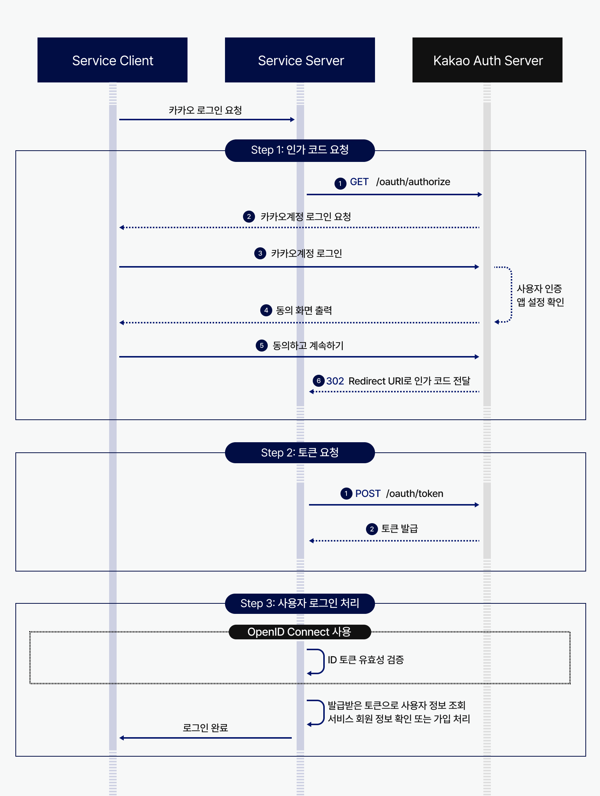
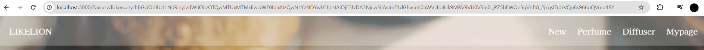

### 1. react-cookie 라이브러리 설치

---

```jsx
npm install react-cookie
```

### 2. Provider 설정(App.js)

---

하위 컴포넌트가 쿠키 상태에 접근하고, 쿠키를 읽고 쓸 수 있도록 Provider로 감싸줍니다.

🔍`CookiesProvider`

- 쿠키를 전역으로 관리할 수 있도록 해주는 컴포넌트입니다.
- 훅을 사용하여 쿠키에 접근할 수 있습니다.

```
import { CookiesProvider } from "react-cookie";

function App() {
  return (
    <CookiesProvider>
      <Router>
        <Header />
        <ToolBar/>
        <Routes>
          <Route path="/" element={<Home/>}
          />
          <Route path="/mypage" element={<Mypage />} />
          <Route path="/new" element={<New />} />
          <Route path="/perfume" element={<Perfume />} />
          <Route path="/diffuser" element={<Diffuser />} />
        </Routes>
        <Footer />
      </Router>
    </CookiesProvider>
  );
}

```

### 3. 로그인 페이지 이동(ToolBar.js)

---



카카오 공식 문서: https://developers.kakao.com/docs/latest/ko/kakaologin/rest-api

로그인 아이콘을 클릭했을 때 로그인 페이지로 이동하도록 해줍시다.

🔍 `window.location.href`

- 페이지를 **새로고침** 하며 이동합니다.
- 기존 페이지의 **히스토리**를 남깁니다. 즉, 사용자가 뒤로 가기를 눌렀을 때 이전 페이지로 돌아갈 수 있습니다. (vs `window.location.replace`)

```jsx
const handleLoginRedirect = () => {
  const redirectUrl =
    process.env.NODE_ENV === "development"
      ? "http://localhost:3000"
      : "https://likelionshop.netlify.app"; // 프론트 배포 주소

  // redirect_uri를 /oauth2/authorization/kakao 에 붙여서 전달
  const oauthUrl = `http://sajang-dev.ap-northeast-2.elasticbeanstalk.com/oauth2/authorization/kakao?redirect_uri=${redirectUrl}`;

  window.location.href = oauthUrl;
};
```

```jsx
</img>
```

### 4. 로그인 완료 후 Redirection(Home.js)

---

Redirection URL 설정을 `localhost:3000`으로 해두었기 때문에 로그인에 성공하면 홈화면으로 돌아옵니다. 

홈화면의 URL에서 쿼리 파라미터를 확인할 수 있습니다. *(accessToken 겟ㅡ!!!)*

🔍 쿼리 파라미터(query parameter)

- 웹 URL에서 **`?`** 이후에 추가되는 데이터
- **키-값** 쌍으로 이루어져 있고, 각 파라미터는 `&`로 구분합니다.
- URL에 직접 포함되기 때문에 보안에 민감한 정보는 담지 않는 것이 좋습니다.
- 주로 짧은 데이터를 사용합니다. (긴 데이터는 POST방식 추천)



### 5. accessToken 저장(Home.js)

---

쿼리 파라미터로 받은 accessToken을 쿠키에 저장합니다.

🔍 `navigate("/", { replace: true })`

- 보안을 위해 쿼리 파라미터를 삭제하기 위한 작업
    - 쿼리 파라미터를 삭제하고 리디렉션(”/”)합니다.
- `replace: true` : 기존 페이지의 **히스토리**를 삭제합니다.

🔍 `setCookie`

- path : 어떤 경로에서 유효할지 정의(”/”은 전체 도메인에서 유효)
- maxAge : 쿠키 유지 시간, 기본적으로 **세션 쿠키**로 처리됨(브라우저 종료 시 사라짐)
    - `60`은 1분
    - `60 * 60`은 1시간
    - `60 * 60 * 24`는 1일
    - `60 * 60 * 24 * 7`은 7일

```jsx
import React, { useEffect } from "react";
import { useNavigate } from 'react-router-dom';
import { useCookies } from "react-cookie";

const Home = () => {
  const [cookies, setCookie] = useCookies(["accessToken"]);
  const navigate = useNavigate();
  useEffect(() => {
    const params = new URLSearchParams(window.location.search);
    const accessToken = params.get("accessToken");

    if (accessToken) {
      setCookie("accessToken", accessToken, {
        path: "/",
        maxAge: 60 * 60 * 24 * 7,
      });

      navigate("/", { replace: true });
    }
  }, [setCookie, navigate]);
  
  return (
    <div className="home-container">
      <Banner></Banner>
      <Menu></Menu>
      <Info></Info>
    </div>
  );
};
```

### 6. 로그인 상태 관리하기(App.js)

---

로그인 여부(state)를 관리하기 위해 전역변수를 사용해봅시다.

❓왜 전역변수를 사용해야 하나요?

- 툴바에 로그인/로그아웃 버튼이 있는데 툴바가 모든 화면(App.js)에 있으니깐~
    
    

툴바에 로그인상태 훅과 업데이트 함수를 태워 보냅시다.

로그인 success 시 로그인했다고 업데이트 하기 위해 홈화면에도 업데이트 함수를 태워 보냅니다.

```jsx
import { CookiesProvider } from "react-cookie";
import React, { useState } from "react";

function App() {
  const [isLogin, setIsLogin] = useState(false);
  
    return (
    <CookiesProvider>
      <Router>
        <Header />
        <ToolBar isLogin={isLogin} onLoginChange={setIsLogin} />
        <Routes>
          <Route
            path="/"
            element={<Home onLoginChange={setIsLogin} />}
          />
          <Route path="/mypage" element={<Mypage />} />
          <Route path="/new" element={<New />} />
          <Route path="/perfume" element={<Perfume />} />
          <Route path="/diffuser" element={<Diffuser />} />
        </Routes>
        <Footer />
      </Router>
    </CookiesProvider>
  );

}
```

### 7. 로그인 상태 업데이트하기(Home.js)

---

로그인 성공 시 isLogin의 state를 true로 변경합니다.

```jsx
const Home = ({ onLoginChange }) => {
  const [cookies, setCookie] = useCookies(["accessToken"]);
  const navigate = useNavigate();
  useEffect(() => {
    const params = new URLSearchParams(window.location.search);
    const accessToken = params.get("accessToken");

    if (accessToken) {
      setCookie("accessToken", accessToken, {
        path: "/",
        maxAge: 60 * 60 * 24 * 7,
      });

      navigate("/", { replace: true });
      onLoginChange(true);
    }
  }, [setCookie, navigate, onLoginChange]);
  
  ... 중략
```

### 8. 로그인 상태에 따라 툴바 아이콘 바꾸기(ToolBar.js)

---

6번에서 태워보낸 로그인 상태 `isLogin`을 받아옵니다

```powershell
const ToolBar = ({ isLogin, onLoginChange }) => {
... 중략
      </img>

```

### 9. 로그아웃 연동하기

---

로그인 아이콘의 onClick 변경

```jsx
  onClick={isLogin ? handleLogout : handleLoginRedirect}
```

로그아웃 api 호출 → 쿠키 삭제 → 로그인상태 변수 false로 상태 변경

```jsx
import axios from "axios";
import { useCookies } from "react-cookie";

const ToolBar = ({ isLogin, onLoginChange }) => {
... 중략
	const [cookies, removeCookie] = useCookies(["accessToken"]);
	const handleLogout = () => {
	  axios
	    .delete("/users/logout", {
	      headers: {
	        accept: "*/*",
	        Authorization: `Bearer ${cookies.accessToken}`,
	      },
	    })
	    .then(() => {
	      onLoginChange(false);
	      removeCookie("accessToken", { path: "/" });
	    })
	    .catch((err) => {
	      console.log("LOGOUT API 요청 실패:", err);
	    });
	};
```
