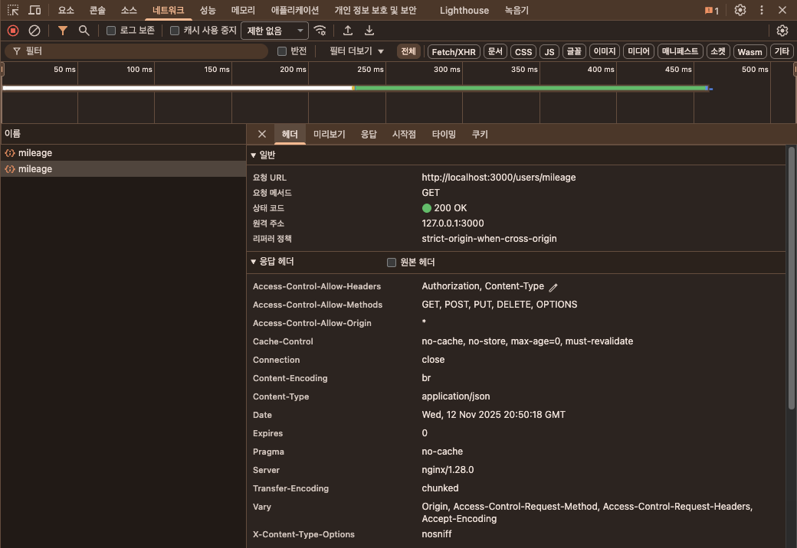
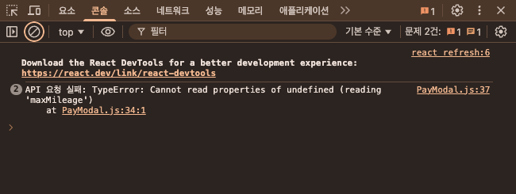
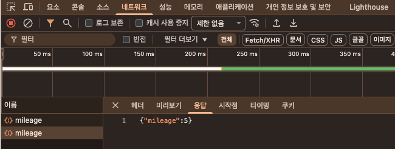

### 💡 오늘의 목표: 결체창 API 연결하기

- 세부 목표:
	- 마일리지 GET API 연결
	- 주문 POST API 연결
	- 비동기 **`async/await`** 이해하기

---

### 📌 PayModal.js - Mileage

- 앞 세션과 마찬가지로 axios와 cookie를 사용하기 위해 import 해야겠죠?
- 최상단에 추가해주세요

```jsx
import axios from "axios";
import { useCookies } from "react-cookie";
```

- 그리고 PayModal 컴포넌트 함수 안에 추가해주세요
- 기존에 선언되어 있던 `maxMileage`가 있다면, 지워주세요
- API 호출 URL은 항상 본인의 `Swagger` 를 확인하고 넣어주세요

```jsx
const PayModal = ({ product, onClose }) => {
	// 이 아래에 추가!!!
	const [cookies] = useCookies(["accessToken"]);
	// const maxMileage = 100000;
	const [maxMileage, setMaxMileage] = useState(0);

	useEffect(() => {
	    axios
	      .get("/users/mileage", {
	        headers: {
	          accept: "*/*",
	          Authorization: `Bearer ${cookies.accessToken}`,
	        },
	      })
	      .then((response) => {
	        setMaxMileage(response.data.mileage); **// 여기 기억해두기!!!**
	      })
	      .catch((err) => {
	        console.log("API 요청 실패:", err);
	      });
	  }, [cookies.accessToken]);
```

- 테스트1
    - “귀찮다! 그냥 netlify에 배포해서 테스트할래!” 한다면 git에 올려서 `git push`까지 해야겠죠?
    - 개발자도구 `네트워크` 칸에서 `200 OK` 뜨는지 확인해봅시다!
        - 코드를 무작정 와다다다 넣고 마지막에 테스트하는 것보다 한 단계씩 테스트를 하면서 진행하는 것이 좋습니다 😊
    
    
    
    - **근데 왜 API 요청이 2번 가요?**
        
        ### 왜 API가 2번 호출될까?
        
        React 18부터 **개발 모드에서만** StrictMode가 컴포넌트를 **의도적으로 두 번 렌더링**합니다
        
        이는 `useEffect`, `useState`, `useReducer`의 부작용을 검출하기 위함입니다
        
        → **개발 환경(local)**: API가 2번 호출됨
        
        → **배포 환경(production)**: 정상적으로 1번만 호출됨
        
        ---
        
        ### React.StrictMode란?
        
        React.StrictMode는 **개발 중 코드의 부작용(side effect)을 조기에 발견하기 위한 개발 전용 검사 도구**입니다
        
        ```jsx
        // index.js
        <React.StrictMode>
          <App />
        </React.StrictMode>
        ```
        
        ---
        
        ### 왜 배포에서는 동작하지 않나?
        
        - StrictMode는 **디버깅용 기능**이기 때문에 **빌드 시 자동으로 제거**되어 최종 번들에는 포함되지 않습니다
        - 성능 저하와 중복 실행을 막기 위해 **프로덕션에서는 비활성화**됩니다
- 테스트2
    - 분명히 `200 OK`였는데… 개발자도구 `콘솔` 칸에서 `실패` 요청이 뜬다면??
        
        
        
    - 다시 `네트워크` 칸에서 가서 API 응답을 확인하신 다음에.. 필드명이 뭔지 확인해보세요!
        - 스웨거에서 확인해보셔도 됩니다!
        
        
        
        - 여기선 mileage라고 해뒀네요? 그럼 맞춰서 프론트코드를 수정해주세요
        
        ```jsx
        axios
          .get("/users/mileage", {
            headers: {
              accept: "*/*",
              Authorization: `Bearer ${cookies.accessToken}`,
            },
          })
          .then((response) => {
            **setMaxMileage(response.data.mileage); // 여기!!**
          })
          .catch((err) => {
            console.log("API 요청 실패:", err);
          });
        ```
        

---

### 📌 PayModal.js - Order

```jsx
const handlePayment = async () => {
    try {
      const response = await axios.post("/orders",
        {
          itemId: product.id,
          quantity: quantity,
          mileageToUse: mileageToUse,
        },
        {
          headers: {
            "Content-Type": "application/json",
            Authorization: `Bearer ${cookies.accessToken}`,
          },
        }
      );

      if (response.data.isSuccess) {
        alert("주문이 성공적으로 생성되었습니다.");
        onClose();
      } else {
        alert(`주문 실패: ${response.data.message}`);
      }
    } catch (error) {
      console.error("결제 오류:", error);
      alert("결제 처리 중 오류가 발생했습니다.");
    }
  };
  
---------------------------------------------------------------
  
<button className="pay-button" **onClick={handlePayment}**>결제하기</button>

```

1. **쿠키에서 액세스 토큰 가져오기**
    - `useCookies(["accessToken"])`를 사용하여 사용자 인증 토큰을 가져옵니다.
    - 이 토큰은 API 요청 시 `Authorization` 헤더에 포함됩니다.
2. **비동기 결제 요청 처리**
    - `handlePayment` 함수는 `async` 함수로 정의되어 있으며, `axios.post`를 사용하여 서버에 결제 요청을 보냅니다.
    - 요청 시 필요한 데이터(`itemId`, `quantity`, `mileageToUse`)를 JSON 형태로 전송합니다.
    - `Authorization` 헤더를 설정하여 사용자의 액세스 토큰을 포함합니다.
3. **결제 응답 처리**
    - `response.data.isSuccess` 값이 `true`이면 결제 성공 메시지를 띄우고, `onClose()`를 호출하여 결제 창을 닫습니다.
    - 실패 시 서버에서 제공하는 `message`를 alert 창에 표시합니다.
4. **오류 처리**
    - `try-catch` 구문을 사용하여 결제 과정에서 발생하는 오류를 처리합니다.
    - 오류가 발생하면 콘솔에 에러를 출력하고 사용자에게 알림을 표시합니다.

---

### 📌  비동기

- 동기? 비동기?
    - 동기(Synchronous) → 하나씩 순차적으로 실행
    - 비동기(Asynchronous) → 동시에 실행

- **왜 API를 비동기로 처리해야 할까요?**
    - 우리가 API를 요청하면, 서버에서 데이터를 받아오는 데 시간이 걸려요.
    - 예를 들어, **사용자 정보를 가져오는 API**를 생각해봅시다.
    
    ```jsx
    console.log("1. 사용자 정보 요청");
    
    const user = axios.get("/user"); // 서버 응답 기다리는 중
    console.log("2. 사용자 정보:", user.data);
    
    console.log("3. 다음 작업 실행");
    ```
    
    ```
    1. 사용자 정보 요청
    (서버 응답 기다리는 중)
    2. 사용자 정보: { name: "철수" }  ← 몇 초 뒤에 출력됨
    3. 다음 작업 실행  ← 이 코드가 API 응답이 올 때까지 멈춤 
    ```
    
    ❌ **API 응답이 올 때까지 프로그램이 멈춰서 다른 작업을 못한다!**
    
    ❌ **사용자 경험이 엄청 나빠진다! (버튼도 안 눌리고, 화면도 안 바뀜)**
    

- 비동기(Asynchronous) 방식으로 API 요청하면
    
    ```jsx
    console.log("1. 사용자 정보 요청");
    
    const fetchUser = async () => {
        const user = await axios.get("/user"); // 기다리는 동안 다른 작업 가능 
        console.log("2. 사용자 정보:", user.data);
    };
    
    fetchUser();  // 비동기 함수 실행
    
    console.log("3. 다음 작업 실행");  // API 응답 기다리지 않고 실행됨 
    
    ```
    
    1. 사용자 정보 요청
    2. 다음 작업 실행 (API 기다리는 동안 실행됨)
    3. 사용자 정보: { name: "철수" } (API 응답이 오면 실행됨)
    
    ✔ **API 요청이 끝나길 기다리는 동안 다른 작업을 할 수 있다!**
    
    ✔ **사용자는 앱이 멈춘다고 느끼지 않는다! (버튼도 클릭 가능, UI도 부드러움)**
    

**✔ 비동기(API 요청 중에도 다른 작업 가능)**

- API 요청을 보낸 후 그동안 다른 작업을 먼저 처리할 수 있음
- 예: 버튼 클릭 가능, 로딩 화면 표시 가능, 다른 API 요청 가능

**❌ 동기(API 응답을 기다리느라 멈춤)**

- API 응답이 오기 전까지 모든 코드 실행이 멈춤
- 사용자가 아무것도 할 수 없는 상태가 됨 (앱이 멈춘 것처럼 보임)

---

### 📌 **`async/await` vs `then/catch`**

**1. `async/await` 방식**

```
const handlePayment = async () => {
    try {
      const response = await axios.post("/orders", requestData, config);
      await axios.post("/orders", requestData, config);
      await axios.post("/orders", requestData, config);
      await axios.post("/orders", requestData, config);
      await axios.post("/orders", requestData, config);
      
      console.log("결제 성공:", response.data);
    } catch (error) {
      console.error("결제 오류:", error);
    }
};
```

**2. `then/catch` 방식**

```
const handlePayment = () => {
    axios.post("/orders", requestData, config)
      .then(response => {
        console.log("결제 성공:", response.data);
      })
      .catch(error => {
        console.error("결제 오류:", error);
      });
};
```

**차이점**

| **비교 항목** | **`async/await`** | **`then/catch`** |
| --- | --- | --- |
| **가독성** | 동기 코드처럼 읽기 쉬움 | 콜백 체인이 많아질 경우 가독성이 떨어짐 |
| **에러 처리** | `try-catch` 사용 가능 | `catch` 블록에서 에러 처리 |
| **비동기 흐름** | 코드 실행 흐름이 직관적 | `.then`을 계속 연결해야 함 |

**장단점 및 사용 추천 경우**

| **상황** | **`async/await` 사용** | **`then/catch` 사용** |
| --- | --- | --- |
| **코드가 길어질 때** | ✅ 읽기 쉬움 | ❌ 콜백 지옥 발생 |
| **에러 처리가 필요할 때** | ✅ try-catch 사용 가능 | ❌ 여러 번 `catch` 해야 할 수도 있음 |
| **비동기 작업이 많을 때** | ✅ 직관적 순서대로 실행 | ❌ `.then()`이 길어질 수 있음 |
| **간단한 요청일 때** | ❌ 너무 길어질 수 있음 | ✅ 짧고 간결 |

---

### 📌 **결제하기 버튼에 추가**

```jsx
<button className="pay-button" onClick={handlePayment}>
  결제하기
</button>
```

- 테스트
