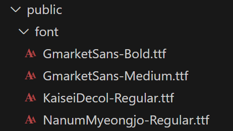

- `.ttf`, `.woff`, `.woff2` 등 웹용 폰트 파일을 준비합니다.
- 해당 폰트 파일을 **`public/font/`** 폴더에 넣습니다.

## 1. 폰트 파일 준비



## 2. CSS에서 `@font-face` 선언

```css
@font-face {
  font-family: "KaiseiDecol-Regular";
  src: url("../../public/font/KaiseiDecol-Regular.ttf") format("truetype");
}
```

---

## 3. 폰트 사용

선언한 `font-family`를 원하는 곳에 적용합니다:

```css
header {
  font-family: "KaiseiDecol-Regular", sans-serif;
  font-size: 22px;
}
```

---
