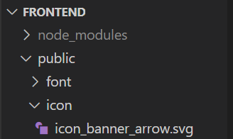

**📜 docs: https://kenwheeler.github.io/slick/**

<br>

## 1. slick 라이브러리 설치

---

```bash
npm install react-slick slick-carousel
```

react-rslick, slick-carousel 두 모듈 모두 설치해줍니다.

## 2. 배너 설정

---

```jsx
const settings = {
    dots: true, // 하단 도트 표시
    infinite: true, // 무한 반복
    speed: 500, // 전환 속도 (ms)
    slidesToShow: 1, // 한 번에 보여줄 슬라이드 수
    slidesToScroll: 1, // 한 번에 스크롤할 슬라이드 수
    autoplay: true, // 자동 재생
    autoplaySpeed: 3000, // 자동 재생 속도 (ms)
    arrows: true, // 옆으로 이동하는 화살표 표시 여부
  };
```

## 3. 배너 이미지 설정

---

```
const images = [
    `${process.env.PUBLIC_URL}/img/banner_background_1.jpg`,
    `${process.env.PUBLIC_URL}/img/banner_background_2.jpg`,
    `${process.env.PUBLIC_URL}/img/banner_background_3.jpg`,
  ];
```

## 4. 배너 컴포넌트 생성

---

```jsx
return (
    <div className="banner-container">
      <Slider {...settings}>
        {images.map((image, index) => (
          <div key={index}>
            
          </div>
        ))}
      </Slider>
    </div>
  );
```

- Slider의 파라미터에 2번에서 설정했던 settings를 넘겨줍니다.
- 배열+반복문으로 이미지를 삽입합니다.
- 이미지 css 설정
    - `width 100%`: 요소의 너비를 부모 요소의 전체 너비(100%)로 설정
    - `height 90vh`: 요소의 높이를 화면(Viewport) 높이의 90%로 설정
    - `overjectFit cover`: 미디어 콘텐츠가 요소의 크기에 맞게 잘리더라도 비율을 유지하면서 꽉 차도록 설정

## 5. Slider 커스텀(1): 살펴보기

---

> Q. 슬라이더 아래 점들과 화살표를 커스텀 하려면 어떻게 해야 할까요?
> 

🔎 개발자 도구로 커스텀 할 요소들을 살펴봅시다. 

❓어떤 클래스명이고, 어떤 파일에 있나요? 

❓어떤 상태인가요?

❓어떻게 바꾸고 싶은가요?

⁉️ 라이브러리의 css 파일을 수정하면 오류가 발생하고 반영되지 않습니다. 어떻게 해야 할까요?

- 나만의 커스텀 css 파일을 만들고 overwrite하여 사용합니다.

⁉️ 커스텀 css가 적용되지 않습니다. 왜그럴까요?

- css파일을 import하는 순서를 확인했나요?

## 6. Slider 커스텀(2): 점점점… 커스텀하기

---

- 우선 점들을 보이게 합시다.

```css
.slick-dots {
    bottom: 25px;
}
```

- 점의 색깔을 바꾸어 봅시다.

```css
.slick-dots li button:before {
    color: white;
    opacity: 0.75;
    font-size: 8px;
}
  
  .slick-dots li.slick-active button:before {
    color: white;
    opacity: 1;
}
```

## 7. Slider 커스텀(3): 화살표 커스텀하기

---

- 화살표 svg 업로드(`/public/icon/icon_banner_arrow.svg`)
    
    
    

- 화살표 컴포넌트 생성(공식 문서 참고)
    - 컴포넌트로 좌, 우 화살표를 한번에 생성해봅시다.
    - 왼쪽 화살표 svg 파일 하나로 오른쪽 화살표도 생성해봅시다.
    - 화살표가 슬라이더 위로 올라오도록 z-index도 설정해줍시다.

```jsx
const CustomArrow = ({ onClick, direction }) => {
  const isPrev = direction === "prev";
  const arrowStyle = {
    width: "fit-content",
    height: "fit-content",
    position: "absolute",
    top: "50%",
    transform: isPrev ? "translateY(-50%)" : "translateY(-50%) rotate(180deg)",
    zIndex: 1,
    [isPrev ? "left" : "right"]: "25px",
  };

  return (
    <button
      type="button"
      data-role="none"
      className={`slick-arrow slick-${direction}`}
      onClick={onClick}
      style={arrowStyle}
    >
      
    </button>
  );
};

```

- 배너 설정에 커스텀한 화살표를 추가

```jsx
prevArrow: <CustomArrow direction="prev" />, // 커스텀 이전 화살표
nextArrow: <CustomArrow direction="next" />, // 커스텀 다음 화살표
```

⁉️ 기존에 있던 default 화살표가 사라지지 않아요 ㅜㅜ

- 개발자 도구로 무엇이 방해하고 있는지 살펴봅시다.
    - css로 원인 제거~!
        
        ```css
        .slick-prev:before,
        .slick-next:before {
          content: none;
        }
        ```
