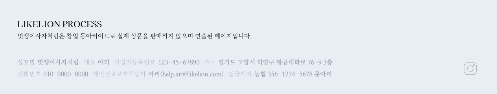
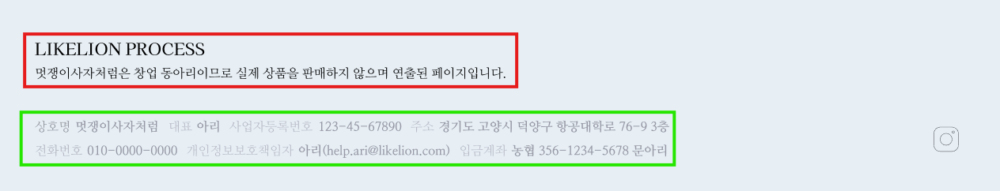
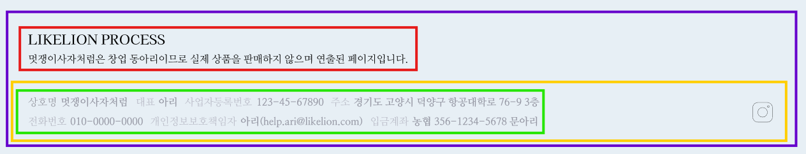
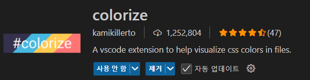
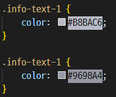

### 목표!



### 1. 푸터란?

**사용자가 웹페이지를 끝까지 스크롤 했을 때 마지막으로 접하는 부분**

→ 웹사이트를 통해 어느 정도 설득이 된 사용자들이 도달하는 곳

→ 높은 구매 의사를 가진 고객이 즉각적으로 기업과 소통할 수 있는 링크를 푸터에 설치해두는 것이 중요

❓ *왜 귀찮게 푸터를 만들어야 하나요?*

- 사용자에게 웹사이트의 정보/저작권 등을 제공하는 부분을 추가 → 웹사이트의 **신뢰도** UP! **인지도** UP!
- 다른 페이지로 이동 유도 → 사용자 **이탈 방지**
- 웹사이트의 핵심 키워드나 링크가 포함 → 검색 엔진 최적화(**SEO**)

### 2. 푸터 분석해보기

🔎 어떤 요소가 공통적인가요? (class 묶을 생각)

🔎 어떻게 div로 나누어야 할까요? (html 짤 생각)

🔎 어떤 css 요소를 사용해야 할까요? (css 짤 생각)

🔎 사용자와 상호작용 해야 하는 요소가 있나요? (js 짤 생각)



눈에 띄는 조각



전체 조각

### 3. 푸터를 컴포넌트로!

```jsx
import React from "react";

const Footer = () => {
  return ( ~푸터 html~ );
};
export default Footer;

```

컴포넌트는 위와 같은 형식을 지닙니다. 푸터 스크립트에서 html을 작성하고

```jsx
import React from "react";
import Footer from "./components/Footer";

function App() {
  return (
        **<Footer />**
  );
}

export default App;
```

모든 화면에 공통적으로 들어가기 때문에 App.js에서 넣어주면… 화면에 보이게 됩니다!

### 4. 푸터 HTML, CSS 작성

```jsx
@font-face {
    font-family: "KaiseiDecol-Regular";
    src: url("../../public/font/KaiseiDecol-Regular.ttf") format("truetype");
  }
```

```jsx
import React from "react";
import "../styles/Footer.css";

const Footer = () => {
  return (
    <div className="footer-container">
      <div className="footer-section">
        <div className="footer-title">LIKELION PROCESS</div>
        <div className="footer-subtitle">
          멋쟁이사자처럼은 창업 동아리이므로 실제 상품을 판매하지 않으며 연출된
          페이지입니다.
        </div>
      </div>
      <div className="footer-section">
        <div className="info-text-row">
          <div className="info-text-wrapper">
            <div className="info-text-1">상호명</div>
            <div className="info-text-2">멋쟁이사자처럼</div>
          </div>
          <div className="info-text-wrapper">
            <div className="info-text-1">대표</div>
            <div className="info-text-2">아리</div>
          </div>
          <div className="info-text-wrapper">
            <div className="info-text-1">사업자등록번호</div>
            <div className="info-text-2">123-45-67890</div>
          </div>
          <div className="info-text-wrapper">
            <div className="info-text-1">주소</div>
            <div className="info-text-2">
              경기도 고양시 덕양구 항공대학로 76-9 3층
            </div>
          </div>
        </div>
        <div className="info-text-row">
          <div className="info-text-wrapper">
            <div className="info-text-1">전화번호</div>
            <div className="info-text-2">010-0000-0000</div>
          </div>
          <div className="info-text-wrapper">
            <div className="info-text-1">개인정보보호책임자</div>
            <div className="info-text-2">아리(help.ari@likelion.com)</div>
          </div>
          <div className="info-text-wrapper">
            <div className="info-text-1">입금계좌</div>
            <div className="info-text-2">농협 356-1234-5678 문아리</div>
          </div>
        </div>
      </div>
    </div>
  );
};
export default Footer;

```

```jsx
@font-face {
    font-family: "KaiseiDecol-Regular";
    src: url("../../public/font/KaiseiDecol-Regular.ttf") format("truetype");
  }

  @font-face {
    font-family: "NanumMyeongjo";
    src: url("../../public/font/NanumMyeongjo-Regular.ttf") format("truetype");
  }
  

.footer-container {
    display: flex;
    flex-direction: column;
    background-color: #E7EFF5;
    padding: 52px 72px;
    gap: 36px;
}

.footer-section {
    display: flex;
    flex-direction: column;
    gap: 12px;
}

.footer-title {
    font-size: 1.2rem;
    font-family: "KaiseiDecol-Regular";
}

.footer-subtitle,
.info-text-wrapper {
    font-family: "NanumMyeongjo";
}

.info-text-1 {
    color: #B8BAC6;
}

.info-text-1 {
    color: #9698A4;
}

.info-text-row {
    display: flex;
    gap: 16px;
}

.info-text-wrapper {
    display: flex;
    gap: 8px;
}
```

💡extension 추천! 색상 코드를 적으면 미리보기를 해준다 와~!





### 5. 반응형 단위

- px(픽셀): 고정 단위, 변하지 않음
- 백분율(%): 부모 요소의 n%
- 뷰포인트 단위(vw, vh): 가로 너비의 1%, 세로 너비의 1%
- em/rem: 부모 요소의 폰트 크기 기준 / 루트 요소의 폰트 크기 기준
- clamp: `clamp(최솟값, 유동값, 최댓값)`으로 유동적인 폰트 크기 설정 가능

```css
font-size: clamp(14px, 2vw, 24px);
```
