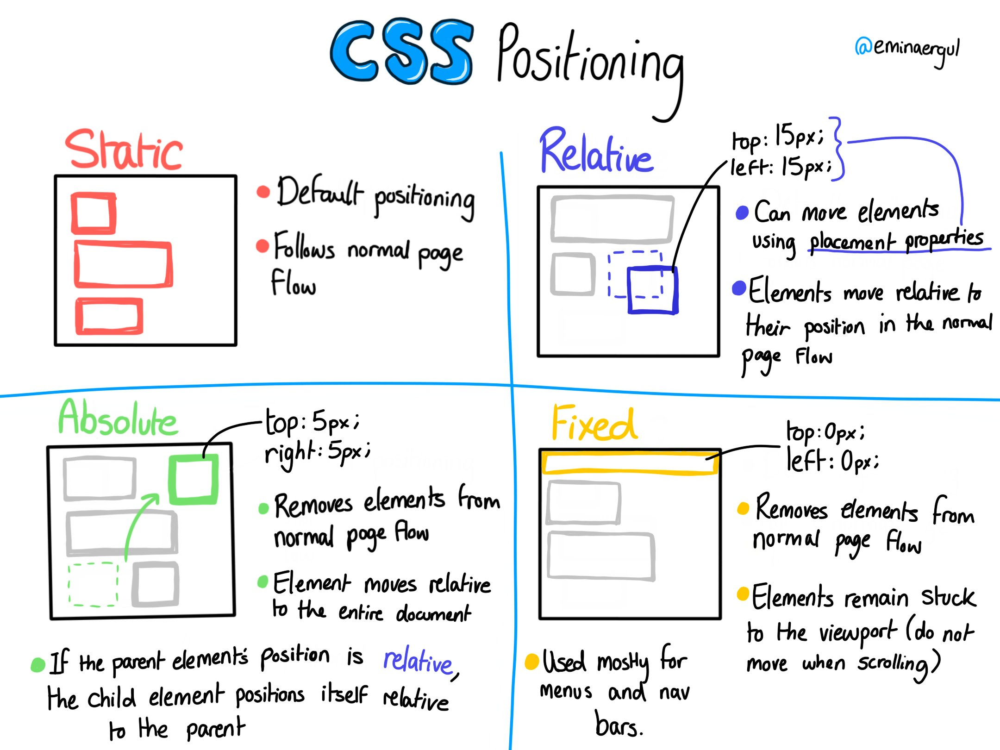
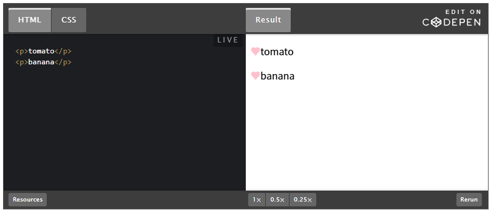
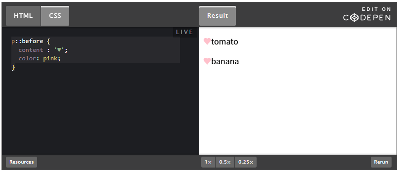

### 1. 메뉴 컴포넌트 만들기

```jsx
import React from "react";

const Menu = () => {
  return (
    <div className="menu-container">
    </div>
  );
};
export default Menu;
```

- ❓ export가 뭔가요?
    
    > `export`는 React나 JavaScript 모듈 시스템에서 코드를 **외부로 내보내기** 위한 키워드입니다.
    > 
    
    이를 통해 다른 파일에서 해당 모듈을 **불러와(import)** 사용할 수 있습니다.
    
- 🚩[심화] export하는 두 가지 방법
    1. 기본 내보내기 (Default Export)
        - 파일 당 **한 번만** 사용 가능
        - `import` 시 **이름을 변경**할 수 있음
        - 
        
        ```jsx
        import React from "react";
        
        const Menu = () => {
          return <div className="menu-container">Menu</div>;
        };
        
        // 기본 내보내기
        **export default** Menu;
        ```
        
        ```jsx
        import **MenuComponent** from "./Menu"; // 이름 자유롭게 변경 가능
        // import Menu from "./Menu";  // 이렇게 해도 가능
        
        function App() {
          return <MenuComponent />;
        }
        ```
        
    2. 명시적 내보내기 (Named Export)
        - **여러 개**의 컴포넌트를 내보낼 수 있음
        - `import` 시 **이름을 정확히 맞춰야** 함
        
        ```jsx
        // 예시) Menu.js
        import React from "react";
        
        **export** const Menu = () => {
          return <div className="menu-container">Menu</div>;
        };
        
        **export** const Footer = () => {
          return <div className="footer-container">Footer</div>;
        };
        ```
        
        ```jsx
        import **{ Menu, Footer }** from "./Menu"; // 이름 정확히 맞춰야 함
        
        function App() {
          return (
            <>
              <Menu />
              <Footer />
            </>
          );
        }
        ```
        

### 2. 이미지, 글자 삽입

```html
import React from "react";

const Menu = () => {
  return (
    <div className="menu-container">
	    <div className="menu-section">
	        </img>
	        <div className="text-overlay text-perfume">Perfume</div>
        </div>
        <div className="menu-section">
	        </img>
	        <div className="text-overlay text-diffuser">Diffuser</div>
        </div>
    </div>
  );
};
export default Menu;
```

🔎 하나의 div에 class를 여러개 적용하고 싶어요

- 클래스명을 띄어쓰기로 구분해서 여러개 적용 가능합니다😎

- ❓`` 태그에 `alt`는 뭔가요?
    
    > Alt 태그는 **대체 텍스트(Alternative text)**라는 의미를 가지고 있습니다.
    > 
    
    웹페이지에 삽입된 이미지가 어떤 내용인지 검색 엔진에게 설명하는 역할을 합니다. 
    
    이미지가 어떤 이유 떄문에 로딩 되지 않거나, 또는 시각 장애인이 스크린 리더를 사용할 때 alt 태그의 내용이 보여지게 됩니다.
    
- ❓백틱(```)과 따옴표(`’`, `“`)의 차이가 뭔가요?
    - 따옴표: **문자열** 리터럴 생성, 내부에 string만 들어갈 수 있습니다
    - 백틱: **템플릿** 리터럴 생성, 내부에 **변수 삽입이 가능**합니다. 또한 멀티라인도 지원합니다.

```css
@font-face {
    font-family: "KaiseiDecol-Regular";
    src: url("../../public/font/KaiseiDecol-Regular.ttf") format("truetype");
}

@font-face {
    font-family: "NanumMyeongjo";
    src: url("../../public/font/NanumMyeongjo-Regular.ttf") format("truetype");
}
  

/* Home Base */
.menu-container {
    display: flex;
    width: 100%;
    justify-content: center;
    font-family: 'KaiseiDecol-Regular';
}

/* Menu Component */
.menu-section {
    width: 50%;
    position: relative;
}

.menu-section::before {
    content: '';
    position: absolute;
    top: 16px;
    left: 16px;
    right: 16px;
    bottom: 16px;
    border: 2px solid white;
    box-sizing: border-box;
}

.menu-perfume,
.menu-diffuser {
    width: 100%;
    display: block;
}

.text-overlay {
    position: absolute;
    color: white;
    font-size: 48px;
}

.text-perfume {
    bottom: 16px;
    left: 28px;
}

.text-diffuser {
    bottom: 16px;
    right: 28px;
}
```

- ❓ `position` 속성
    
    > CSS에서 `position` 속성은 **요소의 위치를 어떻게 배치할지** 결정하는 속성입니다.
    > 
    
    
    
    1. `position: static` (기본값)
        - `top`, `bottom`, `left`, `right`와 **`z-index`**가 **무시**됩니다.
    2. `position: relative` (상대 위치)
        - **원래 있던 위치**를 기준으로 이동합니다.
    3. `position: absolute` (절대 위치)
        - **가장 가까운** `position: relative` ****또는 ****`position: absolute/fixed` **부모**를 기준으로 이동
        - 없다면 뷰포트(전체 페이지)를 기준
    4. `position: fixed` (고정 위치)
        - 뷰포트(화면)를 기준으로 고정
        - 스크롤해도 항상 같은 위치
    5. `position: sticky` (스크롤에 따라 유동적)
        - 부모의 **스크롤 범위 내**에서만 고정
- ❓ `::before` 가상요소
    
    가상요소란 선택자에 추가하는 키워드로, 선택한 요소(element)의 일부에만 스타일을 적용합니다.
    
    즉 ,**HTML에 새로운 요소(element)를 추가한 것처럼 동작**합니다.
    
    앞에 `::`을 붙여 표기합니다.
    
    
    
    
    

### 3. 페이지 이동시키기

```jsx
import React from "react";
import { Link } from "react-router-dom";

const Menu = () => {
  return (
    <div className="menu-container">
      <Link to="/perfume" className="menu-section">
        </img>
        <div className="text-overlay text-perfume">Perfume</div>
      </Link>
      <Link to="/diffuser" className="menu-section">
        </img>
        <div className="text-overlay text-diffuser">Diffuser</div>
      </Link>
    </div>
  );
};
export default Menu;
```
