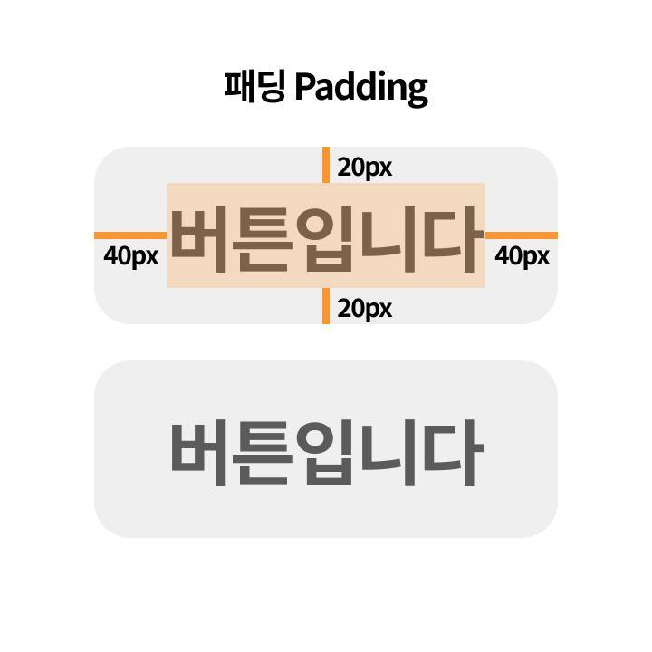
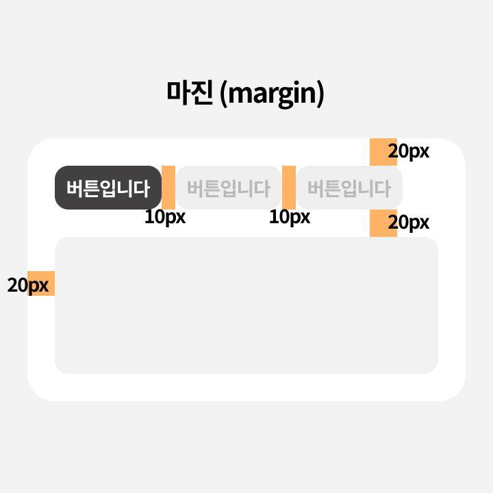

### 목표!


[✨메뉴](create-menu.md)

[🗺️배너](create-banner.md)

[🔧툴바 만들기](create-toolbar.md)

### [복습] css 속성 이것만은 외워줘~

---

- `display: flex` : div를 flex-box로 만들기 → 고무고무 늘어나고 줄어듭니다
    - `gap`: 박스 사이 거리
- `flex-direction: row` , `flex-direction: column` : 가로/세로 정렬
    - 💡display: flex 추가하면 flex-direction: row가 default입니다!
    
    ```css
    display: flex;
    /* flex-direction: row; */
    ```
    
- `align-items`, `justify-content`: 세로/가로 정렬
    - center: 중앙 정렬
    - flex-start: 왼쪽 정렬
    - flex-end: 오른쪽 정렬
    - `justify-content: space-between`: 양쪽 끝 정렬
- `text-align`: 텍스트 정렬
- `border-radius`: 모서리 둥글게 둥글게~
- `margin` / `padding`

| | |
|---|---|
|  |  |
| padding: div **안쪽 여백** | margin: div **바깥쪽 여백** |
