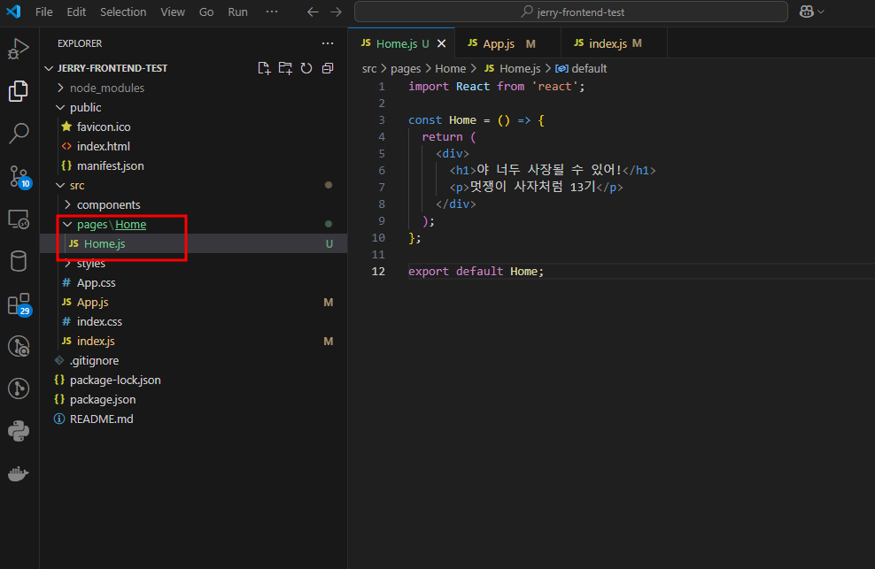
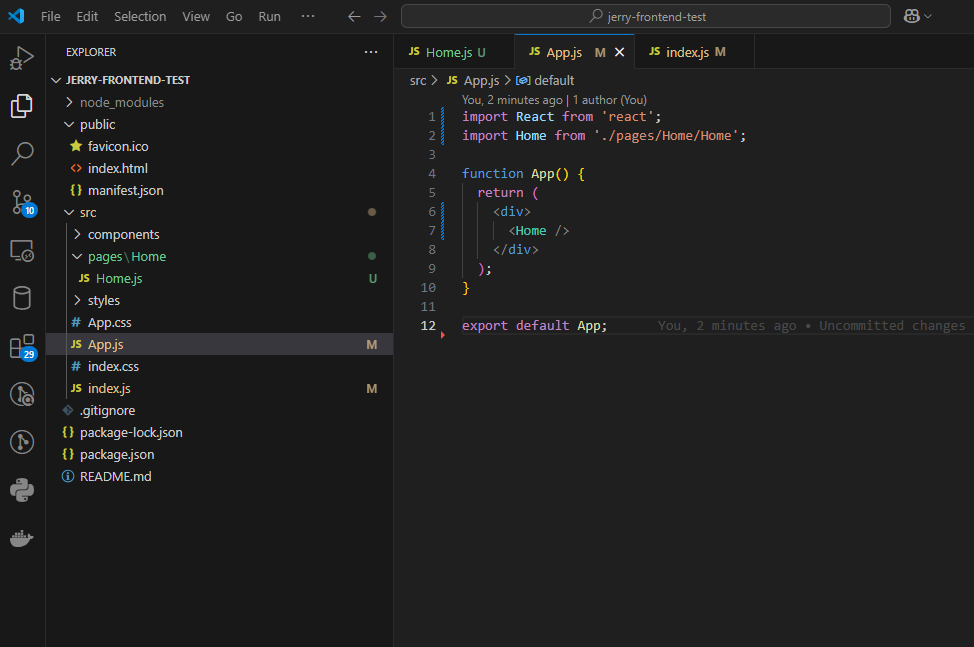
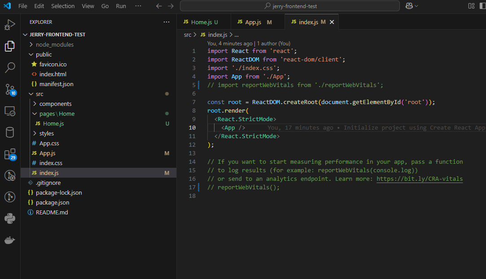
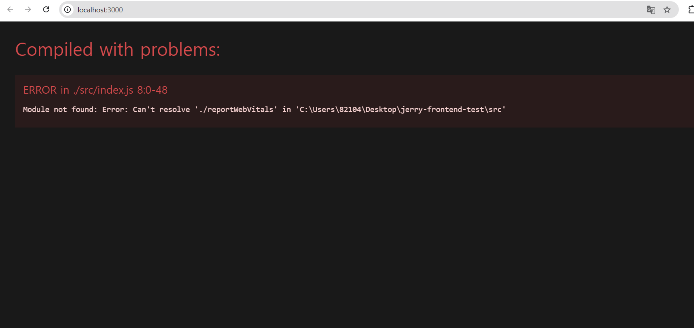
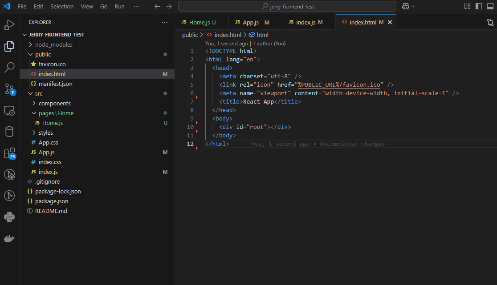
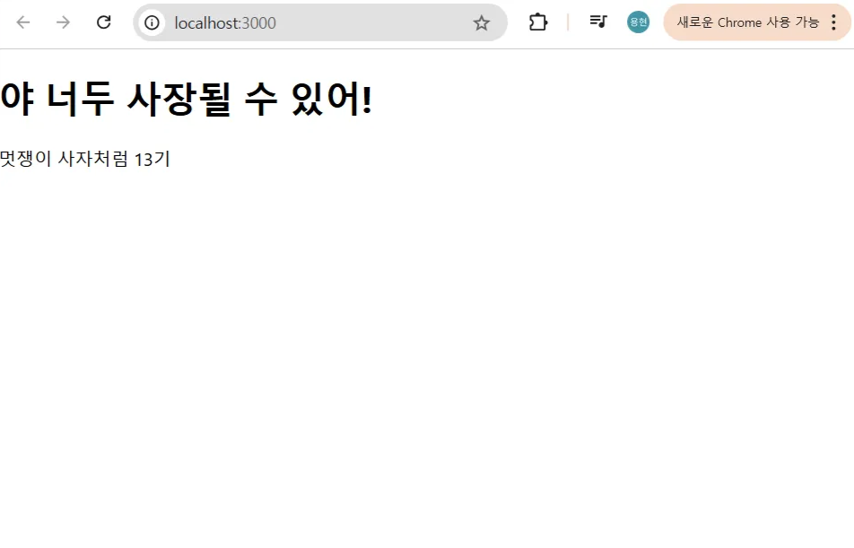
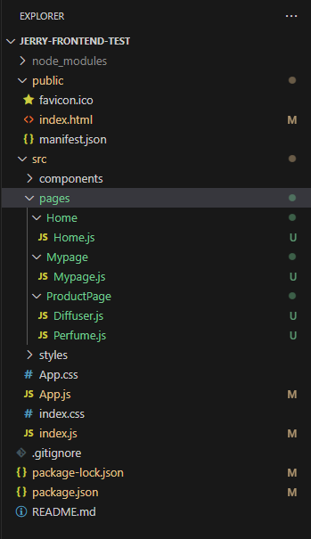
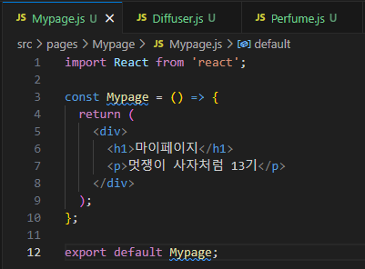
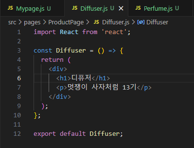
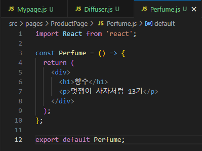

## 1. 🏠 Home.js 생성



- `/pages` 폴더 아래에서 각 페이지들의 소스코드를 관리할 수 있습니다.
- `pages` 폴더 아래에 **`Home` 폴더를 만들어주세요.**
- 그리고 `Home` 폴더 아래에 **`Home.js`를 생성합니다.**

```jsx
import React from 'react';

const Home = () => {
  return (
    <div>
      <h1>야 너두 사장될 수 있어!</h1>
      <p>멋쟁이 사자처럼 13기</p>
    </div>
  );
};

export default Home;
```

- `Home.js` 파일을 생성하고, 다음 코드를 입력해주세요.
- 이 코드에서는 `Home`이라는 이름의 **React 컴포넌트**를 작성했습니다.
    - **컴포넌트**
        
        **컴포넌트**란, React에서 UI를 구성하는 기본 단위입니다.
        
    - **`import React from ‘react’;`**
        
        이 구문은 **React 라이브러리**를 불러오는 코드입니다.
        
        React를 사용해서 JSX(JavaScript XML) 문법을 사용하고, **컴포넌트를 만들고 렌더링**하기 위해 React가 필요합니다.
        
        JSX는 **자바스크립트 안에서 HTML을 사용할 수 있게 해주는 문법**입니다.
        
    - **`const Home = () ⇒ { }`**
        
        Home은 **화살표 함수**로 작성된 **React 컴포넌트**입니다.
        
        이 함수는 UI를 **렌더링하는 역할**을 합니다. 즉, 사용자가 웹사이트를 방문했을 때 이 함수에서 반환하는 내용이 **화면에 보이게** 됩니다.
        
    - **`export default Home;`**
        
        Home 컴포넌트를 다른 파일에서 사용할 수 있도록 **내보내는(export)** 코드입니다.
        
        `export default`를 사용하면 다른 파일에서 이 컴포넌트를 **불러와서** 사용할 수 있습니다.
        
    

## 2. 🚑 App.js 수정



```
import React from 'react';
import Home from './pages/Home/Home';

function App() {
  return (
    <div>
      <Home />
    </div>
  );
}

export default App;
```

- `App.js` 소스코드를 다음과 같이 수정해주세요.
- App.js는 **React 애플리케이션에서 가장 중요한 컴포넌트** 중 하나입니다. 이 코드는 **애플리케이션의 루트 컴포넌트**로, 다른 컴포넌트들을 모든 페이지에 표시하는 역할을 합니다.
- **`import Home from './pages/Home/Home';`**
    
    `Home` 컴포넌트를 **`./pages/Home/Home`** 파일에서 **불러오는 코드**입니다.
    
    `Home.js`에서 `export default Home;`를 사용하여 `Home` 컴포넌트를 내보내기(export)했기 때문에, **다른 파일에서 `import`를 사용**해 `Home` 컴포넌트를 가져와서 사용할 수 있습니다.
    
- **`<Home />`**
    
     `Home` 컴포넌트를 `App` 컴포넌트 안에 삽입
    

## 3. 🗂️ index.js



```jsx
import React from 'react';
import ReactDOM from 'react-dom/client';
import './index.css';
import App from './App';

// import reportWebVitals from './reportWebVitals';

const root = ReactDOM.createRoot(document.getElementById('root'));
root.render(
  <React.StrictMode>
    <App />
  </React.StrictMode>
);

// reportWebVitals();

```

- `index.js`는 React 앱을 실행하는 핵심 파일이므로, **기본 설정을 유지**하면 됩니다.
- 위에서 export한 `App` 컴포넌트를 불러와서 index.js에 삽입되어 있는 것을 볼 수 있습니다.
- 간혹 **reportWebVitals가 index.js에 포함**되어 있는 경우가 있습니다.
    - reportWebVitals는 웹페이지 성능을 측정하는 용도이지만, 지금은 사용하지 않기 때문에 주석처리해주세요!
    - 이런 에러 화면이 뜬다면 꼭 주석처리 혹은 지워주세요!!
        
        
        

## 4. 🌳 index.html



```html
<!DOCTYPE html>
<html lang="en">
  <head>
    <meta charset="utf-8" />
    <link rel="icon" href="%PUBLIC_URL%/favicon.ico" />
    <meta name="viewport" content="width=device-width, initial-scale=1" />
    <title>React App</title>
  </head>
  <body>
    <div id="root"></div>
  </body>
</html>
```

- `public/index.html`은 React 앱의 진입점입니다.
- `index.html` 도 **기본값을 유지**합니다. **필요없는 내용은 삭제**해도 괜찮습니다.

## 5. 🚀 프로젝트 실행하여 확인하기

- `npm start` 명령어를 통해 [`localhost:3000`](http://localhost:3000) 에 접속하거나, 이미 실행중이라면 방금 수정된 소스코드가 바로 적용되어 있으니 확인해봅니다.



## 6. 🎯 요약

> 이렇게 **순차적으로** 각 파일이 협력하여 애플리케이션의 UI를 **렌더링**하고, **동적으로 갱신**할 수 있게 만듭니다.
> 
1. **`Home.js`**
    - **페이지 컴포넌트**로, 사용자에게 보여줄 **컨텐츠**를 담당합니다.
    - 이 컴포넌트는 `App.js`에서 **렌더링**되어 화면에 표시됩니다.
2. **`App.js`**
    - 애플리케이션의 **루트 컴포넌트**입니다.
    - 이 파일에서 **다른 컴포넌트들**을 불러와서 화면에 **렌더링**합니다.
    - `Home.js` 컴포넌트를 불러와서 화면에 **디스플레이**합니다.
3. **`index.js`**
    - React 애플리케이션의 **최초 진입점**입니다.
    - `ReactDOM.render()`를 사용하여 **`App.js`** 컴포넌트를 **`root` div**에 렌더링합니다.
    - React가 **UI를 동적으로 갱신**할 수 있도록 **DOM과 React 컴포넌트 연결**을 처리합니다.
4. **`index.html`**
    - **HTML의 기본 구조**를 제공하며, React 애플리케이션을 **렌더링할 DOM**을 포함합니다.
    - `<div id="root"></div>`: 이 곳에 React가 **컴포넌트를 렌더링**합니다.

## 🦁 미션(5 min) - Mypage, ProductPage도 만들어보자!

- **`Mypage`** 폴더 아래에 **`Mypage.js`**
- **`ProductPage`** 폴더 아래에 **`Perfume.js`, `Diffuser.js`**

- 정답
    
    
    
    
    
    
    
    
