## 사전 준비

| 항목 | 설명 |
| --- | --- |
| React 앱 | 이미 로컬에서 `npm start`로 잘 실행되는 상태 |
| GitHub 레포 | Netlify는 GitHub랑 연동해서 자동 배포하는 방식이 가장 편함(Public Repository) |
| Netlify 계정 | https://app.netlify.com 에서 GitHub 계정으로 로그인 가능 |

---

## Netlify에서 배포 설정

1. https://app.netlify.com 접속
2. "Add new site" > "Import an existing project" 클릭

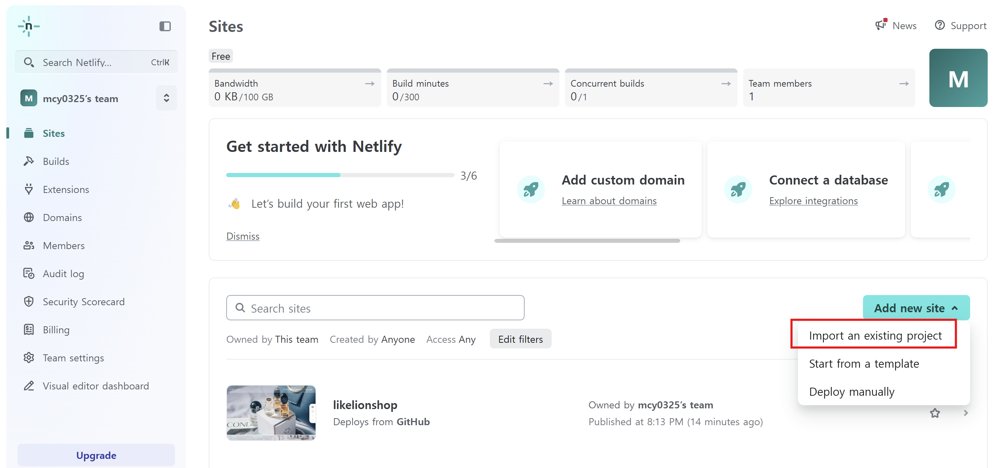

1. GitHub 계정 연동 

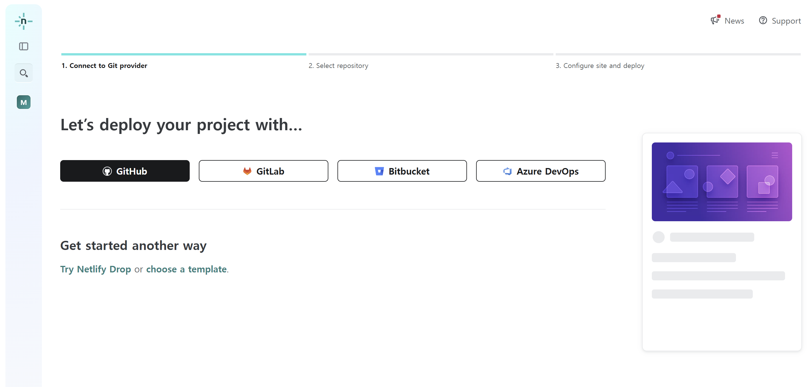

1. 원하는 레포 선택 (React 프로젝트 있는 레포)

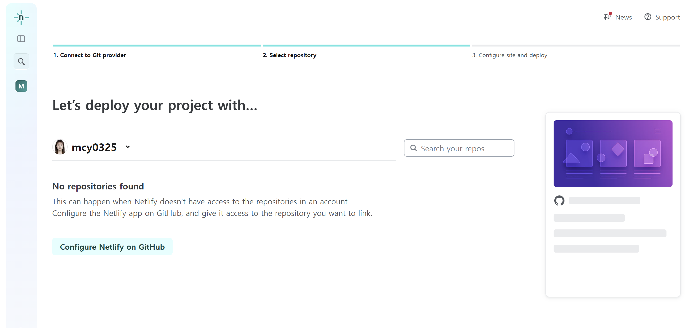

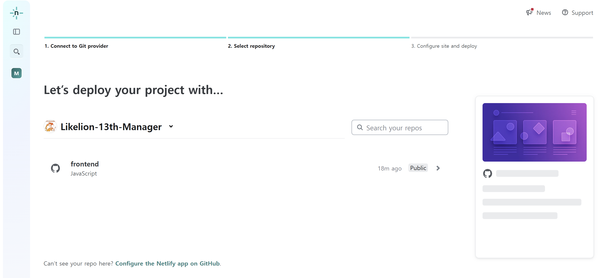

1. 설정 입력

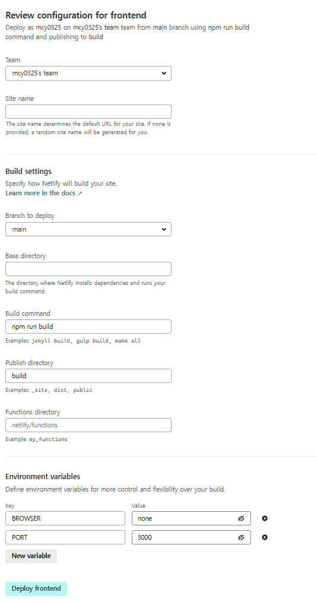

---

## 기다리기 (자동 빌드)

- 빌드가 진행되고, 성공하면 사이트가 배포됨
- 한 번만 배포를 하면, 깃허브에 푸시하고 머지할 때마다 자동으로 빌드됨

---

## 운영진이 배포한 웹사이트!

https://likelionshop.netlify.app/

---

## [추가] Netlify 배포 재시도 해보기

---

1. public 폴더 안에 ‘_redirects’ 이름으로 파일 하나 생성(확장자 없이) 후 위와 같이 작성

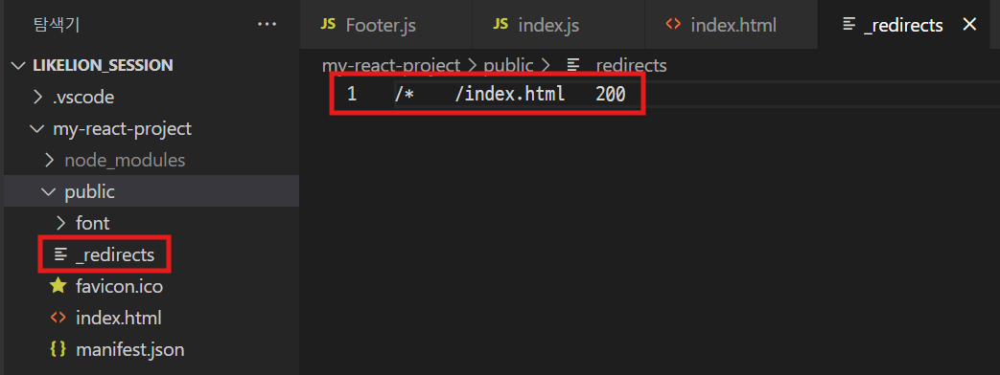

```
/*    /index.html   200
```

1. 깃허브 푸시

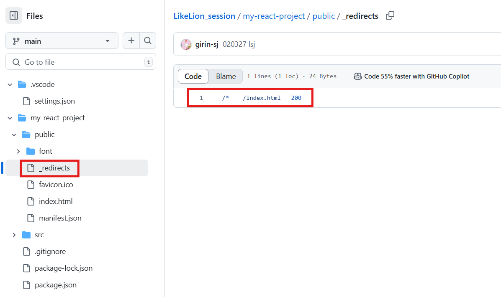

1. Netify에서 Deploy > Deploy settings

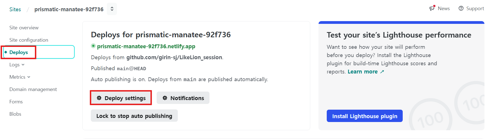

1. Build settings에서 public 폴더 상위 폴더 경로로 작성(이 부분 모르겠으면 이사장에게 질문) 후 build command도 수정

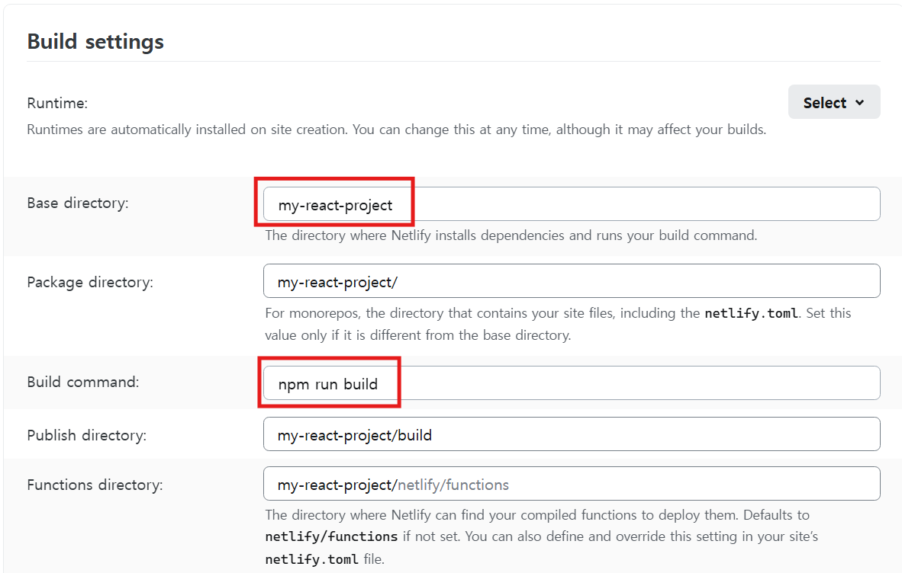

1. Deploy에서 가장 최신 것 선택

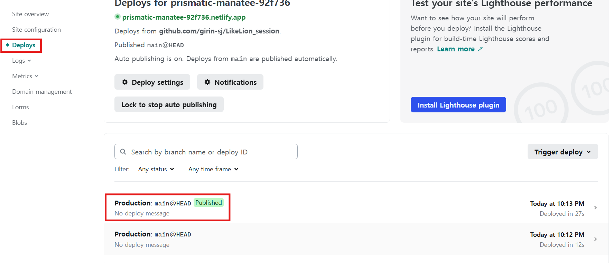

1. Options > Clear cache~ 클릭해서 재배포 후 Open proudction deploy 민트색 버튼 누르면 끝!

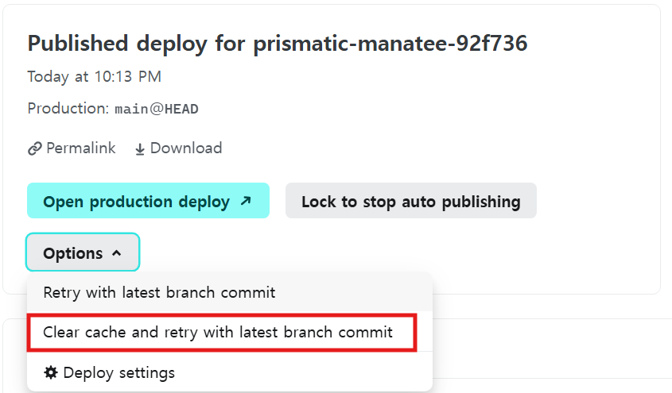
