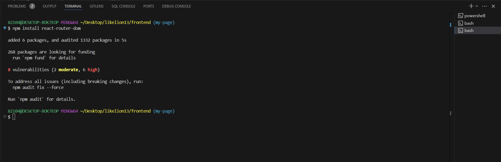

## React Router란?

**React Router**는 **React에서 여러 개의 페이지를 구현할 수 있도록 도와주는 라이브러리**입니다.
보통 React는 **단일 페이지 애플리케이션(SPA)**이지만, React Router를 사용하면 URL에 따라 다른 컴포넌트를 렌더링할 수 있습니다.

## 1. 🔨 React Router 설치

```bash
npm install react-router-dom
```



## 2. 🙏 기본 사용법

### App.js

```jsx
import React from "react";
import { BrowserRouter as Router, Routes, Route } from "react-router-dom";

import Home from "./pages/Home/Home";
import Mypage from "./pages/Mypage/Mypage";
import Diffuser from "./pages/ProductPage/Diffuser";
import Perfume from "./pages/ProductPage/Perfume";
import New from './pages/ProductPage/New';

function App() {
  return (
    **<Router>**
      **<Routes>**
        <**Route** path="/" element={<Home />} />
        <**Route** path="/mypage" element={<Mypage />} />
        <**Route** path="/diffuser" element={<Diffuser />} />
        <**Route** path="/perfume" element={<Perfume />} />
        <**Route** path="/new" element={<New />} />
      **</Routes>**
    **</Router>**
  );
}

export default App;
```

- **`<Router>`**: 라우터 전체를 감싸주는 컴포넌트
- **`<Routes>`**: 여러개의 Route를 감싸는 컨테이너
- **`<Route>`**: 특정 URL과 해당 컴포넌트를 연결
    - **`path=”/”`**:  **`/`**경로에서 **`<Home />`**을 렌더링
    - **`path=”/mypage”`**:  **`/mypage`**경로에서 **`<Mypage />`**을 렌더링

## 3. ✈️ 페이지 이동 (Link)

**`a`** 태그 대신 **`React Router`**에서 제공하는 **`<Link>`**를 사용하면 페이지 이동시 reload없이 빠르게 이동할 수 있습니다.

```jsx
// (예시) 상단 Header나 Navbar에서 주로 사용
<Link to="/">홈</Link>
<Link to="mypage">마이페이지</Link>
```

## 4. 🥊 URL 파라미터 사용하기 (동적 라우팅)

만약 **`/user/1`**, **`/user/2`**처럼 ID별로 다른 페이지를 만들고 싶다면 **URL 파라미터**를 사용할 수 있습니다.

- 라우터 설정

```jsx
// (예시) App.js
import { BrowserRouter as Router, Routes, Route } from "react-router-dom";
import Home from "./pages/Home";
import User from "./pages/User";

function App() {
  return (
    <Router>
      <Routes>
        <Route path="/" element={<Home />} />
        <Route path="/user/:id" element={<User />} />
      </Routes>
    </Router>
  );
}

export default App;
```

- 파라미터 값 가져오기

```jsx
// (예시) User.js
import React from "react";
import { useParams } from "react-router-dom";

function User() {
  const { id } = useParams(); // URL의 :id 값을 가져옴

  return <h1>사용자 ID: {id}</h1>;
}

export default User;

```

## 5. 🗺️ 네비게이션 이동 (useNavigate)

**버튼 클릭 시 특정 페이지로 이동**하고 싶다면 `useNavigate()` 훅을 사용할 수 있습니다.

```jsx
import React from "react";
import { useNavigate } from "react-router-dom";

function Home() {
  const navigate = useNavigate();

  return (
    <div>
      <h1>홈 페이지</h1>
      <button onClick={() => navigate("/about")}>소개 페이지로 이동</button>
    </div>
  );
}

export default Home;
```

- Tip1: **`<Link>`**와 **`useNavigate()`**는 뭐가 달라요?
    
    **<Link>: 단순한 메뉴 이동**
    
    - HTML의 <a>태그와 비슷한 역할
    - 페이지를 새로고침하지 않고 부드럽게 이동
    - 사용자가 직접 클릭해야 동작
    
    **useNavigate(): 버튼 클릭, 특정 이벤트에서 이동**
    
    - 코드에서 이동 가능(버튼 클릭, 조건 충족 시)
    - navigate(-1)로 뒤로 가기 제공
